# 🔁 Lab: Datastream - Replicación de PostgreSQL en BigQuery

Este laboratorio forma parte de la ruta de aprendizaje para Ingenieros de Datos en Google Cloud. Explora cómo replicar datos en tiempo real desde una base de datos PostgreSQL (Cloud SQL) hacia BigQuery usando Datastream, una herramienta de captura de datos modificados (CDC).

---

## 🎯 Objetivos del lab

- Preparar una instancia de **Cloud SQL para PostgreSQL**.
- Importar datos a la base de datos.
- Crear un **perfil de conexión** de Datastream para PostgreSQL.
- Crear un **perfil de conexión** de Datastream para BigQuery.
- Crear una transmisión (stream) con Datastream.
- Validar la replicación de datos y cambios en BigQuery.

---

## Replicación y migración  de datos

La etapa de replicación y migración de una canalización de datos se enfoca en las 
herramientas y opciones para llevar los datos de los sistemas externos o internos a 
Google Cloud para definirlos aún más. 

Google Cloud ofrece un paquete integral de herramientas para migrar y replicar tus 
datos.

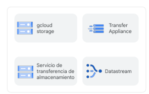

---


## 📦 Flujo del lab

## Tarea 1. Crear una base de datos para la replicación.

### 1.1 Habilitar la API de Cloud SQL

En Cloud Shell, escriba el siguiente comando:

```bash
gcloud services enable sqladmin.googleapis.com
```
### 1.2 Crear una instancia de Cloud SQL para PostgreSQL

```sql
-- Definimos variables de entorno

POSTGRES_INSTANCE=postgres-db
DATASTREAM_IPS=IP_ADDRESS

-- Creamos una instancia de PostgreSQL en Cloud SQL

gcloud sql instances create ${POSTGRES_INSTANCE} \
  --database-version=POSTGRES_14 \
  --cpu=2 --memory=10GB \
  --authorized-networks=${DATASTREAM_IPS} \
  --region=${REGION} \
  --root-password=pwd \
  --database-flags=cloudsql.logical_decoding=on
```


#### Si vamos a la consola Cloud SQL, podemos ver la instancia recientemente creada y anotar **la IP pública de la instancia, se utilizará más adelante.**


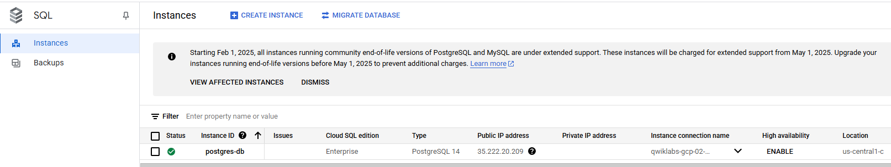


### 1.3 Crear una base de datos y poblarla con datos de ejemplo

Conectarse a la base de datos:

```sql
gcloud sql connect postgres-db --user=postgres
```

### Recordar --> Contraseña: `pwd`

Una vez dentro del shell de PostgreSQL, ejecutar:

```sql

-- Creamos un esquema llamado "test"

CREATE SCHEMA IF NOT EXISTS test;

-- Creamos una tabla llamada " example_table"

CREATE TABLE IF NOT EXISTS test.example_table (
  id SERIAL PRIMARY KEY,
  text_col VARCHAR(50),
  int_col INT,
  date_col TIMESTAMP
);

-- Prepara la tabla para la Replicacion

ALTER TABLE test.example_table REPLICA IDENTITY DEFAULT;


-- Agrego datos

INSERT INTO test.example_table (text_col, int_col, date_col) VALUES
('hello', 0, '2020-01-01 00:00:00'),
('goodbye', 1, NULL),
('name', -987, NOW()),
('other', 2786, '2021-01-01 00:00:00');
```

Que estamos haciendo, hemos creado una Tabla con datos, en una base de datos PostgreSQL preparada para **replicacion**.

¿ De que me sirve esto ?

- validar que Datastream pueda leer cambios en tiempo real.
- Ver como se replican `insert`, `update` o `delete` hacia Bigquery.
### 1.4 Configurar la base de datos para replicación

Aún en el shell de PostgreSQL:

```sql
CREATE PUBLICATION test_publication FOR ALL TABLES;
ALTER USER POSTGRES WITH REPLICATION;
SELECT PG_CREATE_LOGICAL_REPLICATION_SLOT('test_replication', 'pgoutput');
```
Este bloque de comandos:

  - Prepara PostgreSQL para exponer datos (publicación).

  - Le da permisos al usuario.

  - Crea el canal técnico por el que fluirán los cambios (replication slot).

👉 Son pasos obligatorios si querés usar replicación lógica con herramientas como Datastream, Debezium u otros CDC tools.

#
## Tarea 2: Crear los recursos de Datastream y comenzar la replicación
Ahora que la base de datos ya está lista, crea los perfiles de conexión de Datastream y comienza a transmitir para iniciar la replicación.

### 2.1 - Habilitar la API de Datastream


En la consola de Google Clod, desde el menú de navegación, buscar **Datastream** y hacer clic en **Enable**.


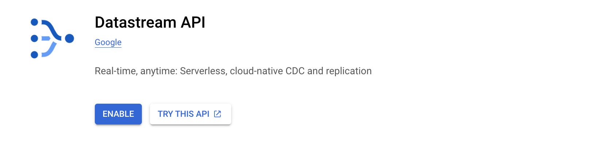


###  2.2 - Crea perfiles de conexión

- Crea dos perfiles de conexión, uno para la fuente de PostgreSQL y otro para el destino de BigQuery.

#### 2.2.1 - Perfil de conexión de PostgreSQL


1. En la consola de Cloud, ve a la pestaña **Perfiles de conexión** y haz clic en **Crear perfil.**

    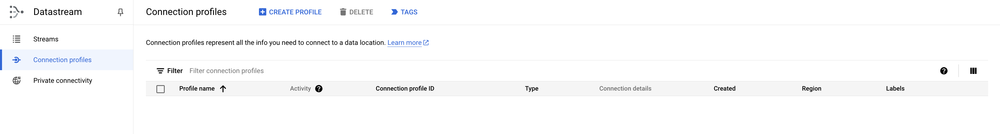

2. Selecciona el tipo de perfil de conexión: **PostgreSQL.**

    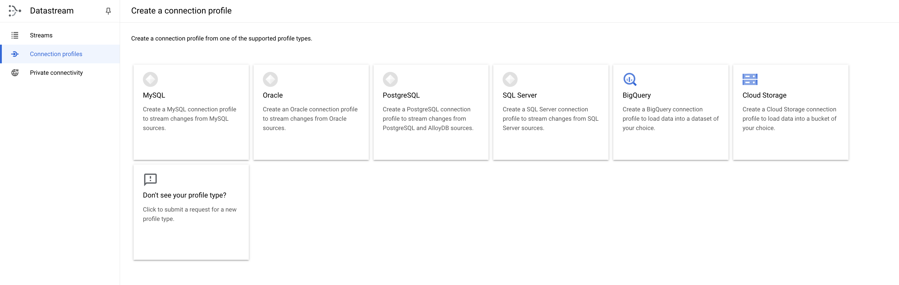


3. Usa como el nombre y el ID del perfil de conexión:  `postgres-cp`

4. Ingresa los detalles de la conexión a la base de datos:  

    
    - Región: REGION (la que te asigna el Lab)
    - La IP y el puerto de la instancia Cloud SQL que creaste antes
    - Username: postgres
    - Password: pwd
    - Database: postgres
    
5. Haz clic en **Continuar.**
6. En la opción de encriptación deja NINGUNA y haz clic en **CONTINUAR.**
7. Selecciona el método de conectividad **IP allowlisting** y haz clic en **Continuar.**
8. Haz clic en **RUN TEST** para asegurarte de que Datastream pueda conectarse a la base de datos.

    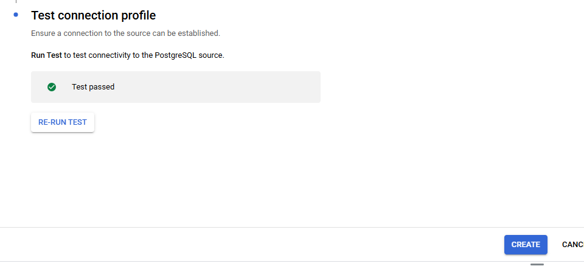

9. Haz clic en **Create.**

#### 2.2.2 - Perfil de conexión de BigQuery

1. En la consola de Cloud, ve a la pestaña **Connection Profiles** y haz clic en **Create Profile.**
2. Selecciona el tipo de perfil de conexión:**BigQuery.**
3. Usa  como el nombre y el ID del perfil de conexión: `bigquery-cp`

4. Región: `REGION`

5. Haz clic en **Crear.**

    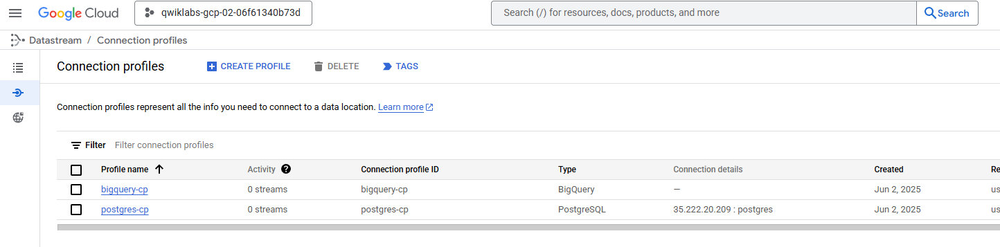


####  2.3 - Crea una transmisión

Crea una transmisión para conectar los perfiles de conexión que creaste antes y definir la configuración de los datos que se deben transmitir de la fuente al destino.

- En la consola de Cloud, ve a la pestaña **Transmisiones** y haz clic en **Crear transmisión.**

    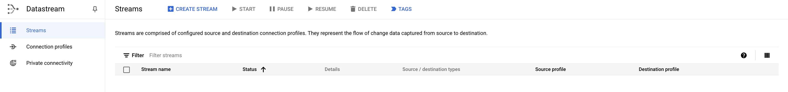

#### **Define los detalles de la transmisión**

  - Usa `test-stream` como el nombre y el ID de la transmisión.
  - Región REGION
  - Selecciona **PostgreSQL** como el tipo de fuente.
  - Selecciona **BigQuery** como el tipo de destino.
  - Haz clic en **CONTINUAR.**

    


#### **Define la fuente**

1. Selecciona el perfil de conexión **postgres-cp** que creaste en el paso anterior.
2. [Opcional] Haz clic en **RUN TEST** para comprobar la conectividad.
3. Haz clic en **CONTINUAR.**

    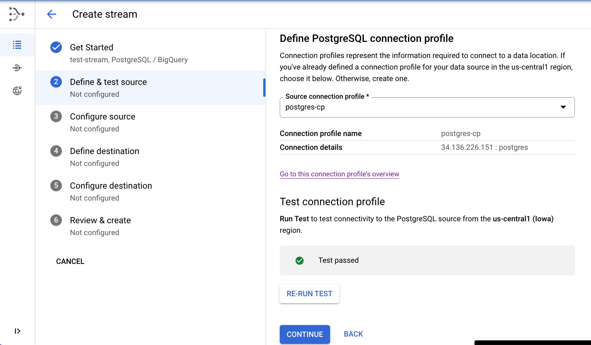


#### **Configura la fuente**

1. Ingresa el nombre `test_replication` para la ranura de replicación.
2. Ingresa el nombre `test_publication` para la publicación.

    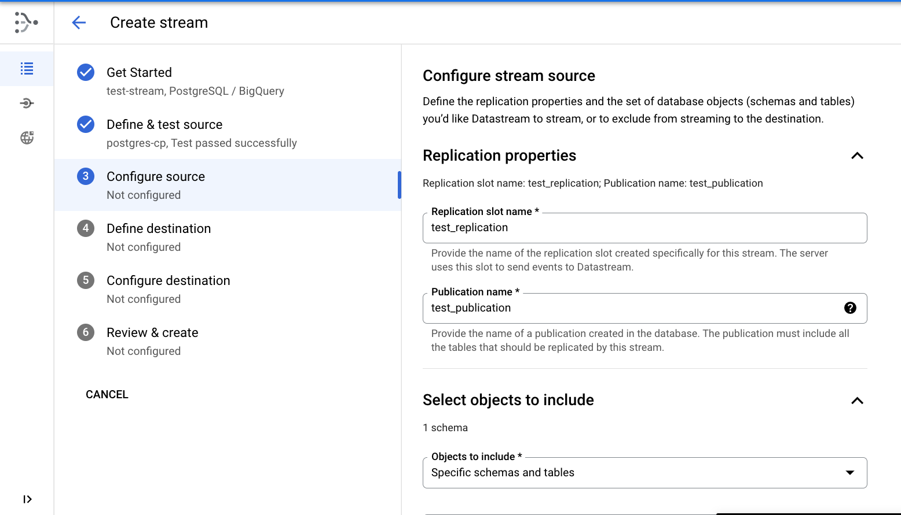

3. Selecciona el esquema **test** para la replicación.

    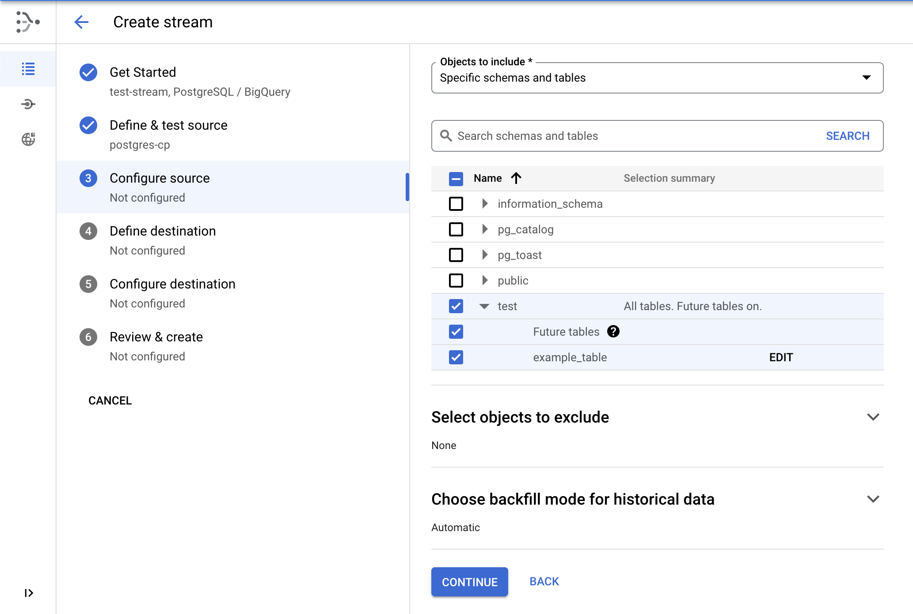

4. Haz clic en **Continuar.**    


#### **Define el destino**

- Selecciona el perfil de conexión **bigquery-cp** que creaste en el paso anterior y haz clic en **Continuar.**

  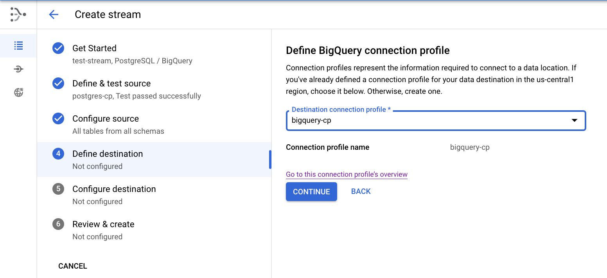


#### **Configura el destino**
- Selecciona la opción Región y la `REGION` como la ubicación del conjunto de datos de BigQuery.
- Configura el límite de inactividad en **0 segundos.**
    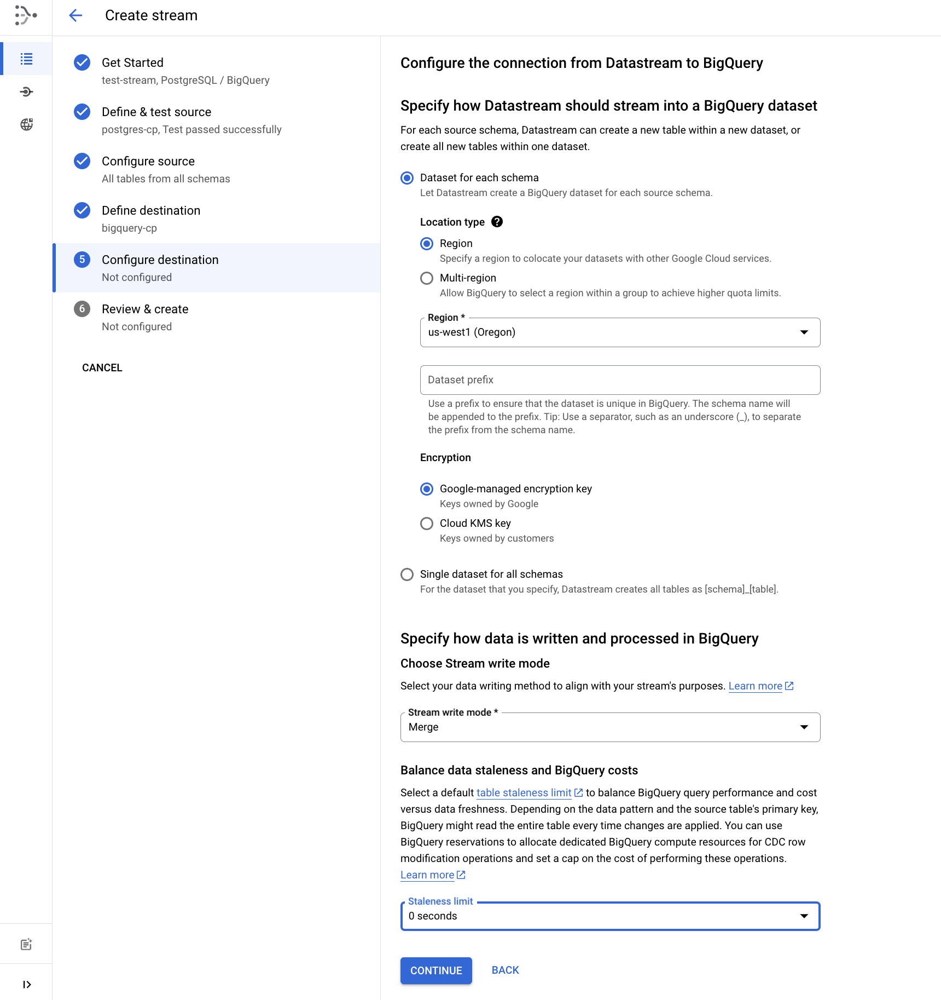

3. Haz clic en **Continuar.**

#### **Revisa los detalles y crea la transmisión**

- Por último, haz clic en **Run Validation** para validar los detalles de la transmisión. Una vez que finalice correctamente, haz clic en **Create & Start**.  
    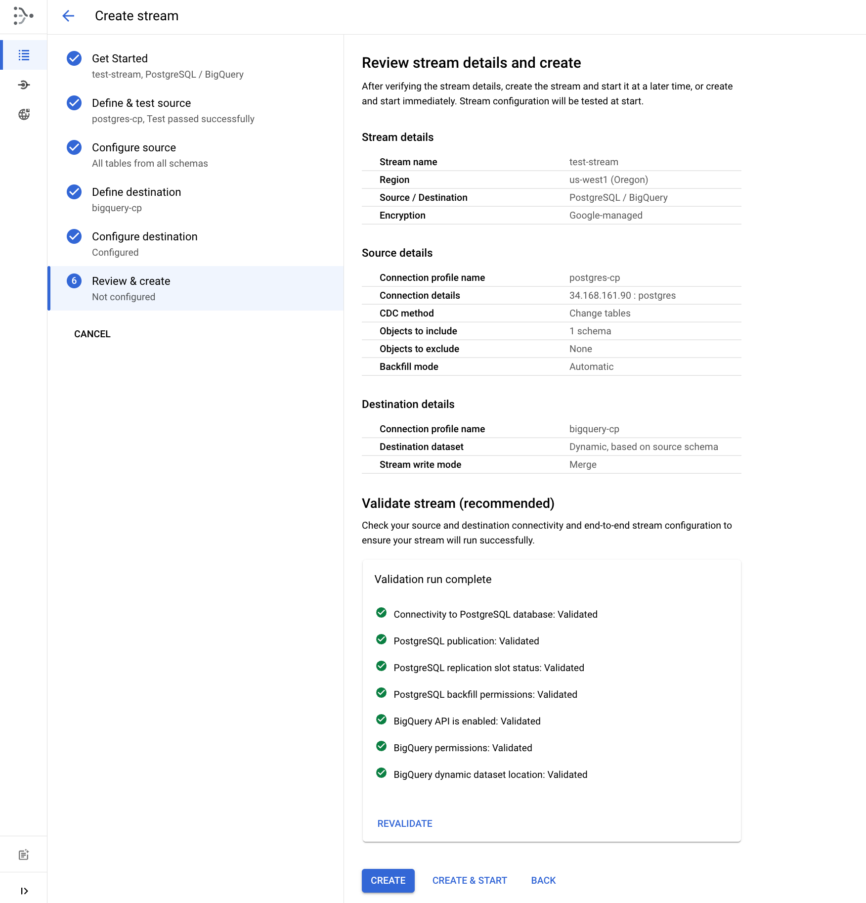


## Esperar 1–2 minutos hasta que el estado sea **Running**.

  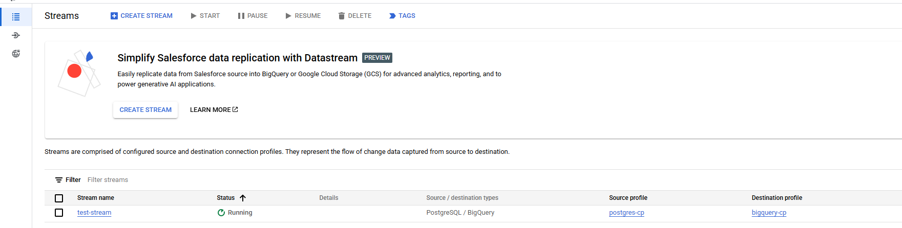
---

#
## Tarea 3: Ver los datos en BigQuery

1. Ir a **BigQuery** desde el menú de navegación.
2. En el panel izquierdo (BigQuery Studio), expandir el proyecto.
3. Expandir el dataset `test`.
4. Hacer clic en la tabla `example_table`.
5. Ir a la pestaña **PREVIEW** para ver los datos replicados.

    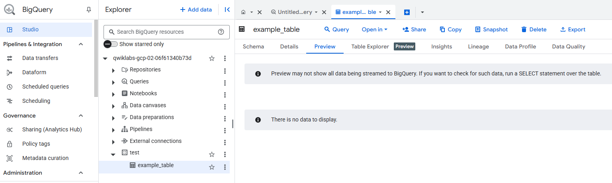

 Si no ves los datos, ejecuta esta consulta:

```sql
SELECT * FROM test.example_table ORDER BY id;
```
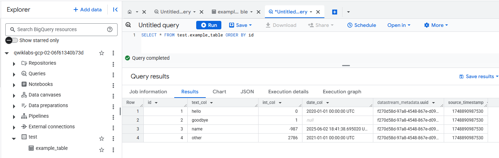
#
## 4. Tarea 4: Verificar replicación de cambios

Comprueba que los cambios en la fuente se repliquen en BigQuery.

Volver a conectarse a PostgreSQL desde Cloud Shell:

```sql
gcloud sql connect postgres-db --user=postgres
```

Ejecutar estas operaciones:

```sql
INSERT INTO test.example_table (text_col, int_col, date_col) VALUES
('abc', 0, '2022-10-01 00:00:00'),
('def', 1, NULL),
('ghi', -987, NOW());

UPDATE test.example_table SET int_col=int_col * 2;

DELETE FROM test.example_table WHERE text_col = 'abc';
```
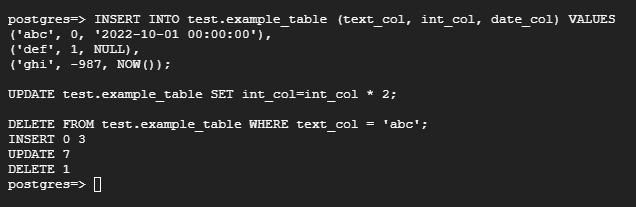

Volver a BigQuery y ejecutar (ABRIR UNA NUEVA QUERY):

```sql
SELECT * FROM test.example_table ORDER BY id;
```

📌 Confirmar que los datos fueron replicados correctamente (insertados, modificados, eliminados).

  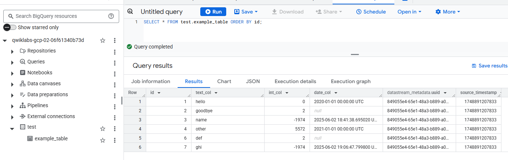

---


##  Resultado esperado

✔️ Una instancia PostgreSQL replicando datos hacia BigQuery.  
✔️ Cambios aplicados en tiempo real desde PostgreSQL a BigQuery.  
✔️ Transmisión configurada y monitoreada desde Datastream Console.

## ✅ Resultado final

Con Datastream, se logró establecer una replicación continua de una base de datos PostgreSQL hacia BigQuery, sin necesidad de procesos ETL adicionales. Cualquier cambio en la base de datos de origen se refleja automáticamente en BigQuery.


---
## 📘 Conceptos clave

- **CDC (Captura de datos modificados)**: técnica que permite propagar en tiempo real los cambios desde una base de datos transaccional.
- **Datastream**: servicio serverless de Google Cloud para replicar datos desde bases de datos relacionales y aplicaciones SaaS.
- **Cloud SQL**: servicio de base de datos relacional administrado por Google.
- **BigQuery**: almacén de datos analíticos sin servidor, ideal para consultas OLAP.


## 🔗 Recursos

- [Documentación de Datastream](https://cloud.google.com/datastream/docs)
- [Guía del lab en Cloud Skills Boost](https://www.cloudskillsboost.google/catalog_lab/5777)

---

