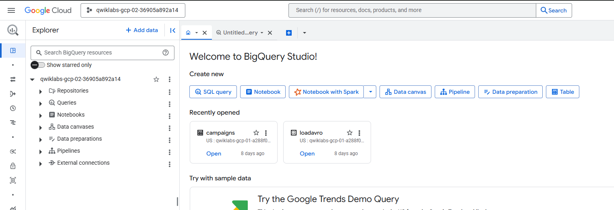
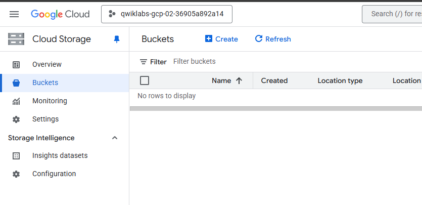
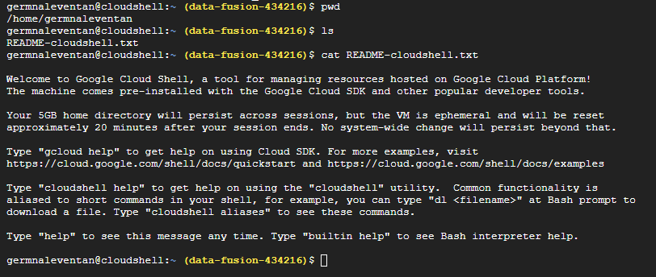
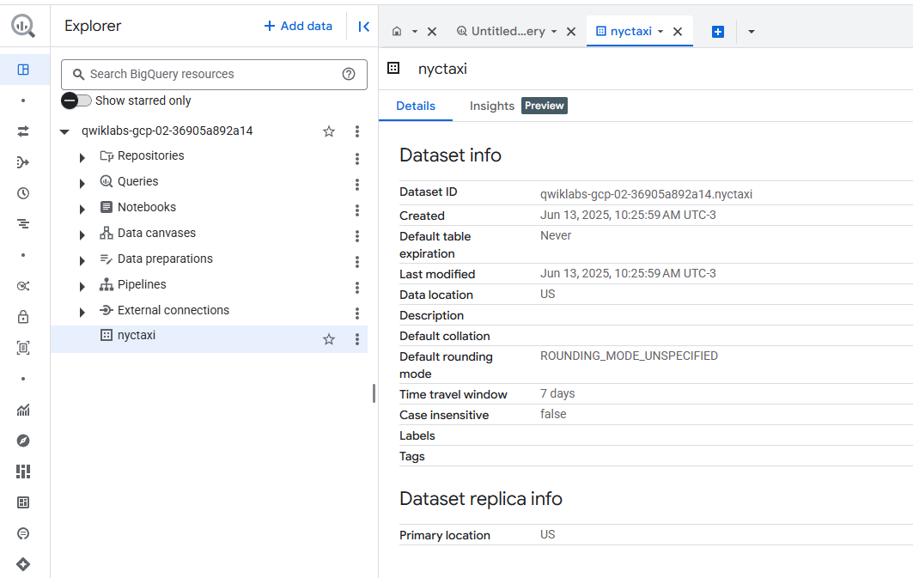
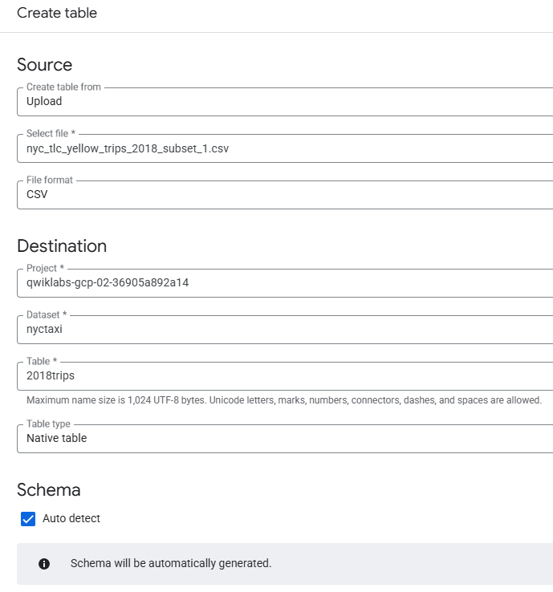
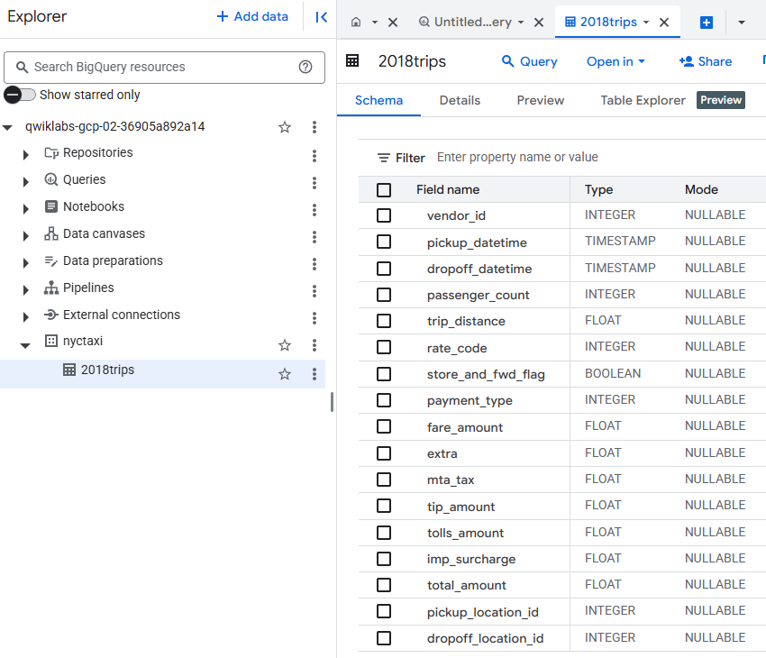
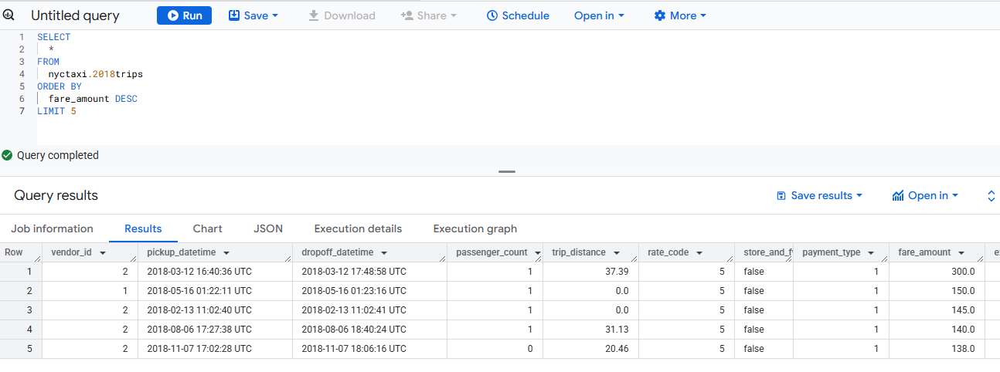
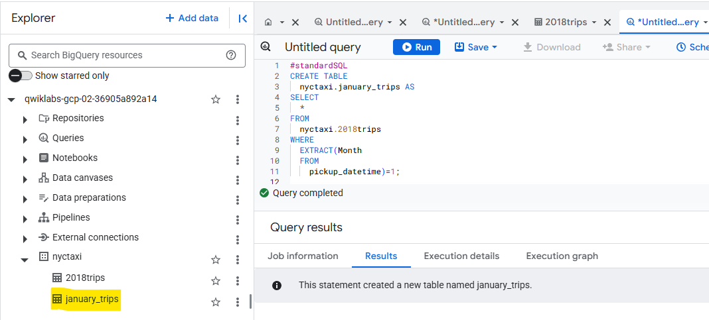
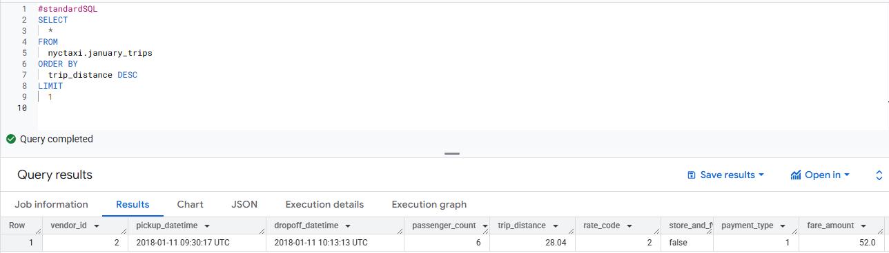

# 📊 Lab: Cómo cargar datos en BigQuery

En este laboratorio forma parte de la ruta de aprendizaje de Ingeniería de Datos en Google Cloud y tiene como objetivo aprender a cargar datos estructurados en BigQuery desde diferentes fuentes utilizando tanto la consola como la CLI.

---

## 🎯 Objetivos

- Crear un dataset en BigQuery.
- Cargar archivos CSV locales desde la consola.
- Cargar archivos desde Cloud Storage usando la CLI (`bq load`).
- Crear nuevas tablas a partir de otras con sentencias DDL.
- Ejecutar consultas SQL básicas para análisis exploratorio.


---

## 📦 Dataset utilizado

Subconjuntos de los datos de **viajes en taxi en la ciudad de Nueva York (NYC)** del año **2018**.

📘 Al final del Laboratorio encontraran el **diccionario de datos** correspondiente, como referencia para entender qué representa cada columna del dataset **NYC Yellow Taxi Trip Records – 2018**.

---

## 🧭 Antes de comenzar: Exploración del entorno

Antes de iniciar con las tareas del laboratorio, es importante realizar una breve exploración de los recursos ya disponibles en nuestro proyecto de Google Cloud. Esta etapa nos ayuda a:

- Familiarizarnos con los servicios que vamos a usar.

- Confirmar que los datasets, buckets o archivos necesarios ya existen.

- Tener un punto de partida más claro para las tareas del laboratorio.

## 🔍 Verificación en BigQuery
- Ingresamos a la consola de BigQuery.

- Buscamos si existe algún dataset ya creado (por ejemplo, nyc_taxi).

- Exploramos las tablas disponibles, sus esquemas y si contienen datos.
   
  

### 🗂️ Verificación en Cloud Storage

- Vamos a Cloud Storage y revisamos los buckets disponibles.

- Buscamos archivos CSV o JSON que puedan ser utilizados en las cargas de datos.

- Verificamos si los archivos están organizados en carpetas y si tienen nombres descriptivos.

   


### 💻 Exploración inicial desde Cloud Shell

Antes de comenzar con las tareas del laboratorio, es recomendable familiarizarnos con el entorno de trabajo. Para ello, abrimos **Cloud Shell** y usamos algunos comandos básicos de Linux para ver qué archivos o carpetas están disponibles.

### 🧭 Paso 1: Abrir Cloud Shell

1. En la consola de Google Cloud, hacé clic en el ícono de la terminal (📟) en la esquina superior derecha.
2. Esperá unos segundos hasta que se inicie el entorno de Cloud Shell.

### 📂 Paso 2: Ver contenido con `ls`

Ejecutá el siguiente comando:

```sh
ls
```

Este comando muestra los archivos y carpetas en tu directorio actual. Por defecto, Cloud Shell te ubica en el directorio home:

```sh
/home/tu-usuario

```

### ¿Qué puede aparecer?
Puede estar **vacío**, o bien contener archivos como:

- `README-cloudshell.txt`: Este archivo suele contener: Información sobre qué es Cloud Shell / Consejos para empezar a usarlo (comandos básicos, navegación)/ Enlaces a la documentación oficial de Google Cloud Shell.

- Carpetas o archivos que hayan sido generados por scripts del laboratorio.

- Directorios de repositorios si usaste git clone.

### 🛠️ Comandos útiles adicionales
```sh
pwd        # Muestra en qué directorio estás
ls -l      # Muestra detalles (permisos, tamaño, fecha)
ls -a      # Muestra archivos ocultos (empiezan con .)
```
Este pequeño diagnóstico inicial nos ayuda a entender si el entorno ya tiene archivos precargados y nos prepara mejor para ejecutar las siguientes tareas del laboratorio.


  


#
#
## ✅ Pasos del laboratorio

### 🔹 Tarea 1: Crear un conjunto de datos (dataset)

1. Abrir BigQuery desde el menú de navegación.
    - En el panel izquierdo de BigQuery, busca tu **Project ID.**
    - Haz clic en los tres puntos verticales **(View actions)** al lado del nombre del proyecto.
2. Crear un nuevo dataset llamado: `nyctaxi`.
    - Selecciona **"Create dataset"**.
    - En el campo Dataset ID, escribe `nyctaxi`.
3. Dejar las opciones predeterminadas (ubicación, cifrado, etc.).
4. Haz clic en **"Create dataset"**.
5. Confirmar que el dataset aparezca en la consola.

    

#
### 🔹 Tarea 2: Cargar un archivo CSV local

1. Subir un archivo de datos **.CSV**, desde mi entorno local a BigQuery. **Esto es útil para migrar datasets pequeños desde tu máquina local a la nube.**

2. Descarga el archivo CSV: 

    Se trata de un subconjunto de los datos históricos de viajes en taxi en la ciudad de Nueva York correspondientes al año 2018. Este dataset es ampliamente utilizado para prácticas de análisis de datos y aprendizaje de herramientas como BigQuery.: 
    
      https://storage.googleapis.com/cloud-training/OCBL013/nyc_tlc_yellow_trips_2018_subset_1.csv


3. En la consola de BigQuery:
   - Seleccionar el dataset `nyctaxi`.
      - Haz clic en los tres puntos verticales (**View actions**) 
   - Crear una nueva tabla.(**"Create table".**)
   - En la sección Source:
      - "Create table from": selecciona Upload. 
      - "Choose File": selecciona el CSV descargado.
      - "File format": selecciona CSV.
   - Nombre de tabla: `2018trips`.
   - Activar **detección automática del esquema**.
      - Marca la opción **Auto detect** (esto permitirá que BigQuery deduzca automáticamente las columnas y sus tipos).
4. Deja las opciones avanzadas por predeterminadas por defecto.

    

5. Haz clic en **Create Table.**
6. Verificar que la tabla fue creada correctamente.

    

7.  Si vamos a la solapa **""Details""** de la tabla `2018trips`, bajamos hasta **Storage info**, podemos ver el numero de filas que contiene la tabla. (**"Number of rows"**)

8. Ejecutar la siguiente consulta para obtener los **5 viajes más costosos**:

    ```sql
    -- Encontrar los 5 viajes más caros del año 2018

    SELECT
      *
    FROM
      nyctaxi.2018trips
    ORDER BY
      fare_amount DESC
    LIMIT 5;
    ```

    📌 Resultado esperado: Se visualiza el viaje más caro del año con un `fare_amount` máximo de **300**.

      
#

### 🔹 Tarea 3: Cargar datos desde Google Cloud Storage con CLI

En esta etapa del laboratorio, vamos a **agregar nuevos datos** al **dataset y tabla que creamos anteriormente** (`nyctaxi.2018trips`). La carga se realizará a partir de un archivo CSV almacenado en Cloud Storage, utilizando la herramienta de línea de comandos `bq` desde Cloud Shell.

A diferencia de pasos anteriores, en este caso vamos a **enriquecer una tabla existente** añadiendo más registros.

Esto nos permite aprender cómo trabajar con BigQuery desde la terminal.


El archivo  **.CSV**, de donde extraemos los nuevos datos,está almacenado en un **bucket público administrado por Google Cloud**  (`gs://cloud-training/OCBL013/nyc_tlc_yellow_trips_2018_subset_2.csv`). Es parte del entorno preconfigurado del laboratorio y contiene un subconjunto de datos reales de viajes en taxi en NYC durante 2018. Lo que nos permite enfocarnos en la tarea principal (la carga a BigQuery) sin tener que preparar o mover los archivos manualmente.

> 🛑 **No es necesario crear este bucket ni subir el archivo manualmente.**  
> Ya está creado por el equipo de Google Cloud como parte del contenido del lab, y es accesible de forma pública para todos los usuarios que realizan este ejercicio.


1. Abrir Cloud Shell.
2. Ejecutar el siguiente comando para **anexar** otro subconjunto CSV a la tabla existente:

    ```sql
    bq load \
    --source_format=CSV \
    --autodetect \
    --noreplace \
    nyctaxi.2018trips \
    gs://cloud-training/OCBL013/nyc_tlc_yellow_trips_2018_subset_2.csv

    ```


3. Confirmar que la cantidad de filas casi se duplica.
4. Repetir la consulta anterior para observar si cambian **los 5 viajes más costosos**.

---
#
### 🔹 Tarea 4: Crear una tabla con datos de enero usando DDL

1. Crear una nueva tabla llamada `january_trips`, a partir de la tabla original,que contenga solo los viajes realizados en enero, usando SQL DDL (Data Definition Language)..

    Abra el Query Editor de BigQuery y ejecuta esta consulta:


   En este paso del laboratorio vamos a **crear una nueva tabla llamada `january_trips`** que contendrá únicamente los registros de viajes realizados en el mes de enero.

    Para lograrlo, vamos a usar una sentencia **SQL DDL (Data Definition Language)**, que permite definir y crear estructuras en BigQuery (como tablas o vistas) directamente desde una consulta.

    ### Entonces, pasando en limpio, ¿Qué haremos exactamente?

    - Tomamos la tabla original: `nyctaxi.2018trips`.
    - Aplicamos un filtro para conservar solo los viajes donde el campo `tpep_pickup_datetime` corresponde al mes de enero.
    - Creamos una nueva tabla con esos resultados: `january_trips`.

    #### Pasos

    1. Abrí BigQuery y accedé al **Query Editor**.
    2. Ejecutá la siguiente consulta SQL: 

        ```sql

        -- "Creá una tabla nueva llamada january_trips, y completala con los datos que devuelve esta consulta SELECT ..."

        
        CREATE TABLE
          nyctaxi.january_trips AS
        SELECT
          *
        FROM
          nyctaxi.2018trips
        WHERE
          EXTRACT(MONTH FROM pickup_datetime) = 1;
        ```


        


      3. Ejecutar la siguiente consulta para encontrar el viaje de enero con mayor distancia:

          ```sql
          SELECT
            *
          FROM
            nyctaxi.january_trips
          ORDER BY
            trip_distance DESC
          LIMIT 1;
          ```


          


---

## 🧠 Conocimientos adquiridos

- Cómo trabajar con datasets y tablas en BigQuery.
- Diferencias entre carga desde archivos locales vs. carga desde GCS.
- Uso práctico del comando `bq load` para tareas repetibles.
- Escritura de sentencias SQL y DDL para manipulación y creación de tablas.
- Exploración de datos en SQL con `ORDER BY`, `LIMIT`, `EXTRACT`.

---

## 🏁 Resultado final

✔️ Dataset `nyctaxi` con tabla `2018trips` cargada desde múltiples fuentes.  
✔️ Tabla derivada `january_trips` generada con DDL.  
✔️ Consultas SQL ejecutadas para análisis exploratorio.

---

## 🔗 Recursos adicionales

- [Documentación oficial de BigQuery](https://cloud.google.com/bigquery/docs)
- [Comando `bq` CLI](https://cloud.google.com/bigquery/docs/bq-command-line-tool)
- [Lab en Cloud Skills Boost](https://www.cloudskillsboost.google/catalog_lab/2119)


---
🗂️ **Diccionario de Datos:**

 NYC Yellow Taxi Trip Records – 2018
Nombre del dataset común: `nyc-tlc.yellow.trips_2018`

| Columna                 | Tipo de dato | Descripción                                                                                                                                    |
| ----------------------- | ------------ | ---------------------------------------------------------------------------------------------------------------------------------------------- |
| `vendor_id`             | INTEGER      | Código del proveedor del servicio de taxi (1 = Creative Mobile, 2 = VeriFone).                                                                 |
| `tpep_pickup_datetime`  | TIMESTAMP    | Fecha y hora en que comenzó el viaje (Taxi Pick-up).                                                                                           |
| `tpep_dropoff_datetime` | TIMESTAMP    | Fecha y hora en que finalizó el viaje (Taxi Drop-off).                                                                                         |
| `passenger_count`       | INTEGER      | Cantidad de pasajeros reportados en el viaje.                                                                                                  |
| `trip_distance`         | FLOAT        | Distancia del viaje en millas.                                                                                                                 |
| `rate_code`             | INTEGER      | Código de tarifa aplicada. Ej.: 1 = tarifa estándar.                                                                                           |
| `store_and_fwd_flag`    | STRING       | Indica si los datos fueron almacenados antes de enviarse (Y = sí, N = no).                                                                     |
| `pickup_location_id`    | INTEGER      | ID del área de recolección (según el TLC Zone Lookup Table).                                                                                   |
| `dropoff_location_id`   | INTEGER      | ID del área de destino (también usando el TLC Zone Lookup Table).                                                                              |
| `payment_type`          | INTEGER      | Tipo de pago: 1 = Credit card, 2 = Cash, etc.                                                                                                  |
| `fare_amount`           | FLOAT        | Importe básico del viaje (sin extras).                                                                                                         |
| `extra`                 | FLOAT        | Cargos adicionales (ej: por hora pico, noche, etc).                                                                                            |
| `mta_tax`               | FLOAT        | Impuesto fijo del MTA (Metropolitan Transportation Authority), normalmente USD 0.50.                                                           |
| `tip_amount`            | FLOAT        | Monto de propina (si aplica).                                                                                                                  |
| `tolls_amount`          | FLOAT        | Peajes pagados durante el viaje.                                                                                                               |
| `improvement_surcharge` | FLOAT        | Recargo por mejoras, normalmente USD 0.30.                                                                                                     |
| `total_amount`          | FLOAT        | Monto total cobrado al pasajero.                                                                                                               |
| `congestion_surcharge`  | FLOAT        | Recargo por congestión (USD 2.50, en algunas zonas/horarios). *(aplica desde 2019, a veces aparece en datasets de 2018 si están actualizados)* |


📌 **Notas adicionales:**

- **Zonas**: Los IDs de pickup_location_id y dropoff_location_id pueden ser interpretados con el archivo auxiliar taxi+_zone_lookup.csv, donde se detallan los barrios y zonas.

- **Temporalidad**: El campo de fecha/hora (tpep_pickup_datetime) es útil para análisis temporales, agrupaciones por hora, día, semana, etc.

- **Propinas**: Solo aplican cuando el pago es con tarjeta (tipo 1).

- **Rate Code (rate_code)** puede tener valores como:

      1 = tarifa estándar

      2 = JFK

      3 = Newark

      4 = Nassau/Westchester

      5 = tarifa negociada

      6 = grupo compartido


#
> Este repositorio fue creado y documentado por  **German Leventan Sago**   🔧     
>📅 Fecha: JuLio 2025  
> 💬 Contactos:  
> GitHub: [@GermanPLS](https://github.com/GermanPLS)  
> Perfil Cloud Skills Boost: [Ver Perfil](https://www.cloudskillsboost.google/public_profiles/29490151-ce34-4b53-95b4-0c5938ce2bcc)  
  > Cartera de insignias Credly: [Ver Perfil](https://www.credly.com/users/german-leventan-sago/badges#credly)        
  > Perfil Linkedln: [Ver Perfil](https://www.linkedin.com/in/german-pablo-leventan-sago-7a5a6732/)  
> 📧 germanleventan@gmail.com
