# 🌊 Lab: BigLake - Qwik Start

Este laboratorio forma parte del módulo sobre patrones de canalización de datos de **extracción y carga (EL)** en Google Cloud. Está diseñado para explorar BigLake, una solución moderna de acceso a datos distribuidos sin necesidad de moverlos o copiarlos a BigQuery.

---
**BigLake** es un motor de almacenamiento unificado de datos en Google Cloud que te permite consultar datos estructurados y no estructurados en diferentes formatos (como CSV, Parquet, JSON, Avro, etc.), ya estén guardados en Cloud Storage, BigQuery o otros motores, usando un mismo sistema.

- BigLake te permite consultar datos donde estén, sin moverlos ni duplicarlos, usando SQL de BigQuery.

## ¿Qué Hace BigLake?

- Permite crear **tablas externas** sobre objetos de almacenamiento (por ejemplo, archivos Parquet en Cloud Storage).
- Aplica **políticas de control de acceso detallado** mediante BigQuery (por fila y por columna).
- Separa el acceso a la tabla del acceso al objeto real en GCS mediante **delegación de acceso**.
- Es compatible con motores abiertos como **Apache Spark**, usando la **BigQuery Storage API**.

## ¿Qué resuelve BigLake?

   Tradicionalmente tenías dos mundos separados:

   - Data warehouses (como BigQuery): para datos estructurados.

  - Data lakes (como Cloud Storage): para datos semi o no estructurados.

BigLake los une:

   - Consulta archivos Parquet, ORC o CSV en Cloud Storage como si fueran tablas.

  - Aplica políticas de seguridad, control de acceso y rendimiento, como en un warehouse.

  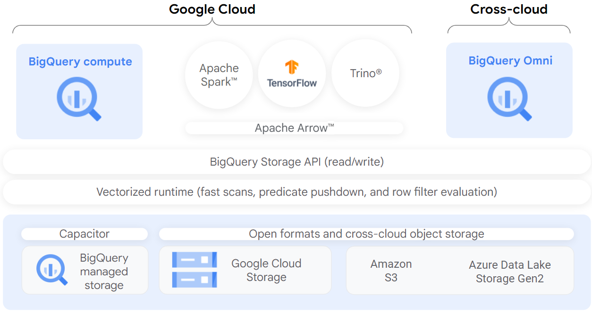

---

## 🎯 Objetivos del lab

- Crear y visualizar un **recurso de conexión externo**.
- Configurar el acceso a un **data lake en Cloud Storage**.
- Crear una **tabla de BigLake**.
- Consultar la tabla desde **BigQuery**.
- Establecer **políticas de control de acceso**.
- Convertir una **tabla externa existente** en una de BigLake.

---

# Canalización de datos de extracción y carga - EL


**Extract (Extraer)**

Obtener datos desde una o varias fuentes de datos:

      Bases de datos relacionales (MySQL, PostgreSQL, SQL Server)

      Archivos planos (CSV, JSON, XML)

      APIs (REST, GraphQL)

      Sistemas de almacenamiento en la nube (Cloud Storage, S3)

      Sistemas legacy (on-premise)

**Load (Cargar)**
Transferir esos datos tal como están (sin transformar) a un sistema de almacenamiento central, como:

      Un Data Lake (ej: Google Cloud Storage, Amazon S3)

      Un Data Warehouse (ej: BigQuery, Snowflake, Redshift)


### ¿Por qué a veces solo se hace EL y no ETL?

Porque en arquitecturas modernas (data lakehouse, por ejemplo), se prefiere separar el procesamiento de los datos de su almacenamiento:

Se extraen y cargan todos los datos sin procesar (“raw data”) al lago de datos.

Luego, se hacen las transformaciones necesarias por separado, según la necesidad analítica (por lotes o en tiempo real).

### Ventajas del enfoque EL
Te permite almacenar los datos completos, incluso si hoy no sabés cómo vas a usarlos.

Facilita el versionado y el reprocesamiento posterior.

Se adapta mejor a entornos de Big Data y herramientas modernas como Apache Spark, BigQuery, Databricks.

#

---

##  Flujo del laboratorio

### Tarea 1: Crear un Recurso de Conexión
Las tablas de BigLake acceden a los datos de Google Cloud Storage a través de un recurso de conexión. Un recurso de conexión puede estar asociado con una sola tabla o un grupo arbitrario de tablas en el proyecto.

1. Ir a **BigQuery > BigQuery Studio**.
2. Click en **`+ AGREGAR > Connections to external data sources`.**
3. En la lista Tipo de conexión, selecciona **Vertex AI remote models, remote functions and BigLake (Cloud Resource).**


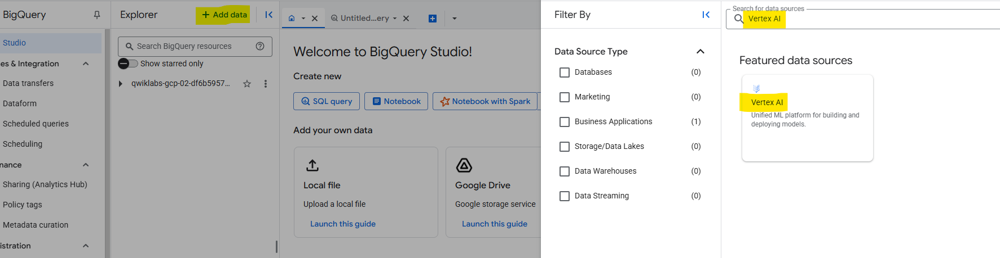
  
 
 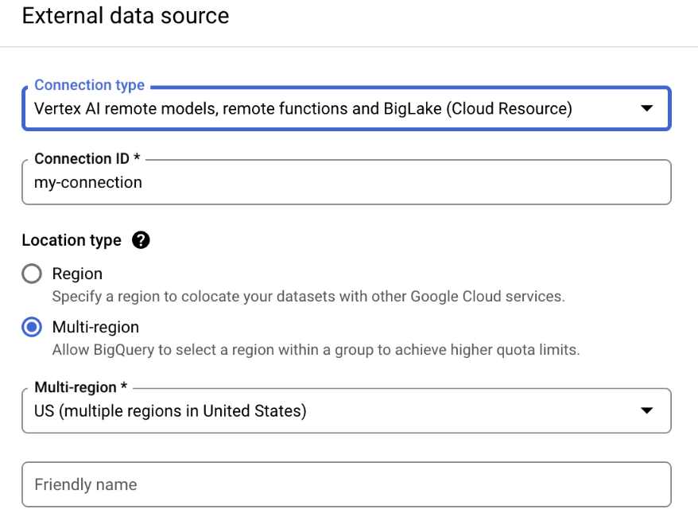


4. En el campo ID de conexión, ingresa `my-connection`.
5. En Tipo de ubicación, elige Multirregional y selecciona **EE.UU. (varias regiones en Estados Unidos)** en el menú desplegable.
6. Haz clic en **Crear conexión.**
7. Para ver la información de conexión, selecciona la conexión en el menú de navegación.(BigQuery)


8. En la sección **Información de conexión** , copia el ID de la cuenta de servicio. Lo necesitarás en la siguiente sección.  

    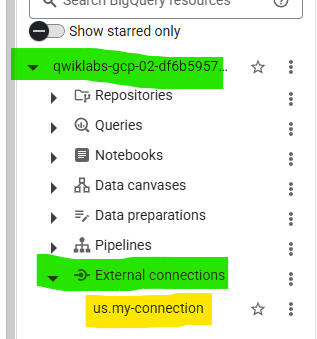
    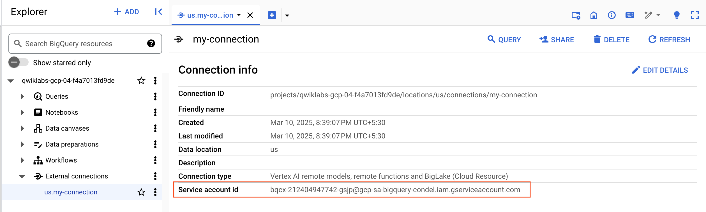


### Chequeamos Cloud Storage, ya que este lab --> BigLake: Qwik Start ya viene preconfigurado un bucket en Cloud Storage con los archivos de datos que vas a usar.
   

#
### 2. Tarea 2: Configurar el Acceso a Cloud Storage
En esta sección, le otorgarás al recurso de conexión nuevo acceso de solo lectura al data lake de Cloud Storage para que BigQuery pueda acceder a los archivos en nombre de los usuarios. Recomendamos que otorgues a la cuenta de servicio del recurso de conexión el rol de IAM de Visualizador de objetos de Storage, que permite que la cuenta de servicio acceda a los buckets de Cloud Storage.

1. Ir a **IAM y administración > IAM**.
2. Click en `+GRANT ACCESS`.
3. En el campo **Principales nuevas**, ingresa el ID de cuenta de servicio que **copiaste antes.**
4. En el campo **Seleccionar un rol**, elige **Cloud Storage** y, luego, **Storage Object Viewer.**
   
5. **Guardar los cambios (Save)**.


#
### Tarea 3: Crear una Tabla de BigLake
En el siguiente ejemplo, se usa el formato de archivo CSV, pero puedes usar cualquier formato que admita BigLake, como se muestra en Limitaciones. Si conoces la creación de tablas en BigQuery, este proceso debe ser similar. La única diferencia es que debes especificar la conexión de los recursos en la nube asociados.

1. Crear conjunto de datos en **BigQuery**: `demo_dataset` y en Tipo de ubicación, elige **Multirregional**
2. Crear nueva tabla:
   - Fuente: `customer.csv` desde Cloud Storage.
   - Nombre: `biglake_table`.
   - Tipo de tabla: **Tabla externa**.
   - Usar conexión BigLake: `us.my-connection`.
      
   - En Esquema, **habilita Editar como texto** y copia y pega el siguiente esquema en el cuadro de texto:
      ```json
      [
      {
         "name": "customer_id",
         "type": "INTEGER",
         "mode": "REQUIRED"
      },
      {
         "name": "first_name",
         "type": "STRING",
         "mode": "REQUIRED"
      },
      {
         "name": "last_name",
         "type": "STRING",
         "mode": "REQUIRED"
      },
      {
         "name": "company",
         "type": "STRING",
         "mode": "NULLABLE"
      },
      {
         "name": "address",
         "type": "STRING",
         "mode": "NULLABLE"
      },
      {
         "name": "city",
         "type": "STRING",
         "mode": "NULLABLE"
      },
      {
         "name": "state",
         "type": "STRING",
         "mode": "NULLABLE"
      },
      {
         "name": "country",
         "type": "STRING",
         "mode": "NULLABLE"
      },
      {
         "name": "postal_code",
         "type": "STRING",
         "mode": "NULLABLE"
      },
      {
         "name": "phone",
         "type": "STRING",
         "mode": "NULLABLE"
      },
      {
         "name": "fax",
         "type": "STRING",
         "mode": "NULLABLE"
      },
      {
         "name": "email",
         "type": "STRING",
         "mode": "REQUIRED"
      },
      {
         "name": "support_rep_id",
         "type": "INTEGER",
         "mode": "NULLABLE"
      }
      ]
      ```

3. Haz clic en **Crear la tabla.**

    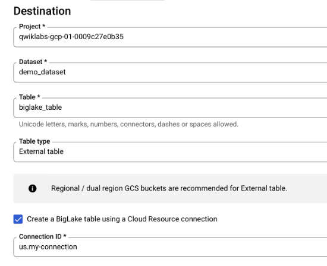

#
### Tarea 4: Consulta una tabla de BigLake con BigQuery

Ahora que creaste la tabla de BigLake, puedes usar cualquier cliente de BigQuery para enviar una consulta.

Ejecuta lo siguiente para consultar la **tabla de BigLake** a través del editor de BigQuery:

```sql
SELECT * FROM `PROJECT_ID.demo_dataset.biglake_table`

-- La consulta muestra los datos correctamente desde el archivo en Cloud Storage.
```


#
### Tarea 5: Configurar Políticas de Control de Acceso (Columnas)

Una vez que se crea una tabla de BigLake, se puede administrar de manera similar que las tablas de BigQuery. Para crear políticas de control de acceso para tablas de BigLake, primero crearás una taxonomía de etiquetas de políticas en BigQuery. Luego, debes aplicar las etiquetas de política a las filas o columnas sensibles. En esta sección, crearás una política a nivel de la columna

1. En **BigQuery > demo_dataset > biglake_table**, seleccionar `Editar esquema`.
2. Seleccionar las columnas sensibles:
   - `address`, `postal_code`, `phone`.
3. Haz clic en **Agregar etiqueta de política.**
4. Haz clic en `taxonomy name` para expandirlo y seleccionar **biglake-policy.**

5. Haz clic en **Seleccionar.** --> Ahora, tus columnas deben tener adjuntas las etiquetas de política.

6. Haz clic en **Guardar.**

7. Verifica que tu esquema de tablas ahora se ve de la siguiente manera.


      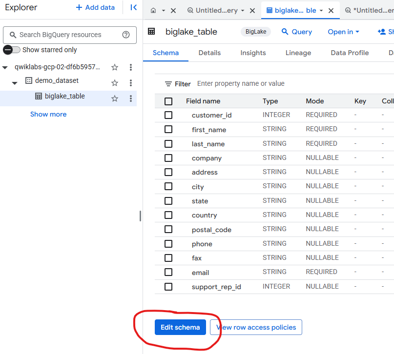
      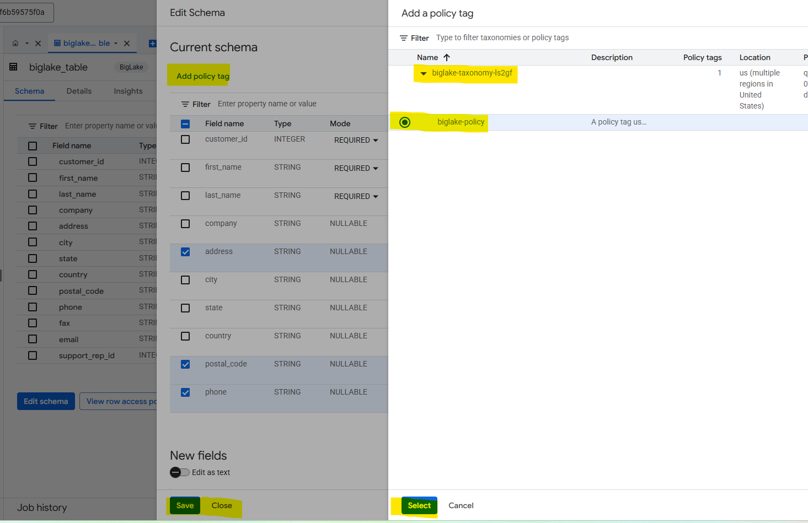
      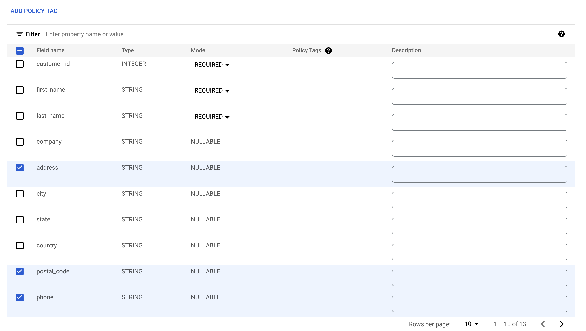
      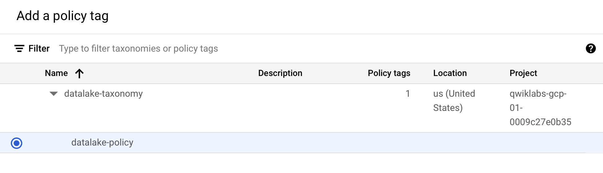
      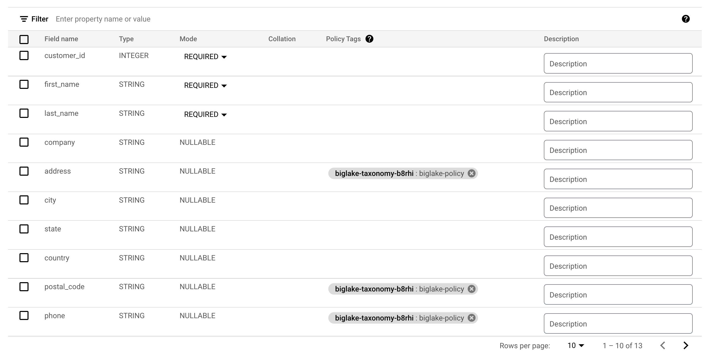
      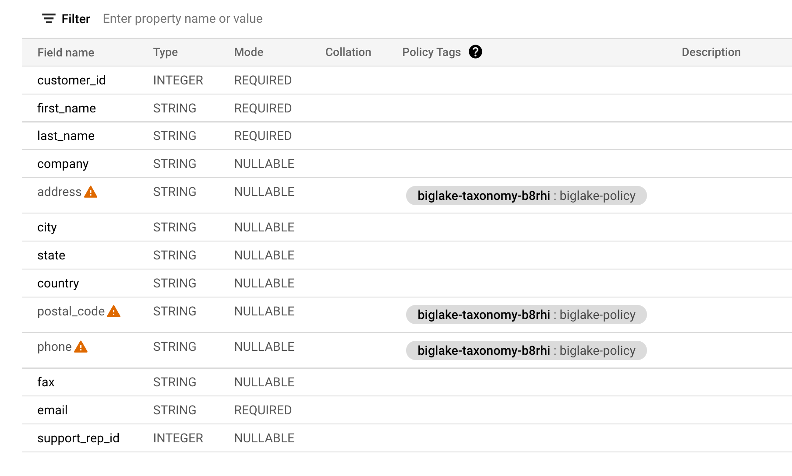

  


### Verifica la seguridad a nivel de la columna

   - Abre el editor de consultas de biglake_table.

   - Ejecuta lo siguiente para consultar la tabla de BigLake a través del editor de BigQuery:

      ```sql
      SELECT * FROM `PROJECT_ID.demo_dataset.biglake_table`
      -- Resultado: error de acceso denegado
      ```
   - Haz clic en Ejecutar.

            Deberías recibir un error de acceso denegado:

      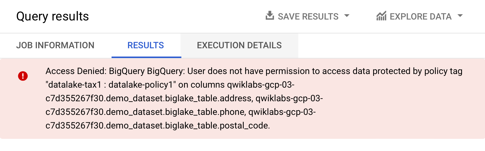


- Ahora, ejecuta la siguiente consulta, pero omite las columnas a las que no tienes acceso:

    ```sql
      SELECT * EXCEPT(address, phone, postal_code)
      FROM `PROJECT_ID.demo_dataset.biglake_table`
    ```
  La consulta debe ejecutarse sin problemas y devolver las columnas a las que tienes acceso. En este ejemplo, se muestra que la seguridad a nivel de la columna aplicada a través de BigQuery también se puede aplicar a tablas de BigLake.

  
  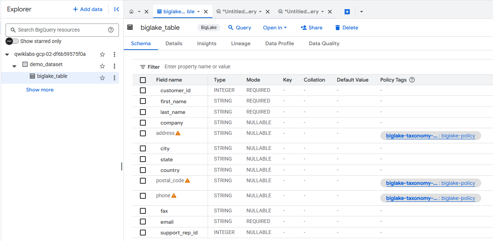


#
### Tarea 6. Actualiza las tablas externas a tablas de BigLake

Para actualizar las tablas existentes a las tablas de BigLake, asocia la tabla existente con una conexión de recursos en la nube. Para obtener una lista completa de marcas y argumentos, consulta `bq update` y `bq mkdef.`

### Crea la tabla externa
- Haz clic en los tres puntos junto a **demo_dataset**, luego, elige **Crear tabla.**

- En Fuente para **Crear tabla desde**, elige **Google Cloud Storage.**

- Haz clic en **Explorar** para seleccionar el conjunto de datos. Navega al bucket denominado `Project ID` y, luego, al archivo `invoice.csv` para importarlo a BigQuery y haz clic en **Seleccionar.**

- En **Destino**, verifica que se seleccionó tu proyecto de lab y que estás utilizando el demo_dataset.

- Para el nombre de la tabla, utiliza `external_table.`

- Cambia el tipo de tabla a **Tabla externa.**

- En **Esquema**, habilita **Editar como texto** y copia y pega el siguiente esquema en el cuadro de texto:


```json
[
{
    "name": "invoice_id",
    "type": "INTEGER",
    "mode": "REQUIRED"
  },
  {
    "name": "customer_id",
    "type": "INTEGER",
    "mode": "REQUIRED"
  },
  {
    "name": "invoice_date",
    "type": "TIMESTAMP",
    "mode": "REQUIRED"
  },
  {
    "name": "billing_address",
    "type": "STRING",
    "mode": "NULLABLE"
  },
  {
    "name": "billing_city",
    "type": "STRING",
    "mode": "NULLABLE"
  },
  {
    "name": "billing_state",
    "type": "STRING",
    "mode": "NULLABLE"
  },
  {
    "name": "billing_country",
    "type": "STRING",
    "mode": "NULLABLE"
  },
  {
    "name": "billing_postal_code",
    "type": "STRING",
    "mode": "NULLABLE"
  },
  {
    "name": "total",
    "type": "NUMERIC",
    "mode": "REQUIRED"
  }
]
```
- Haz clic en **Crear tabla.**


   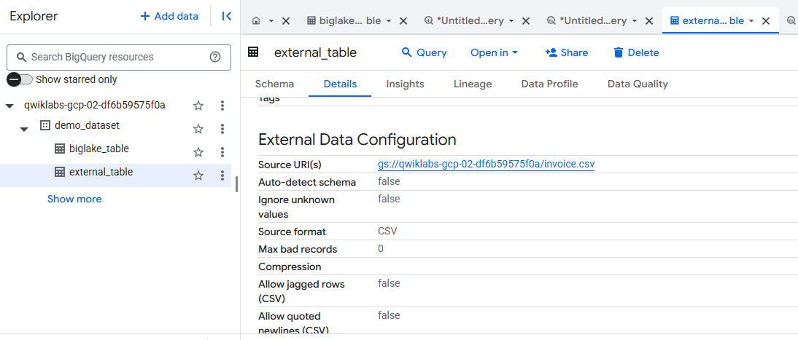
### Actualiza la tabla externa a la tabla de BigLake

   Abre una nueva ventana de Cloud Shell y ejecuta el siguiente comando para generar una nueva definición de tabla externa que especifique cuál conexión usar:
   ```sql
   export PROJECT_ID=$(gcloud config get-value project)
   bq mkdef \
   --autodetect \
   --connection_id=$PROJECT_ID.US.my-connection \
   --source_format=CSV \
   "gs://$PROJECT_ID/invoice.csv" > /tmp/tabledef.json
   ```
- Verifica que se haya creado tu definición de tabla:
   ```sql
   cat /tmp/tabledef.json
   ```
- Obtén el esquema de tu tabla:
   ```sql
   bq show --schema --format=prettyjson  demo_dataset.external_table > /tmp/schema
   ```
- Actualiza la tabla con la definición de tabla externa nueva:
   ```sql
   bq update --external_table_definition=/tmp/tabledef.json --schema=/tmp/schema demo_dataset.external_table
   ```

### Verifica la tabla actualizada

- En el menú de navegación, ve a **BigQuery > BigQuery Studio.**

- Navega a `demo-dataset` y haz doble clic en **external_table.**

- Abre la pestaña **Detalles.**

- Verifica en la configuración de datos externos que la tabla ahora esté usando el ID de conexión correcto.

   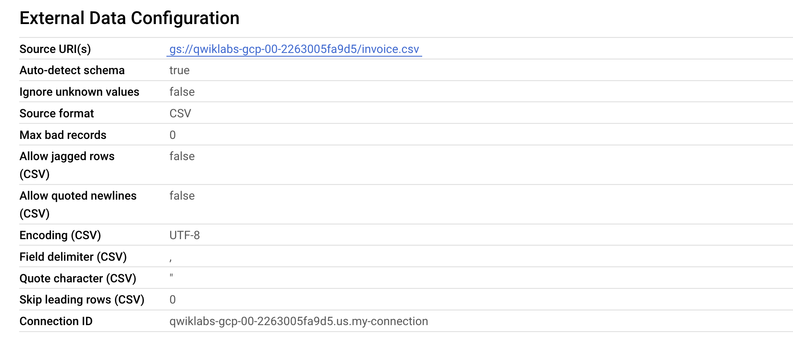

- Actualizaste correctamente la tabla externa existente a una tabla de BigLake asociándola a una conexión de recurso de nube.
---

##  Conceptos clave

- **BigLake**: permite consultar datos externos (Cloud Storage, Amazon S3, Azure) como si estuvieran en BigQuery.
- **Tablas externas vs. BigLake**:
  - BigLake permite seguridad avanzada, rendimiento optimizado y soporte multi-cloud.
  - Las tablas externas son más simples pero con limitaciones de seguridad.
- **Caché de metadatos**: mejora el rendimiento de las consultas en BigLake.
- **Delegación de acceso**: separación de acceso entre la tabla y la fuente subyacente.

---

##  

## 🧪 Resumen del Lab

En este lab se aprende a **crear y consultar una tabla BigLake en BigQuery** usando datos ya almacenados en un **bucket preconfigurado de Cloud Storage**.  

Pasos principales:  
1. Verificar el bucket y los archivos de datos provistos.  
2. Crear una **conexión de recursos externos** en BigQuery.  
3. Definir una **tabla BigLake** que apunta a los datos en Cloud Storage.  
4. Asignar permisos para controlar el acceso.  
5. Consultar los datos con SQL en BigQuery **sin copiarlos** a almacenamiento interno.  

💡 **Objetivo:** Unificar acceso a datos externos con BigLake, manteniendo seguridad y gobernanza centralizada.  

## Tipo de Proceso: EL (Extract & Load)

Este laboratorio implementa un flujo de **Extract & Load (EL)**, es decir:  

- **Extract (Extracción):** Se accede a datos en un bucket externo de Cloud Storage.  
- **Load (Carga):** Los datos se exponen como tabla BigLake en BigQuery.  
- **Transform (Transformación):** No se realizan transformaciones significativas durante el lab.  

Esto permite consultar datos externos con SQL sin mover ni duplicar los datos físicamente.  


---

## 🔗 Recursos adicionales

- [Documentación oficial de BigLake](https://cloud.google.com/bigquery/docs/biglake-intro)
- [Guía del lab en Cloud Skills Boost](https://www.cloudskillsboost.google/catalog_lab/4896)
- [Comparación de tablas externas vs BigLake](https://cloud.google.com/bigquery/docs/external-data-sources#external_data_source_feature_comparison)

---

