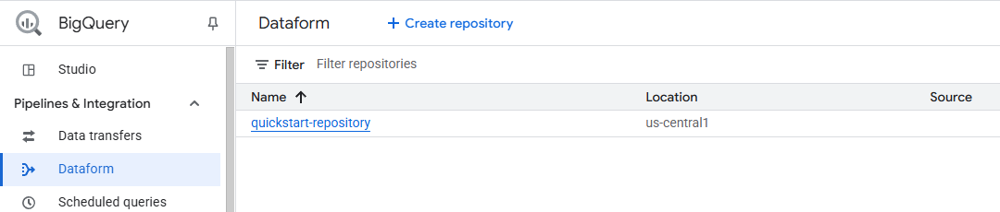
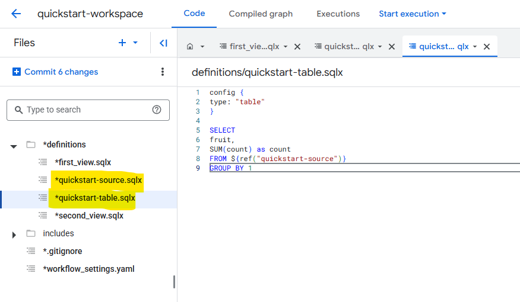
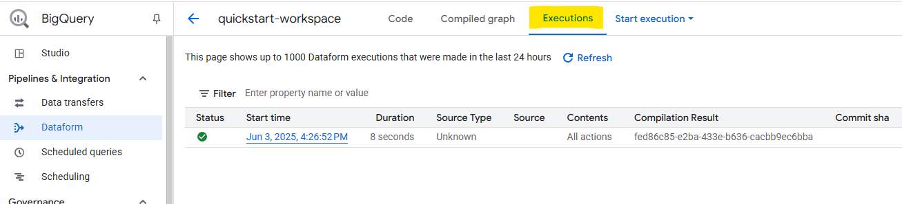
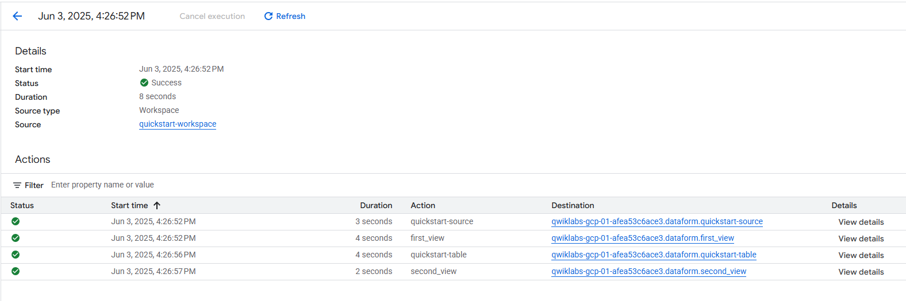

# 🛠️ Lab: Crear y ejecutar un flujo de trabajo en SQL en Dataform

Este laboratorio pertenece al módulo de canalización **ELT** en Google Cloud. A diferencia del clásico ETL, en **ELT** los datos se cargan primero y se transforman después, ya dentro del sistema de análisis. Usarás Dataform, una herramienta sin servidores y enfocada en SQL, para transformar esos datos directamente en BigQuery, de forma organizada y automatizada.

---

## 🎯 Objetivos del lab

- Crear un **repositorio de Dataform**.
- Inicializar un **espacio de trabajo de desarrollo**.
- Crear y ejecutar un **flujo de trabajo de SQL**.
- Verificar los **registros de ejecución** para validar los resultados.

---

##  ELT - extracción, carga y transformación


- **Extract (Extraer)**
Obtenés los datos desde las fuentes originales 


- **Load (Cargar)**
Cargás esos datos sin transformar en un destino central, normalmente un Data Warehouse

- **Transform (Transformar)**
Una vez cargados, hacés las transformaciones dentro del Data Warehouse, usando SQL u otras herramientas.

---

##  Flujo del laboratorio

### Tarea 1. Crear un repositorio de formularios de datos

1. En la consola, expanda el menú Navegación y luego seleccione **BigQuery > Dataform.**
2. Haga clic en **CREAR REPOSITORIO (CREATE REPOSITORY ) .**


3. On the **Create repository** page, do the following:

    - In the **Repository ID** field, enter `quickstart-repository.`

    - In the **Region** list, select `REGION.`

    -  Click **CREATE.**

    - Una vez creado el repositorio, verá la cuenta de servicio de Dataform. Cópiela para poder usarla más adelante y asignar los permisos necesarios.

    - Haga clic en **Go to Repositories (Ir a repositorios).**

  ## NOTA IMPORTANTE: COPIAR CUENTA DE SERVICIO

   
#

### Tarea 2. Crear e inicializar un espacio de trabajo de desarrollo de Dataform    


1. En la página Dataform, haga clic en el repositorio **quickstart-repository** que acaba de crear.

2. Haga clic en **CREATE DEVELOPMENT WORKSPACE** .

3. En la ventana **Create development workspace** , haga lo siguiente:

    -   En el campo **Workspace ID** , ingrese `quickstart-workspace`.

    - Haga clic en **CREATE** .

4. Una vez creado, haga clic en el espacio de trabajo de desarrollo del espacio de trabajo de inicio rápido .

5. Haga clic en **INITIALIZE WORKSPACE**.


#
### 3. Crear flujo de trabajo en SQL
- Crear archivos `.sqlx` para definir tablas, vistas, operaciones o aserciones.
- Utilizar bloques `config`, `js`, `pre_operations`, `post_operations`.
- Establecer dependencias con `ref()` o `dependencies`.


#
### Tarea 3. Crear un archivo SQLX para definir una vista

En esta sección, define una vista que luego utilizarás como fuente de datos para una tabla.

1. En el panel **Files** , junto a definitions, haga clic en el menú **More**.

2. Haga clic en **Create file**.

3. En el panel **Create new file** , haga lo siguiente:

    - En el campo **Add a file path** , ingrese `definitions/quickstart-source.sqlx`.

    - Haga clic en **CREATE FILE** .
    
  

### Definir una vista

1. En el panel **Files** , expanda la carpeta de **definitions** .

2. Haga clic en `quickstart-source.sqlx`.

3. En el archivo, ingrese el siguiente fragmento de código:

```sql

config {
  type: "view"
}

SELECT
  "apples" AS fruit,
  2 AS count
UNION ALL
SELECT
  "oranges" AS fruit,
  5 AS count
UNION ALL
SELECT
  "pears" AS fruit,
  1 AS count
UNION ALL
SELECT
  "bananas" AS fruit,
  0 AS count
```

  
  #
## Tarea 5. Otorgar acceso a Dataform a BigQuery.

1. En la consola de Google Cloud, en el **menú de Navegación** (Icono del menú de navegación), seleccione **IAM y administrador > IAM .**

2. Haga clic en **VIEW BY PRINCIPALS** . A continuación, haga clic en **GRANT ACCESS.**

3. En el campo **New principals** , ingrese el ID de su cuenta de servicio Dataform.

4. En la lista desplegable **Seleccionar un rol** , seleccione el rol **BigQuery Job User**.

5. Haga clic en **Agregar otro rol** y, luego, en la lista desplegable Seleccionar un rol , seleccione el rol **BigQuery Data Editor** .

6. Haga clic en **Add another role** y, luego, en la lista desplegable Seleccionar un rol , seleccione el rol **BigQuery Data Viewer** .

7. Haga clic en **Save** .


## Tarea 6. Ejecutar el flujo de trabajo

1. En la consola, vaya a **Navigation Menu > BigQuery > Dataform.**

2. Haga clic en **quickstart-repository** para abrir el repositorio.

3. Haga clic en **quickstart-workspace** para abrir el espacio de trabajo de desarrollo.

4. En la página del **quickstart-workspace** , haga clic en **START EXECUTION .**

5. Haga clic en **Execute actions** .

    

6. Haga clic en la pestaña **All actions** .

7. En el panel **Execute** , haga clic en **START EXECUTION** .

Dataform utiliza la configuración del repositorio predeterminada para crear el contenido de su flujo de trabajo en un conjunto de datos de BigQuery llamado `dataform`.

### Ver registros de ejecución.

1. En la página **quickstart-workspace** , haga clic en **EXECUTIONS** para abrir el panel Ejecuciones.

2. Para ver los detalles de su ejecución, haga clic en la última ejecución.

    
    
---

##  Conceptos clave

- **ELT**: los datos se cargan primero en BigQuery y luego se transforman.
- **Dataform**: permite organizar, versionar y programar transformaciones de SQL.
- **SQLX**: archivos que mezclan SQL + JS para crear tablas, vistas y control de calidad.
- **Aserciones y operaciones**: para validaciones de calidad de datos y SQL personalizado.
- **Dependencias**: se definen con `ref()` (implícitas) o con `dependencies[]` (explícitas).
- **Compilación + Ejecución**: Dataform compila los archivos y ejecuta los flujos en BigQuery.

---

## 🧪 Resultado esperado

✔️ Un repositorio funcional con estructura de proyecto Dataform.  
✔️ Transformaciones definidas en archivos SQLX.  
✔️ Flujo de trabajo ejecutado y validado en BigQuery.  
✔️ Logs disponibles para seguimiento y debugging.

---

## 🔗 Recursos útiles

- [Lab oficial](https://www.cloudskillsboost.google/catalog_lab/20934)
- [Documentación Dataform](https://cloud.google.com/dataform/docs)
- [Referencias SQLX](https://cloud.google.com/dataform/docs/dataform-core)
- [Aserciones y operaciones](https://cloud.google.com/dataform/docs/assertions)

---

