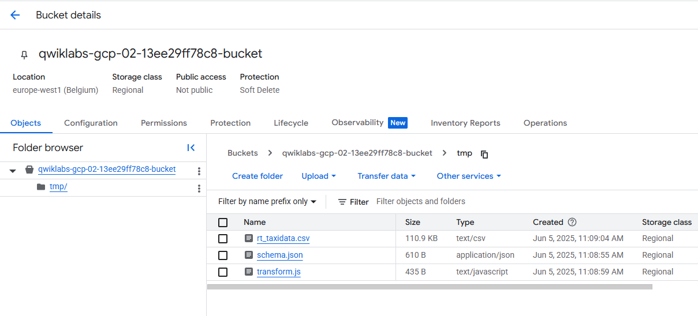
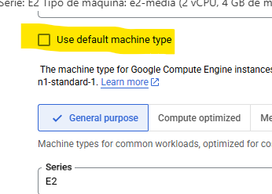
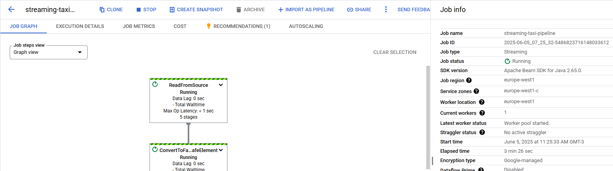

# 📊 Lab: Crear una canalización de transmisión de datos para un panel en tiempo real con Dataflow

Este laboratorio se enmarca en el módulo de canalización de datos ELT (Extract, Load, Transform) en Google Cloud. A lo largo del ejercicio, crearás una canalización de datos en tiempo real con Dataflow, que ingresa información, la carga en BigQuery, y finalmente permite visualizar indicadores clave en vivo con Looker Studio.

---

## 🎯 Objetivos del lab

- Crear un trabajo de **Dataflow** usando una plantilla preexistente.
- Transmitir datos a **BigQuery**.
- Supervisar el trabajo desde la consola de Dataflow.
- Consultar los datos en BigQuery con SQL.
- Visualizar las métricas clave en **Looker Studio**.


---
## Descripción general

En este laboratorio, usted es propietario de una flota de taxis en Nueva York y busca monitorear el rendimiento de su negocio en tiempo real. Construirá un flujo de datos en tiempo real para registrar los ingresos de los taxis, el número de pasajeros, el estado de los viajes y mucho más, y luego visualizará los resultados en un panel de gestión.

El objetivo de este laboratorio es que construyas un pipeline de datos en tiempo real usando Dataflow, para simular cómo una empresa (en este caso, una flota de taxis en Nueva York) puede monitorear sus operaciones minuto a minuto.
#
##  Flujo del laboratorio

### Tarea 1. Crear un conjunto de datos de BigQuery

En esta tarea, creará el conjunto de datos llamado `taxirides`.


En este laboratorio, utilizará un extracto del conjunto de datos abierto de la Comisión de Taxis y Limusinas de Nueva York : https://data.cityofnewyork.us/


 Se utilizará un pequeño archivo de datos, separado por comas, para simular actualizaciones periódicas de los datos de taxis.


1. En la consola de Google Cloud, en el **menú de Navegación** , haga clic en **BigQuery** .

2. Si ve el cuadro de diálogo de bienvenida, haga clic en **Listo**.

3. Haga clic en **Ver acciones** junto a su ID de proyecto y luego haga clic en **Crear conjunto de datos**.

4. En ID del conjunto de datos, escriba `taxirides`.

5. En Ubicación de datos, seleccione:

        Region

6.  Luego haga clic en **Create Dataset**.

7. En el panel del Explorador de Bigquery, haga clic en expandir nodo para evr el **Dataset creado**.

8. Haga clic en Ver acciones  junto al conjunto de datos de `taxirides` y, a continuación, haga clic en **Abrir**.

9. Haga clic en **Create Table**.

10. En la tabla, escriba **realtime**.

11. Para el esquema, haga clic en **Edit as text** y pegue lo siguiente:

    ```sql
    -- Definimos el esquema manualmente, en lugar de subir un archivo o inferir el esquema automáticamente


    ride_id:string,
    point_idx:integer,
    latitude:float,
    longitude:float,
    timestamp:timestamp,
    meter_reading:float,
    meter_increment:float,
    ride_status:string,
    passenger_count:integer
    ```

12. En **Partition and cluster settings**, seleccione **timestamp.**

13. Click **Create Table**.
#
### Tarea 2. Copiar Archivos Necesarios al Bucket de Cloud Storage
- Enviar archivos simulados a Cloud Storage (simulación de eventos).
- Confirmar que la canalización detecta y carga datos en BigQuery.


En esta tarea, moverás los archivos necesarios a tu Proyecto.

Al iniciar el lab, el bucket de Cloud Storage **ya está creado automáticamente por el entorno del laboratorio.**

 Generalmente:

 - Tiene un nombre con este formato: qwiklabs-gcp-<algo>-bucket

 - Es creado en la región que el lab indica por defecto.

 - Ya tenés permisos para leer y escribir en él.

Por eso, **no hace falta crearlo manualmente.** Solo tenés que usar ese bucket para:

 - Copiar los archivos del lab (`schema.json`, `transform.js`, `rt_taxidata.csv`).

 - Especificarlo como Temp location al crear el pipeline de Dataflow.

 1. En **Cloud Shell** , ejecute los siguientes comandos para mover los archivos necesarios para el trabajo de Dataflow:

  ```bash
  gcloud storage cp gs://cloud-training/bdml/taxisrcdata/schema.json  gs://Project_ID-bucket/tmp/schema.json
  gcloud storage cp gs://cloud-training/bdml/taxisrcdata/transform.js  gs://Project_ID-bucket/tmp/transform.js
  gcloud storage cp gs://cloud-training/bdml/taxisrcdata/rt_taxidata.csv  gs://Project_ID-bucket/tmp/rt_taxidata.csv
  ```

### ¿ Que hace este comando ? 

opia archivos desde un bucket público (read-only), usado por Google para entrenamientos: `gs://cloud-training/bdml/taxisrcdata/`.

Y los guarda en bucket propio, que tenés que reemplazar con el nombre real de tu bucket (donde dice `Project_ID-bucket`). El subdirectorio `/tmp/` es solo una carpeta lógica: `gs://Project_ID-bucket/tmp/`


  

#
### Tarea 3. Crear el Pipeline de Streaming en Dataflow


 #### 3.1 - Reinicie la conexión a la API de Dataflow.

- En Cloud Shell, ejecute los siguientes comandos para asegurarse de que la API de Dataflow esté habilitada correctamente en su proyecto.

    ```sh
    gcloud services disable dataflow.googleapis.com
    gcloud services enable dataflow.googleapis.com
    ```

 #### 3.2 - Crear una nueva canalización de streaming:


1. En la consola,en el menú de Navegación, haga clic en **View all Products > Analytics > Dataflow.**

2. En la barra de menú superior, haga clic en **Create Job From Template.**

3. Escriba `streaming-taxi-pipeline` como nombre de trabajo para su trabajo de Dataflow.

4. en **Regional endpoint**, selecione: 

        Region

5. En **Dataflow template** , seleccione la plantilla **Cloud Storage Text to Bigquery (Stream)** en **Process Data Continuously (stream).**

( plantilla: Texto de almacenamiento en la nube a Bigquery (transmisión) en Procesar datos de forma continua (transmisión) . )

6. En ` Cloud Storage Input File(s)` , pegue o escriba:

    ```sh
    # Ruta del archivo fuente en Cloud Storage. Este CSV contiene los datos de taxi que se procesarán en streaming.

    Project_ID-bucket/tmp/rt_taxidata.csv
    ```

7. En `Cloud Storage location of your BigQuery schema file, described as a JSON`, pegue o escriba:

    ```sh
    # Archivo .json que define el esquema de la tabla de BigQuery (los campos y tipos de datos). Es necesario para que Dataflow entienda cómo mapear las columnas.

    Project_ID-bucket/tmp/schema.json
    ```

8. En `BigQuery Output table`, pegue o escriba:
    ```sh
    # Tabla de destino donde se cargarán los datos procesados.

    Project_ID:taxirides.realtime
    ```

9. En `Temporary directory for BigQuery loading process` , pegue o escriba:
    ```sh
    # Directorio temporal que Dataflow usará para cargar datos a BigQuery. Este paso es intermedio y esencial para el procesamiento en streaming.

    Project_ID-bucket/tmp
    ```

10. Haga clic en`Required Parameters`.
11. En `Temporary location`, utilizada para escribir archivos temporales, pegue o escriba:
    ```sh
    # Ubicación para archivos temporales del pipeline en general.

    Project_ID-bucket/tmp
    ```
12. En `JavaScript UDF path in Cloud Storage`, pegue o escriba:

    ```sh
    # Archivo .js con la lógica de transformación en JavaScript.Esto permite transformar los datos antes de cargarlos a BigQuery.

    Project_ID-bucket/tmp/transform.js
    ```
13. En `JavaScript UDF name` , pegue o escriba:

    ```sh
    # Nombre de la función definida dentro del archivo transform.js
    transform
    ```


14. En **Max workers,** , tipo 2 (Cantidad máxima de workers que puede usar el job para escalar)
15. En **Number of workers**, escriba 1. (Workers que se inician al comenzar. Como mínimo uno)
16. Desmarque la opción **Use default machine type**. (Así podés elegir manualmente el tipo de máquina).

    

17. En **Propósito general (General purpose)** , seleccione lo siguiente:

    Serie: E2
    Tipo de máquina: e2-media (2 vCPU, 4 GB de memoria)
  
18. Haga clic en **Run Job** .

    

### ¡Ha comenzado un nuevo trabajo de streaming! Ahora puede ver una representación visual del flujo de datos. Los datos tardarán entre 3 y 5 minutos en empezar a transferirse a BigQuery.

## ✅ Resultado
Se lanza un pipeline de streaming en Dataflow que:

- **Lee archivos CSV** desde Cloud Storage,

- **Transforma los datos** usando una función JavaScript,

- **Escribe los datos en tiempo real** en BigQuery,


#
## Tarea 4. Analizar los datos de taxis con BigQuery.

En esta tarea, analiza los datos a medida que se transmiten.

1. Ir a **Bigquery**

2. En el Editor de consultas, escriba lo siguiente y haga clic en **Ejecutar**:

```sql
-- para ver una muestra rápida de los datos que están llegando a la tabla.

SELECT * FROM taxirides.realtime LIMIT 10
```

#
## Tarea 5. Realizar agregaciones en el flujo para generar informes.

En esta tarea, se calculan agregaciones en la secuencia para generar informes.

1. En el **Query Editor** , borre la consulta actual.

2. Copie y pegue la siguiente consulta y luego haga clic en **Run** .

    ```sql
    WITH streaming_data AS (

    SELECT
    timestamp,
    TIMESTAMP_TRUNC(timestamp, HOUR, 'UTC') AS hour,
    TIMESTAMP_TRUNC(timestamp, MINUTE, 'UTC') AS minute,
    TIMESTAMP_TRUNC(timestamp, SECOND, 'UTC') AS second,
    ride_id,
    latitude,
    longitude,
    meter_reading,
    ride_status,
    passenger_count
    FROM
    taxirides.realtime
    ORDER BY timestamp DESC
    LIMIT 1000

    )

    # calculate aggregations on stream for reporting:
    SELECT
    ROW_NUMBER() OVER() AS dashboard_sort,
    minute,
    COUNT(DISTINCT ride_id) AS total_rides,
    SUM(meter_reading) AS total_revenue,
    SUM(passenger_count) AS total_passengers
    FROM streaming_data
    GROUP BY minute, timestamp
    ```

Esta consulta genera métricas clave **por minuto** sobre los últimos eventos registrados por la flota de taxis, alimentada en tiempo real mediante un pipeline de **Dataflow**.

### 🔧 ¿Qué hace esta query?

Construye un resumen **en tiempo real** de la operación de la flota de taxis, agrupando información **por minuto** a partir de los **últimos 1000 eventos** registrados en la tabla `taxirides.realtime`, que se actualiza mediante Dataflow en modo streaming.

Este resumen puede utilizarse para crear un **dashboard de monitoreo en Looker Studio**, visualizando la actividad minuto a minuto del servicio de taxis.

---

### 🔎 ¿Cómo lo hace?

1. **Crea una tabla temporal** llamada `streaming_data`:
   - Toma las últimas 1000 filas (eventos más recientes) de la tabla `taxirides.realtime`.
   - Extrae el `timestamp` de cada evento en tres niveles de granularidad: hora, minuto y segundo (`TIMESTAMP_TRUNC`).
   - Selecciona campos clave como `ride_id`, `latitude`, `longitude`, `meter_reading`, `ride_status` y `passenger_count`.

2. **Realiza agregaciones por minuto**:
   - `COUNT(DISTINCT ride_id)` → total de viajes únicos.
   - `SUM(meter_reading)` → total recaudado en ese minuto.
   - `SUM(passenger_count)` → cantidad de pasajeros transportados.

3. **Agrega una columna `dashboard_sort`** usando `ROW_NUMBER()` para facilitar el orden en dashboards.

---

### 📈 Métricas calculadas

- 🚖 **Cantidad total de viajes** (`total_rides`)
- 💰 **Recaudación total** (`total_revenue`)
- 🧍‍♂️ **Total de pasajeros transportados** (`total_passengers`)

---

3. Haga clic **Save > Save query.**


4. En el cuadro de diálogo Guardar consulta, en el campo **Name** , escriba **My Saved Query**

5. En **Región** , asegúrese de que la región coincida con la región de laboratorio de Qwiklabs.

6. Click **Save.**


#
## Tarea 6. Detener el trabajo de flujo de datos.

En esta tarea, detiene el trabajo de Dataflow para liberar recursos para su proyecto.

1. En la consola de la nube, haga clic en **View all Products > Analytics > Dataflow.**

2. Haga clic en **streaming-taxi-pipeline** o en el nombre del nuevo trabajo.

3. Haga clic en **Stop** y luego seleccione **Cancel > Stop Job.** 


#


## 📊 Tarea 7 – Crear un Panel de Control en Tiempo Real (Looker Studio)

### 🎯 Objetivo

Construir un **dashboard en Looker Studio** que visualiza métricas clave minuto a minuto sobre los viajes de taxi, usando los datos procesados en tiempo real por Dataflow y almacenados en la tabla `taxirides.realtime`.

---

### 🧠 ¿Por qué hacerlo?

Visualizar los datos de forma gráfica facilita el análisis, la detección de patrones y el monitoreo operativo. Un panel en tiempo real permite:

- Observar la actividad minuto a minuto.
- Detectar picos o caídas en la demanda.
- Compartir métricas clave con otros equipos.

---

### 🧪 Pasos para crear el panel

1. Ingresá a BigQuery y asegurate de tener cargada y ejecutada la consulta SQL que agrupa los datos por minuto.
2. Hacé clic en **"Open in > Looker Studio"** desde los resultados de la query.
3. En Looker Studio, hacé clic en **"Get started"**.

#### 🧰 Configuración del gráfico

- Seleccioná el gráfico inicial que se genera automáticamente.
- Reemplazá la **dimensión de rango de tiempo**:
  - Eliminá `minute`.
  - Agregá `dashboard_sort` como nueva dimensión (permite mantener el orden correcto en el tiempo).

#### 📐 Métricas a visualizar

En el panel de configuración (`Setup > Metric`):

- Reemplazá `dashboard_sort` por:
  - `total_rides`
  - `total_passengers`
  - `total_revenue`

#### 📊 Tipo de gráfico

- Cambiá el tipo de gráfico a **Combo Chart** (gráfico combinado) para visualizar múltiples métricas al mismo tiempo.

#### ⚙️ Orden y detalles

- En `Setup > Sort`, seleccioná:
  - `dashboard_sort`
  - Orden **Ascendente**

---

### 💾 Guardar y compartir

1. Hacé clic en **"Save and share"** para guardar tu panel.
2. Completá los pasos de configuración de Looker Studio si es la primera vez.
3. Una vez guardado, podés compartir el enlace del panel o refrescar los datos manualmente con **"More options > Refresh data"**.

---

## 📈 Tarea 8 – Crear un Gráfico de Series Temporales

### 🎯 Objetivo

Visualizar la evolución en el tiempo de los viajes **en curso** (`ride_status = 'enroute'`), observando cómo varía la lectura del taxímetro (`meter_reading`) minuto a minuto.

---

### 🧪 Pasos para crear el gráfico de series temporales

1. Ingresá a [Looker Studio](https://lookerstudio.google.com/navigation/reporting).
2. Creá un nuevo informe en blanco: **Blank Report**.
3. Agregá una fuente de datos desde BigQuery:
   - Seleccioná **Custom Query**
   - Pegá la siguiente consulta:
     ```sql
     SELECT * FROM taxirides.realtime WHERE ride_status = 'enroute'
     ```
   - Hacé clic en **Add > Add to Report**.

#### ⏱️ Preparar el campo de tiempo

1. En el panel **Data**, hacé clic en **Add Field > Add calculated field**.
2. Cambiá el tipo del campo `timestamp` a:  
   `Date & Time > Date Hour Minute (AAAAMMDDhhmm)`
3. Guardá los cambios (`Continue > Done`).

---

### 📊 Insertar gráfico de serie temporal

1. En el menú superior, hacé clic en **Add a chart > Time series chart**.
2. Colocá el gráfico en el informe.
3. Configurá:
   - **Dimension:** `timestamp` o `calendar`
   - **Metric:** `meter_reading`

✅ Esto mostrará la evolución de los viajes en curso y sus valores del taxímetro minuto a minuto.

---

## 🧾 Conclusión

Con estas dos visualizaciones:

- El **Combo Chart** permite ver un resumen general de viajes, ingresos y pasajeros minuto a minuto.
- El **Gráfico de Series Temporales** muestra cómo evolucionan los viajes en curso en tiempo real.

Estas herramientas permiten tomar decisiones más rápidas y basadas en datos frescos, además de facilitar el monitoreo visual de la operación.

#
#
## 🔗 Recursos adicionales

- [Lab oficial en Cloud Skills Boost](https://www.cloudskillsboost.google/catalog_lab/1796)
- [Documentación de Dataflow](https://cloud.google.com/dataflow/docs)
- [Plantillas de Dataflow](https://cloud.google.com/dataflow/docs/guides/templates/provided)
- [Looker Studio](https://lookerstudio.google.com/)
#
