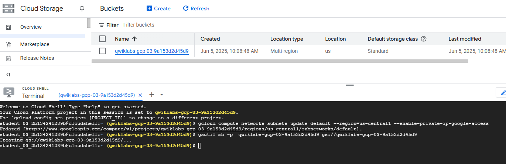

# Usa Dataproc Serverless para Spark para cargar archivos en una tabla de BigQuery

En este lab trabajarás con Dataproc Serverless para Spark, una opción sin servidores para ejecutar trabajos de procesamiento de datos. El objetivo es cargar archivos en BigQuery. Comenzarás configurando el entorno, luego descargarás los recursos del laboratorio, ejecutarás un script en Spark para procesar los datos, y al final verificarás los resultados en BigQuery.


 Referencia: https://www.cloudskillsboost.google/authoring/labs/31670

Objetivos de aprendizaje

    ● Configurar el entorno

    ● Descargar los recursos del lab

    ● Configurar y ejecutar el código de Spark
        
    ● Visualizar datos en BigQuery


## Descripción general
Dataproc Serverless es un servicio completamente administrado que facilita la ejecución de cargas de trabajo de procesamiento y análisis de datos de código abierto sin tener que administrar la infraestructura ni ajustar las cargas de trabajo de forma manual.

Dataproc Serverless para Spark proporciona un entorno optimizado diseñado para transferir con facilidad las cargas de trabajo de Spark existentes a Google Cloud.

En este lab, ejecutarás una carga de trabajo de Batch en un entorno de Dataproc Serverless. La carga de trabajo utilizará una plantilla de Spark para procesar un archivo Avro, y así crear y cargar una tabla de BigQuery.

## Actividades

En este lab, usarás Dataproc Serverless para Spark para cargar archivos en una  tabla de BigQuery.

 - Primero, configurarás el entorno.

 - Luego, descargarás los recursos del lab.
 - Después, configurarás y ejecutarás el código de Spark.
 - Finalmente, verás los datos en BigQuery.


# 
## Laboratorio
## Tarea 1. Completa las tareas de configuración del entorno.

Primero, realizarás algunas tareas de configuración del entorno para respaldar la ejecución de una carga de trabajo de Dataproc Serverless.

**1 - En Cloud Shell, ejecuta el siguiente comando, que habilitará el acceso a la IP privada:**

```bash
    gcloud compute networks subnets update default --region=REGION --enable-private-ip-google-access
```


**2 - Utiliza el siguiente comando para crear un nuevo bucket de Cloud Storage como la ubicación de etapa de pruebas:**
```sh
gsutil mb -p  PROJECT_ID gs://PROJECT_ID
```


**3 - Usa el siguiente comando para crear un nuevo bucket de Cloud Storage como ubicación temporal para BigQuery mientras crea y carga una tabla:**
```sh
gsutil mb -p  PROJECT_ID gs://PROJECT_ID-bqtemp
```


**4 - Crea un conjunto de datos de BigQuery para almacenar los datos.**
```sh
bq mk -d  loadavro
```


#
## Tarea 2. Descarga los recursos del lab

A continuación, descargarás algunos recursos necesarios para completar el lab en la VM de Compute Engine proporcionada para el lab. Realizarás el resto de los pasos del lab dentro de la VM de Compute Engine.

1 - En el menú de navegación, haz clic en **Compute Engine**. Aquí verás una VM de Linux aprovisionada para ti. Haz clic en el botón **SSH** junto a la instancia **lab-vm.**


2 - En el prompt de la terminal de la VM, descarga el archivo Avro que se procesará para su almacenamiento en BigQuery.
```sh
wget https://storage.googleapis.com/cloud-training/dataengineering/lab_assets/idegc/campaigns.avro
```
3 - A continuación, mueve el archivo Avro al bucket de Cloud Storage de la etapa de pruebas que creaste anteriormente.
```sh
gcloud storage cp campaigns.avro gs://PROJECT_ID
```


4 - Descarga un archivo que contenga el código de Spark que se ejecutará en el entorno de Dataproc Serverless.
```sh
wget https://storage.googleapis.com/cloud-training/dataengineering/lab_assets/idegc/dataproc-templates.zip
```

5 - Extrae el archivo.
```sh
unzip dataproc-templates.zip
```


6 - Cámbiate al directorio de Python.

```sh
cd dataproc-templates/python
```

#
## Tarea 3. Configura y ejecuta el código de Spark

A continuación, vas a establecer algunas variables de entorno en la **terminal de la instancia de VM** y ejecutarás una plantilla de Spark para cargar datos en BigQuery.

1 - Establece las siguientes variables de entorno para el entorno de Dataproc Serverless.
```sh
    export GCP_PROJECT=PROJECT_ID
    export REGION=REGION
    export GCS_STAGING_LOCATION=gs://PROJECT_ID
    export JARS=gs://cloud-training/dataengineering/lab_assets/idegc/spark-bigquery_2.12-20221021-2134.jar
```


2 - Ejecuta el siguiente código para ejecutar la plantilla de Spark Cloud Storage a BigQuery para cargar el archivo Avro en BigQuery.
```sh
./bin/start.sh \
-- --template=GCSTOBIGQUERY \
    --gcs.bigquery.input.format="avro" \
    --gcs.bigquery.input.location="gs://PROJECT_ID" \
    --gcs.bigquery.input.inferschema="true" \
    --gcs.bigquery.output.dataset="loadavro" \
    --gcs.bigquery.output.table="campaigns" \
    --gcs.bigquery.output.mode=overwrite\
    --gcs.bigquery.temp.bucket.name="PROJECT_ID-bqtemp"
```

```
Nota: Puedes ignorar cualquier advertencia en la que se indique lo siguiente: WARN FileStreamSink: Assume no metadata directory. Error while looking for metadata directory in the path… Como se trata de una prueba pequeña, no es necesario un directorio de metadatos.
```

```
Nota: Si ves un mensaje de error que indica que el trabajo por lotes falló, espera y, luego, vuelve a ejecutar el comando hasta que el trabajo se complete correctamente.
```


#
## Tarea 4. Confirma que los datos se cargaron en BigQuery

Ahora que ejecutaste correctamente la plantilla de Spark, es momento de examinar los resultados en BigQuery.

1 - Visualiza los datos de la nueva tabla en BigQuery.

```sh
bq query \
 --use_legacy_sql=false \
 'SELECT * FROM `loadavro.campaigns`;'
```

2 - La consulta debería devolver resultados similares a los siguientes:
Resultado de ejemplo:


#

