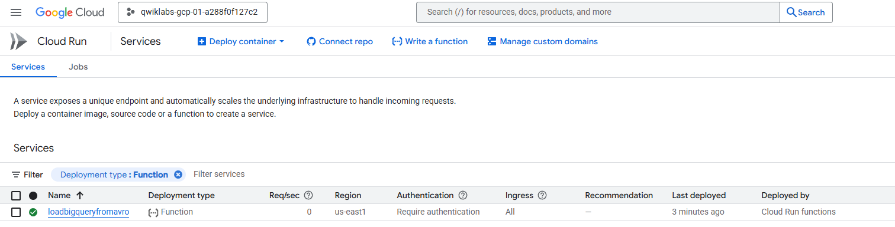
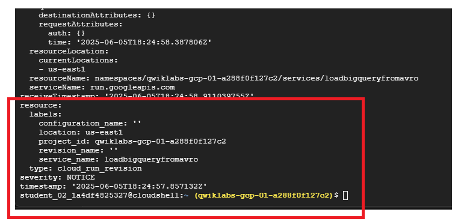

# ⚙️ Lab: Cómo usar Cloud Run Functions para cargar datos en BigQuery

 En este lab, vas a desarrollar una función con **Cloud Run Functions** que se activa ante un evento y carga datos automáticamente en **BigQuery**.

---

## 🎯 Objetivos del lab

- Crear una función en **Cloud Run**.
- Implementar y probar la función.
- Visualizar los datos cargados en **BigQuery**.
- Revisar los registros de ejecución de la Cloud Run Function.

---


✅ ¿Por qué es automatización?


Porque No necesitás intervención manual para cargar datos.

Todo se ejecuta automáticamente en respuesta a un evento (como subir un archivo, recibir una solicitud HTTP, o un cron programado).

Usás servicios serverless que escuchan, procesan y cargan los datos automáticamente en BigQuery u otros destinos.

##

## Descripción general
Una Cloud Run Function es un fragmento de código que se ejecuta en respuesta a un evento, como una solicitud HTTP, un mensaje desde un servicio de mensajería o la carga de un archivo. Los eventos de la nube representan todo lo que ocurre en tu entorno de nube. Pueden ser cambios en la información de una base de datos, la adición de archivos a un sistema de almacenamiento o la creación de una nueva instancia de máquina virtual.

Debido a que las Cloud Run Functions se basan en eventos, solo se ejecutan cuando ocurre una acción. Esto las convierte en una buena opción para las tareas que necesitan realizarse rápido o que no es necesario que se ejecuten todo el tiempo.

En este lab práctico, se muestra cómo crear, implementar y probar una Cloud Run Function que cargará una tabla de BigQuery con el SDK de Google Cloud.


#

##  Flujo del laboratorio

### Tarea 1: Habilita las APIs

En esta tarea, habilitarás las APIs pertinentes antes de crear las Cloud Run Functions.

1 - En Cloud Shell, ejecuta el siguiente comando para establecer tu variable de ID del proyecto:

```sh
export PROJECT_ID=$(gcloud config get-value project)
```
2 - Ejecuta los siguientes comandos para establecer la variable de región:
```sh
export REGION="REGION"
gcloud config set compute/region $REGION
```
3 - Ejecuta los siguientes comandos para establecer las variables de configuración:
```sh
gcloud config set run/region $REGION
gcloud config set run/platform managed
gcloud config set eventarc/location $REGION
```
4 - Ejecuta los siguientes comandos para habilitar todos los servicios necesarios:
```sh
gcloud services enable \
  artifactregistry.googleapis.com \
  cloudfunctions.googleapis.com \
  cloudbuild.googleapis.com \
  eventarc.googleapis.com \
  run.googleapis.com \
  logging.googleapis.com \
  pubsub.googleapis.com
```
    Nota: Para Eventarc, es posible que pasen unos minutos antes de que todos los permisos se propaguen al agente de servicio.

#
### Tarea 2: Establece los permisos necesarios

En esta tarea, otorgarás a la cuenta de servicio predeterminada de Compute Engine la capacidad de recibir eventos de Eventarc y, al agente de servicio de Cloud Storage, el permiso para publicar mensajes en temas de Pub/Sub, lo que habilita flujos de trabajo basados en eventos y acciones activadas por almacenamiento.

1 - En Cloud Shell, ejecuta el siguiente comando para establecer la variable PROJECT_NUMBER:
```sh
export PROJECT_NUMBER=$(gcloud projects describe $PROJECT_ID --format='value(projectNumber)')
```
2 - Ejecuta el siguiente comando para otorgar a la cuenta de servicio predeterminada de Compute Engine dentro de tu proyecto los permisos necesarios para recibir eventos de Eventarc:
```sh
gcloud projects add-iam-policy-binding $PROJECT_ID \
    --member="serviceAccount:$PROJECT_NUMBER-compute@developer.gserviceaccount.com" \
    --role="roles/eventarc.eventReceiver"
```
3 - Ejecuta los siguientes comandos para recuperar el agente de servicio de Cloud Storage para tu proyecto y otorgarle el permiso para publicar mensajes en temas de Pub/Sub:
```sh
SERVICE_ACCOUNT="$(gcloud storage service-agent --project=$PROJECT_ID)"

gcloud projects add-iam-policy-binding $PROJECT_ID \
    --member="serviceAccount:${SERVICE_ACCOUNT}" \
    --role='roles/pubsub.publisher'
```

#
### Tarea 3: Crea la función

En esta tarea, crearás una función simple llamada loadBigQueryFromAvro. Esta función lee un archivo Avro que se sube a Cloud Storage y, luego, crea y carga una tabla en BigQuery.

1 - En Cloud Shell, ejecuta el siguiente comando para crear y abrir un archivo llamado `index.js`:
```sh
nano index.js
```
2 - Copia el siguiente código para la Cloud Function en el archivo `index.js`:
```sh
/**
* index.js Cloud Function - Avro on GCS to BQ
*/
const {Storage} = require('@google-cloud/storage');
const {BigQuery} = require('@google-cloud/bigquery');

const storage = new Storage();
const bigquery = new BigQuery();

exports.loadBigQueryFromAvro = async (event, context) => {
    try {
        // Check for valid event data and extract bucket name
        if (!event || !event.bucket) {
            throw new Error('Invalid event data. Missing bucket information.');
        }

        const bucketName = event.bucket;
        const fileName = event.name;

        // BigQuery configuration
        const datasetId = 'loadavro';
        const tableId = fileName.replace('.avro', ''); 

        const options = {
            sourceFormat: 'AVRO',
            autodetect: true, 
            createDisposition: 'CREATE_IF_NEEDED',
            writeDisposition: 'WRITE_TRUNCATE',     
        };

        // Load job configuration
        const loadJob = bigquery
            .dataset(datasetId)
            .table(tableId)
            .load(storage.bucket(bucketName).file(fileName), options);

        await loadJob;
        console.log(`Job ${loadJob.id} completed. Created table ${tableId}.`);

    } catch (error) {
        console.error('Error loading data into BigQuery:', error);
        throw error; 
    }
};

```
3 - En nano, presiona **(Ctrl + x)** y, después, **(Y)**. Luego, presiona **Intro** para guardar el archivo.

#
## Tarea 4: Crea un bucket de Cloud Storage y un conjunto de datos de BigQuery.

En esta tarea, configurarás la infraestructura en segundo plano para almacenar los recursos que se usan para invocar la Cloud Run Function (un bucket de Cloud Storage) y, luego, almacenar el resultado en BigQuery cuando se complete.

1 - En Cloud Shell, ejecuta el siguiente comando para crear un nuevo bucket de Cloud Storage como la ubicación de etapa intermedia:

```sh
gcloud storage buckets create gs://$PROJECT_ID --location=$REGION
```

2 - Ejecuta el siguiente comando para crear un conjunto de datos de BigQuery en el que se almacenarán los datos:

```sh
bq mk -d  loadavro
```
# 

#
## Tarea 5: Implementa tu función

En esta tarea, implementarás la nueva Cloud Run Function y la activarás para que se carguen los datos en BigQuery.

1 - En Cloud Shell, ejecuta el siguiente comando que instala las dos bibliotecas de JavaScript para leer desde Cloud Storage y almacenar el resultado en BigQuery:
```sh
npm install @google-cloud/storage @google-cloud/bigquery
```


2 - Ejecuta el siguiente comando para implementar la función:
```sh
gcloud functions deploy loadBigQueryFromAvro \
    --gen2 \
    --runtime nodejs20 \
    --source . \
    --region $REGION \
    --trigger-resource gs://$PROJECT_ID \
    --trigger-event google.storage.object.finalize \
    --memory=512Mi \
    --timeout=540s \
    --service-account=$PROJECT_NUMBER-compute@developer.gserviceaccount.com 
```
        Nota: Si ves un mensaje de error relacionado con la propagación del agente de servicio de Eventarc, espera unos minutos y vuelve a probar el comando.




3 - Ejecuta el siguiente comando para confirmar que el activador se creó correctamente. El resultado será similar al siguiente ejemplo:

```sh
gcloud eventarc triggers list --location=$REGION
```


4 - Ejecuta el siguiente comando para descargar el archivo Avro que la Cloud Run Function procesará para almacenarlo en BigQuery:


```sh
wget https://storage.googleapis.com/cloud-training/dataengineering/lab_assets/idegc/campaigns.avro
```


5 - Ejecuta el siguiente comando para mover el archivo Avro al bucket de Cloud Storage de etapa intermedia que creaste anteriormente. Esta acción activará la Cloud Run Function:
```sh
gcloud storage cp campaigns.avro gs://PROJECT_ID
```

#
## Tarea 6: Confirma que los datos se cargaron en BigQuery

En esta tarea, confirmarás que los datos procesados por la Cloud Run Function se cargaron correctamente en BigQuery. Para ello, consultarás la tabla loadavro.campaigns con el comando bq.

1 - En Cloud Shell, ejecuta el siguiente comando para ver los datos en la nueva tabla de BigQuery con el comando **bq:**

```sh
bq query \
 --use_legacy_sql=false \
 'SELECT * FROM `loadavro.campaigns`;'
```
        Nota: Por lo general, la Cloud Run Function se procesará muy rápido, pero es posible que la consulta ejecutada en BigQuery no devuelva resultados. Si este es tu caso, espera un momento y vuelve a ejecutar la consulta.

La consulta devolvería resultados similares a los siguientes:

Resultado de ejemplo:   


## Tarea 7: Consulta los registros

En esta tarea, recuperarás todas las entradas de registro que están asociadas con el servicio llamado loadBigQueryFromAvro.

1 - En Cloud Shell, ejecuta el siguiente comando para examinar los registros de tu Cloud Run Function:

```sh
gcloud logging read "resource.labels.service_name=loadBigQueryFromAvro"
```

Los mensajes en el registro serán similares a los siguientes:



---

##  Conceptos clave

- **Cloud Run Functions**: ejecutan código sin servidor en respuesta a eventos.
- **BigQuery**: almacén analítico altamente escalable.
- **IAM**: gestión de permisos y accesos para servicios y funciones.
- **Desacoplamiento**: este patrón permite responder a eventos de forma flexible y escalable.

---

## 🧪 Resultado esperado

✔️ Función desplegada y activa.  
✔️ Datos insertados correctamente en BigQuery.  
✔️ Logs disponibles en Cloud Logging.  
✔️ Automatización de carga de datos lista para integrarse con otros servicios (GCS, Pub/Sub, etc.).

---

## 🔗 Recursos adicionales

- [Lab oficial en Cloud Skills Boost](https://www.cloudskillsboost.google/authoring/labs/31673)
- [Documentación de Cloud Run](https://cloud.google.com/run/docs)
- [Uso de BigQuery desde funciones](https://cloud.google.com/functions/docs/tutorials/bigquery)

---

