# Creación de pipelines por lotes en Cloud Data Fusion - GSP807


## Descripción general
**ETL** significa Extraer, Transformar y Cargar. Existen otras variantes de este concepto, como EL, ELT y ELTL.

Este laboratorio le enseñará a usar **Pipeline en Cloud Data Fusion** para crear una canalización ETL, donde se usará el complemento **Wrangler** para crear y aplicar transformaciones a los datos que pasan por la canalización.

La fuente de datos más común para aplicaciones ETL suele ser la información almacenada en archivos de texto con formato de valores separados por comas (CSV), ya que muchos sistemas de bases de datos exportan e importan datos de esta manera.

La salida se escribirá en una tabla de BigQuery y utilizará SQL estándar para realizar análisis de datos en este conjunto de datos de destino.

##  Objetivo

- Crear un pipeline ETL por lotes usando Cloud Data Fusion.
- Leer datos desde Cloud Storage (CSV).
- Transformarlos con *Wrangler*.
- Cargarlos en una tabla de BigQuery.
#


# Laboratorio
#

- haga clic en **IAM y administrador > IAM**.

- Confirme que la cuenta de servicio de computación predeterminada `{project-number}-compute@developer.gserviceaccount.com` esté presente y tenga el rol asignado de `editor`.

#
# Tarea 1. Cargar los datos

Antes de construir la canalización ETL, es necesario preparar la fuente de datos desde la cual Cloud Data Fusion leerá la información.

Se crea un bucket (contenedor) dentro del proyecto de Google Cloud. Este bucket actuará como almacenamiento intermedio para alojar el archivo **.csv** que se usará como **entrada** del pipeline.

Abra Cloud Shell, ejecute los siguientes comandos:

```bash
export BUCKET=$GOOGLE_CLOUD_PROJECT
gcloud storage buckets create gs://$BUCKET
```

```bash
gsutil cp gs://cloud-training/OCBL163/titanic.csv gs://$BUCKET
```


#
# Tarea 2. Agregue los permisos necesarios para su instancia de Cloud Data Fusion

Antes de que Cloud Data Fusion pueda acceder al archivo **.CSV** alojado en Cloud Storage, es necesario asegurarse de que la cuenta de servicio asociada a la instancia de Data Fusion tenga los permisos adecuados para leer el archivo desde el bucket.

- haz clic en "Ver todos los productos" y selecciona **Data Fusion > Instancias** . Deberías ver una instancia de Cloud Data Fusion ya configurada y lista para usar.


- Abrí el menú de **IAM & Administración** en la consola de GCP.

- Buscá la cuenta de servicio predeterminada de Compute Engine : 

    `{project-number}-compute@developer.gserviceaccount.com`

   copie la **cuenta de servicio** en su portapapeles.          


- En la página Permisos de IAM, haga clic en **+ Otorgar acceso (+Grant Access)**.


- En el campo Nuevos principales pegue la cuenta de servicio.

- Haga clic en el campo **Select a role field** y comience a escribir **Cloud Data Fusion API Service Agent** ; luego selecciónelo.

- Haga clic en **ADD ANOTHER ROLE** .

  Añade el rol `Dataproc Administrator `.

- Haga clic en **Guardar** .

### Otorgar permiso al usuario de la cuenta de servicio

- haga clic en **IAM y administración > IAM **.

- Seleccione la casilla de verificación  -- **Include Google-provided role grants**.

- Desplácese hacia abajo en la lista para encontrar la cuenta de servicio Cloud Data Fusion administrada por Google que se parece a `service-{project-number}@gcp-sa-datafusion.iam.gserviceaccount.comy` luego copie el nombre de la cuenta de servicio en su portapapeles.

- A continuación, navegue hasta **IAM & admin > Service Accounts.** .

- Haga clic en la cuenta del motor de cómputo predeterminada que se parece a `{project-number}-compute@developer.gserviceaccount.com` y seleccione la pestaña Principales con acceso en la navegación superior.

- Haga clic en el botón **Grant Access** .

- En el campo **New Principals** , pegue la cuenta de servicio que copió anteriormente.

- En el menú desplegable **Role** , seleccione **Service Account User.**

- Haga clic en **Guardar** .

#
# Tarea 3. Construir una canalización por lotes


- Se accede nuevamente a la instancia de Cloud Data Fusion desde la consola de Google Cloud:

    **Menú de navegación → Data Fusion → Instancias → Ver instancia**.

   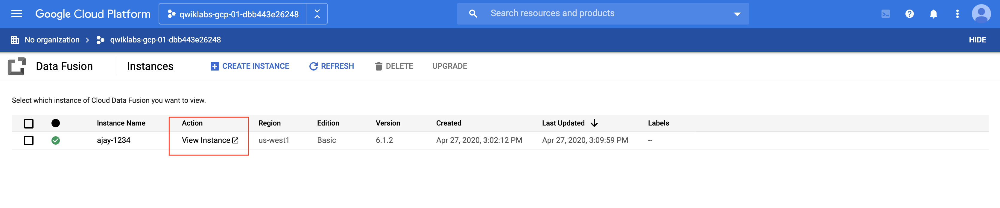


- Una vez iniciada la sesión, se accede a la interfaz web de Cloud Data Fusion, la cual incluye un panel lateral de navegación para acceder a los distintos módulos.

- En el panel izquierdo, se selecciona la opción **Wrangler**.

- En el lado izquierdo hay un panel con las conexiones preconfiguradas a sus datos, incluida la conexión de Cloud Storage. En **(GCS) Google Cloud Storage** , seleccione **Cloud Storage Default** .

- Haga clic en el bucket correspondiente.

- Haga clic en **titanic.csv** .

    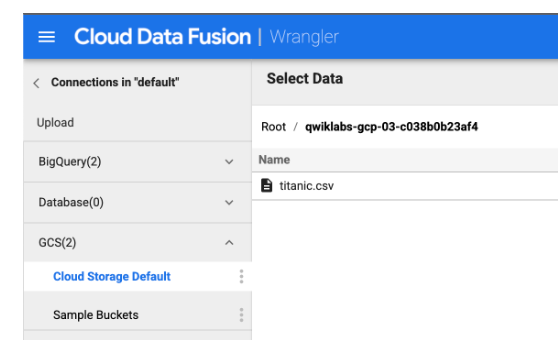


- En el cuadro de diálogo **Opciones de análisis(Parsing Options)** que aparece, seleccione **text** en la lista desplegable **Format**.

- Luego haga clic en **CONFIRM** .

 


    Los datos se cargan en la pantalla de Wrangler. Ahora puede empezar a aplicar las transformaciones de datos de forma iterativa.


- La primera operación consiste en **analizar los datos CSV sin procesar** en una representación tabular dividida en filas y columnas. 

    Para ello, seleccione el icono desplegable en el encabezado de la primera columna (cuerpo) y seleccione la opción **Analizar (Parse)** y, en el submenú, **CSV** .

    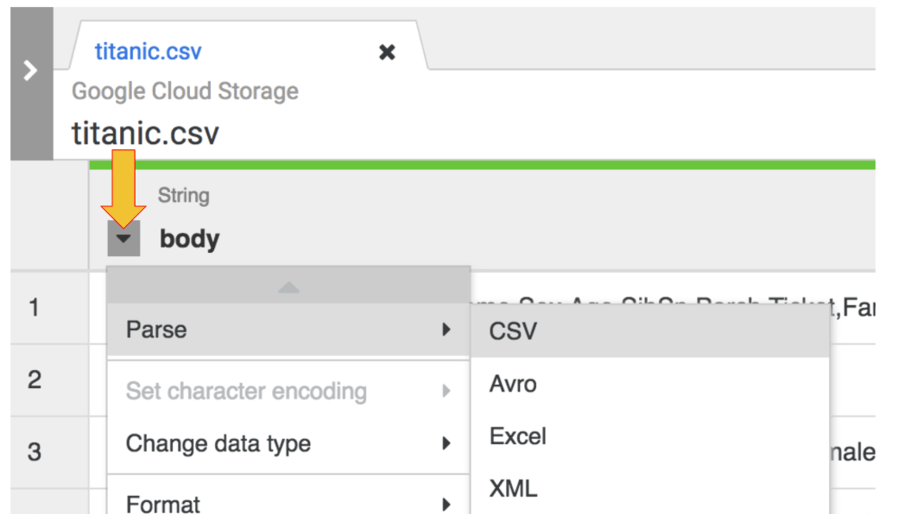


- En los datos sin procesar, puedes ver que la primera fila consta de encabezados de columnas, por lo que seleccionarás la opción **Set first row as header** en el cuadro de diálogo **Parse as CSV (Analizar como CSV)** que se nos presenta.

- A continuación, haga clic en **Aplicar** .

    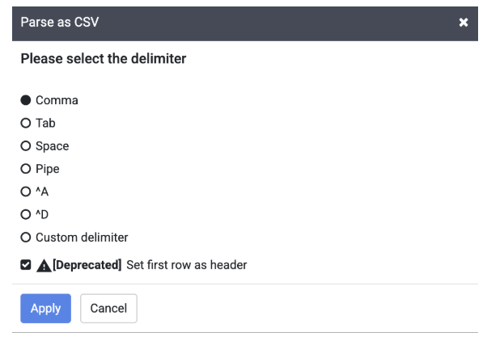

**Nota:** Puede ignorar la advertencia de obsolescencia junto a la casilla de verificación Establecer la primera fila como encabezado .


- En esta etapa, se analizan los datos sin procesar y se pueden ver las columnas generadas por esta operación (columnas a la derecha de la columna del cuerpo ). En el extremo derecho, se ve la lista de todos los nombres de las columnas.

    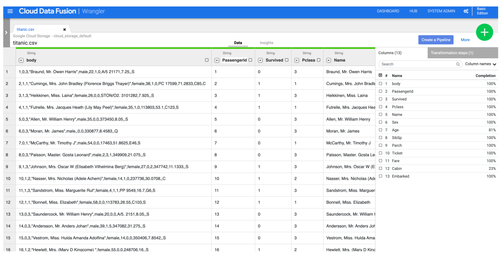

- Ahora es momento de hacer limpieza. Ya no necesitas la columna "body" que representa los datos CSV sin procesar, así que elimínala usando la opción de menú: selecciona el icono desplegable del encabezado de la primera columna " body " y selecciona la opción de menú "Eliminar columna" .

- Ahora es momento de hacer limpieza. Ya no necesitas la columna **"body"** que representa los datos CSV sin procesar, así que elimínala usando la opción de menú: selecciona el icono desplegable del encabezado de la primera columna **" body "** y selecciona la opción de menú **"Eliminar columna"** .

    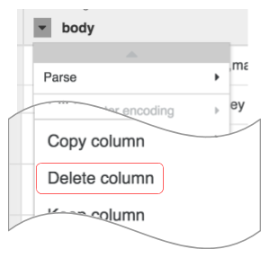

    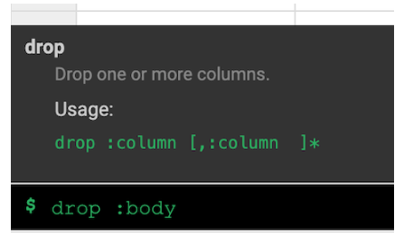

- Haz clic en la pestaña **"Pasos de transformación" (Transformation steps)** en el extremo derecho de la interfaz de Wrangler. Verás las dos transformaciones que has aplicado hasta el momento.

    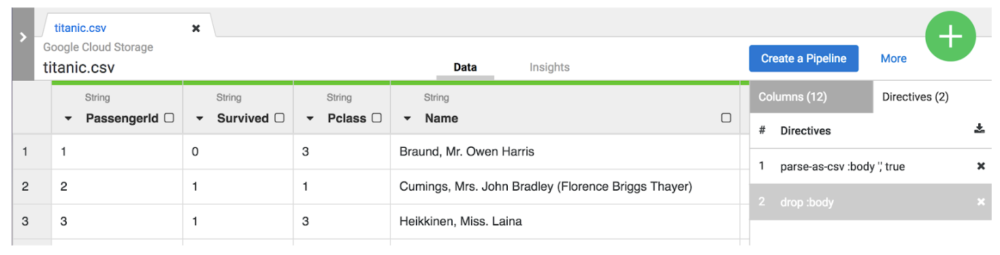

- Para este laboratorio, las dos transformaciones, o recetas, son suficientes para crear la canalización ETL. El siguiente paso es incorporar esta receta a un paso de creación de canalización donde la receta representa la T en ETL.

- Haga clic en el botón **Crear una canalización (Create a Pipeline)** para pasar a la siguiente sección y crear una canalización, donde verá cómo se ensambla la canalización ETL.


- Cuando aparezca el siguiente cuadro de diálogo, seleccione **Canalización por lotes (Batch pipeline)** para continuar.


**Nota:** Un pipeline por lotes se puede ejecutar de forma interactiva o programar para que se ejecute con una frecuencia de hasta 5 minutos o tan solo una vez al año.


#
# Tarea 4. Explorar Pipeline Studio

El resto de las tareas de creación de pipelines se realizarán en Pipeline Studio, la interfaz que permite crear pipelines de datos visualmente.


En este punto, verá dos nodos en su canalización: el complemento de **archivo GCS** que leerá el archivo CSV de Google Cloud Storage y el complemento **Wrangler** que contiene la receta con las transformaciones.


**Nota:** Un nodo en una tubería es un objeto conectado en una secuencia para producir un grafo acíclico dirigido. Por ejemplo: Origen, Destino, Transformación, Acción, etc.

- Estos dos complementos (nodos) representan la **E** y la **T** en su canalización **ETL**. 

    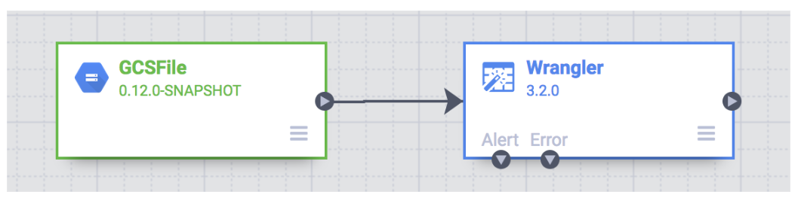

Para completar esta canalización, agregue el receptor de BigQuery, la parte **L** de nuestro **ETL**.

- Para agregar el receptor de BigQuery a la canalización, navegue a la sección **Receptor (Sink)** en el panel izquierdo y haga clic en el ícono **de BigQuery** para colocarlo en el lienzo.

    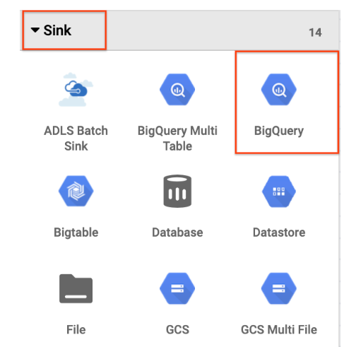

- Una vez colocado el receptor de BigQuery en el lienzo, conecte el nodo Wrangler con el nodo de BigQuery. Para ello, arrastre la flecha desde el nodo Wrangler hasta el nodo de BigQuery, como se muestra a continuación. 

    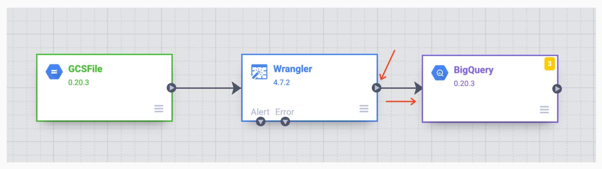

#
# Tarea 5. Configurar la canalización


- Pase el ratón sobre el nodo **GCS** y se mostrará el botón **"Propiedades"** . Haga clic en él para abrir la configuración.

    Cada complemento tiene algunos campos obligatorios que deben completarse y están marcados con un asterisco (*). 


   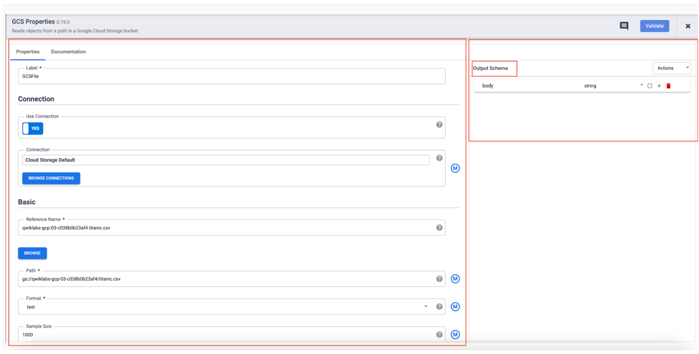

    Dependiendo del complemento que uses, puedes ver un **esquema de entrada (Input Schema)** a la izquierda, una sección de **configuración (Configuration )** en el centro y un esquema de **salida a la derecha (Output Schema)**.

    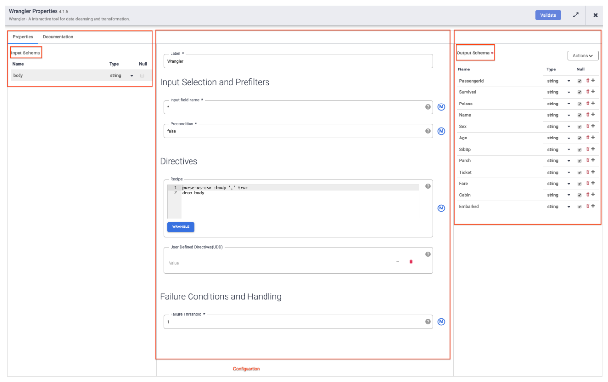

- A continuación, pase el cursor sobre el nodo **Wrangler** y haga clic en **Propiedades** .   

- Coloque el mouse sobre su nodo de **BigQuery**, haga clic en **Propiedades** e ingrese las siguientes configuraciones:

    - Para Nombre de referencia , ingrese `Titanic_BQ`.

    - Para el conjunto de datos , ingrese `demo`.

    - Para la tabla , ingrese `titanic`.

    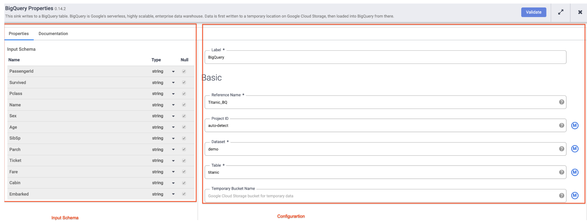

#
# Tarea 6. Probar la tubería

Todo lo que queda por hacer ahora es probar tu pipeline para ver que funciona como se espera, pero antes de hacerlo asegúrate de nombrar y guardar tu borrador para no perder nada de tu trabajo.


- haz clic en **"Guardar"** en el menú de la esquina superior derecha:

    - nombre de su pipeline: `ETL-batch-pipeline`

    - para la descripción: `ETL pipeline to parse CSV, transform and write output to BigQuery`

- Haga clic en **Guardar** .


- Para probar su pipeline, haga clic en el icono de **vista previa (Preview) (1)** 


- Haz clic en el icono **Ejecutar (Run) (2)** . Mientras la canalización se ejecuta en modo de vista previa, no se escriben datos en la tabla de BigQuery, pero podrás confirmar que los datos se leen correctamente y que se escribirán según lo previsto una vez implementada la canalización.

- El **botón de vista previa** es un interruptor, así que asegúrate de volver a hacer clic en él para salir del modo de vista previa al finalizar.


    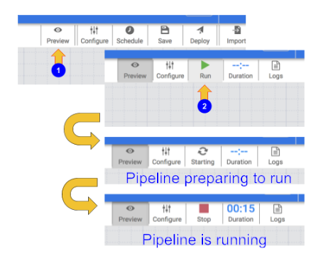

- Cuando su pipeline termine de ejecutarse, pase el cursor sobre el nodo **Wrangler** y haga clic en Propiedades . Luego, haga clic en la pestaña **Vista previa** . Si todo salió bien, debería ver los datos sin procesar de la entrada **(el nodo a la izquierda)** y los registros analizados que se emitirán como salida **(el nodo a la derecha)**.


    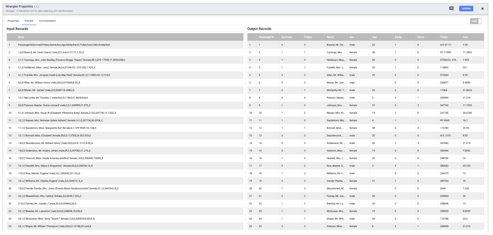


**Nota:** Cada nodo que opera con datos debería mostrar un resultado similar. Esta es una buena manera de comprobar su trabajo y asegurarse de que va por buen camino antes de implementar su canalización. Si encuentra algún error, puede corregirlo fácilmente en el modo borrador.

- Haga clic en el ícono **Vista previa** nuevamente, esta vez para salir del modo **Vista previa**.

- Si todo parece correcto hasta ahora, puede proceder a implementar la canalización. Haga clic en el icono **Deploy (" Implementar" )** en la esquina superior derecha.Icono de implementaciónpara implementar el pipeline.


- Verá un cuadro de diálogo de confirmación que indica que su canalización se está implementando.

- Una vez que su canalización se haya implementado correctamente, estará listo para ejecutar su canalización ETL y cargar algunos datos en BigQuery.

- Haga clic en el icono **Ejecutar** para ejecutar el trabajo ETL.

- A medida que la canalización procesa los datos, verá **métricas** emitidas por cada nodo que indican cuántos registros se han procesado.

    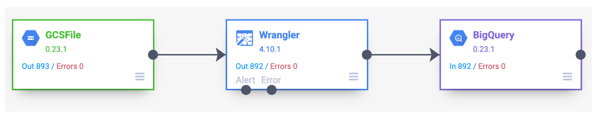

- Cuando haya terminado, debería ver que el estado del pipeline cambia a **Correcto (Succeeded)**, lo que indica que el pipeline se ejecutó correctamente.


    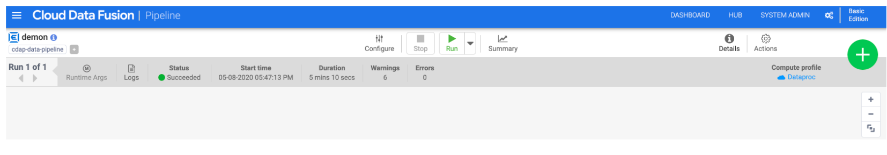


## **Apunte:**

En Cloud Data Fusion, el proceso tiene dos pasos clave antes de que tu pipeline se ejecute y mueva datos reales:

1. **Deploy** (Implementar) --> Esto construye y prepara la canalización para su ejecución real. (Prepara y valida el pipeline, antes de ejecutar por primera vez o tras cambios)

2. **Run** (Ejecutar) --> Una vez implementado, se habilita el botón "Ejecutar", que ahora sí lanza el pipeline real. (	Ejecuta el pipeline real, para mover los datos (ETL real))


#
# Tarea 7. Ver los resultados


- Ir a **Bigquery**

- Ejecute la sguiente consulta:

```sh
SELECT * FROM `demo.titanic` LIMIT 10
```


## **¡Felicidades!**

Aprendiste a usar los componentes básicos disponibles en Pipeline Studio de Cloud Data Fusion para crear una canalización por lotes. 

También aprendiste a usar Wrangler para crear pasos de transformación para tus datos.

#

