# ⚡ GSP808 - Building Realtime Pipelines in Cloud Data Fusion  
Este laboratorio enseña cómo construir un pipeline de procesamiento de datos en tiempo real usando Cloud Data Fusion, integrando Pub/Sub como fuente de eventos y escribiendo los resultados en BigQuery.

##  Objetivo  
- Construir un pipeline de streaming con Cloud Data Fusion.  
- Leer mensajes JSON desde un tópico de Pub/Sub.  
- Transformar los datos con Wrangler.  
- Escribir los resultados en BigQuery.

## 🛠️ Tecnologías utilizadas  
Cloud Data Fusion, Pub/Sub, BigQuery, Apache Spark Streaming, Wrangler

#
# Laboratorio

## Tarea 1. Permisos del proyecto

### Comprobar los permisos del proyecto

Antes de comenzar a trabajar en Google Cloud, debes asegurarte de que tu proyecto tenga los permisos correctos dentro de Administración de identidad y acceso (IAM).

- haga clic en **IAM y administrador > IAM**.

- Confirme que la cuenta de servicio de computación predeterminada `{project-number}-compute@developer.gserviceaccount.com` esté presente y tenga el rol asignado de `editor`.

#
## Tarea 2. Asegúrese de que la API de flujo de datos esté habilitada correctamente


Para garantizar el acceso a la API necesaria, reinicie la conexión a la API de Dataflow.

1. En Cloud Console, escribe "Dataflow API" en la barra de búsqueda superior. Haz clic en el resultado " **Dataflow API**" .

2. Haga clic **Manage** .

3. Haga clic en **Disable API** .

    Si se le solicita que confirme, haga clic **Disable** .

4. Haga clic en **Enable** .

#
## Tarea 3. Cargar los datos


1. Primero, necesitas descargar los `tweets de muestra` a tu computadora. Luego los subirás con Wrangler para crear los pasos de transformación.


    También necesitarás preparar el mismo archivo de tweets de muestra en tu contenedor de Cloud Storage. Hacia el final de este laboratorio, transmitirás los datos desde tu contenedor a un tema de Pub/Sub.

2. En Cloud Shell, ejecute los siguientes comandos para crear un nuevo depósito:


    ```bash
    export BUCKET=$GOOGLE_CLOUD_PROJECT
    gsutil mb gs://$BUCKET
    ```
    El depósito creado tiene el mismo nombre que el ID del proyecto.

3. Ejecute el siguiente comando para copiar el archivo de tweets en el depósito:

    ```bash
    gsutil cp gs://cloud-training/OCBL164/pubnub_tweets_2019-06-09-05-50_part-r-00000 gs://$BUCKET
    ```
4. Verifique que el archivo se haya copiado en su depósito de almacenamiento en la nube.

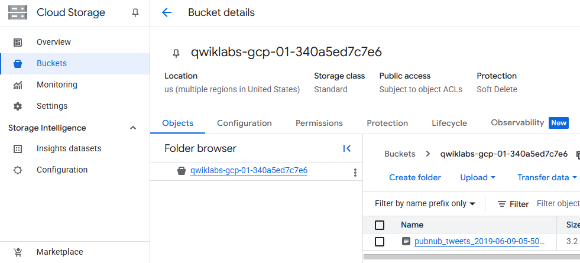
    

#
## Tarea 4. Configuración del Pub/Sub Topic

Para utilizar un Pub/Sub, debe crear un topic para almacenar datos y una suscripción para acceder a los datos publicados en el tema.

1. En la consola en nube, desde el menú de navegación, haga clic en Ver todos los productos; en la sección Análisis, haga clic en Pub/Sub y luego seleccione Temas .

2. Haga clic en **Create topic.** .

3. El tema debe tener un nombre único. Para este laboratorio, asígnele un nombre `cdf_lab_topicy` haga clic en **CREATE** 

    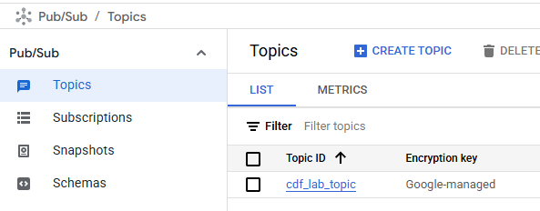

.


#
## Tarea 5. Agregar una suscripción de Pub/Sub
Sigue en la página del tema. Ahora te suscribirás para acceder al tema.

1. Haga clic en **Create subscription.** .


2. Escriba un nombre para la suscripción, como `cdf_lab_subscription`, establezca el Tipo de entrega en **Pull** y luego haga clic en **Create** .


    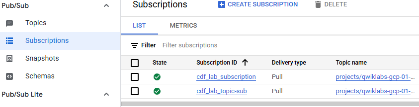

#
## Tarea 6. Agregue los permisos necesarios para su instancia de Cloud Data Fusion

- haz clic en "Ver todos los productos" y selecciona **Data Fusion > Instancias** . Deberías ver una instancia de Cloud Data Fusion ya configurada y lista para usar.


- Abrí el menú de **IAM & Administración** en la consola de GCP.

- Buscá la cuenta de servicio predeterminada de Compute Engine : 

    `{project-number}-compute@developer.gserviceaccount.com`

   copie la **cuenta de servicio** en su portapapeles.          


- En la página Permisos de IAM, haga clic en **+ Otorgar acceso (+Grant Access)**.


- En el campo Nuevos principales (New principals field) pegue la cuenta de servicio.

- Haga clic en el campo **Select a role field** y comience a escribir **Cloud Data Fusion API Service Agent** ; luego selecciónelo.

- Haga clic en **ADD ANOTHER ROLE** .

  Añade el rol `Dataproc Administrator `.

- Haga clic en **Guardar** .

### Otorgar permiso al usuario de la cuenta de servicio

- haga clic en **IAM y administración > IAM **.

- Seleccione la casilla de verificación  -- **Include Google-provided role grants**.

- Desplácese hacia abajo en la lista para encontrar la cuenta de servicio Cloud Data Fusion administrada por Google que se parece a `service-{project-number}@gcp-sa-datafusion.iam.gserviceaccount.comy` luego copie el nombre de la cuenta de servicio en su portapapeles.

- A continuación, navegue hasta **IAM & admin > Service Accounts.** .

- Haga clic en la cuenta del motor de cómputo predeterminada que se parece a `{project-number}-compute@developer.gserviceaccount.com` y seleccione la pestaña Principales con acceso en la navegación superior.

- Haga clic en el botón **Grant Access** .

- En el campo **New Principals** , pegue la cuenta de servicio que copió anteriormente.

- En el menú desplegable **Role** , seleccione **Service Account User.**

- Haga clic en **Guardar** 

#

## Tarea 7. Navegar por la interfaz de usuario de Cloud Data Fusion

Para navegar por la interfaz de usuario de Cloud Data Fusion, siga estos pasos:

1. En Cloud Console, vuelva a Data Fusion y haga clic en el enlace **"Ver instancia"** junto a su instancia de Data Fusion.

2. En el Centro de control de Cloud Data Fusion, use el menú de Navegación para exponer el menú de la izquierda, luego elija **Pipeline > Studio** .

3. En la parte superior izquierda, utilice el menú desplegable para seleccionar **Data Pipeline – Realtime** .


    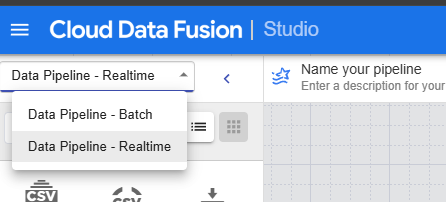

#

## Tarea 8. Construir una canalización en tiempo real

Al trabajar con datos, es útil ver el aspecto de los datos sin procesar para usarlos como punto de partida para la transformación. Para ello, utilizará Wrangler para preparar y limpiar los datos. Este enfoque centrado en los datos le permitirá visualizar rápidamente sus transformaciones, y la retroalimentación en tiempo real le permitirá estar en el camino correcto.

1. En la sección Transformar de la paleta de plugins, seleccione **Wrangler** . El nodo Wrangler aparecerá en el lienzo. **Ábralo haciendo clic en el botón Propiedades**.

2. Haga clic en el **botón WRANGLE** debajo de la sección Directivas .

    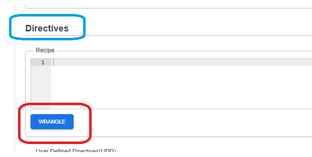

3. Cuando cargue, en el menú lateral izquierdo, haz clic en "**Upload**" . A continuación, haz clic en el icono de carga para subir el archivo de muestra de tweets que descargaste previamente a tu ordenador.


    

4. Los datos se cargan en la pantalla del Wrangler en formato de filas y columnas. Tardará un par de minutos.

5. La primera operación consiste en analizar los datos JSON en una representación tabular dividida en filas y columnas. Para ello, seleccione el icono desplegable del encabezado de la primera columna (cuerpo), luego seleccione la opción de menú Analizar y, a continuación, JSON en el submenú. En la ventana emergente, configure la profundidad en 1 y haga clic en Aplicar .

    

6. Repita el paso anterior para ver una estructura de datos más significativa para la transformación posterior. Haga clic en el icono desplegable de la columna **"body"** , seleccione **"Parse > JSON"** y configure la **Depth** en **1**. A continuación, haga clic en **"Aplicar"** .

    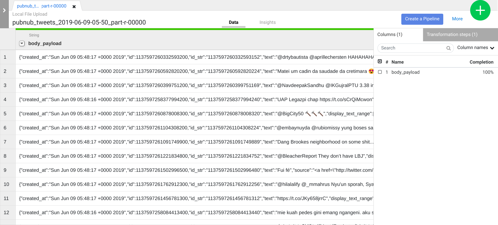


    Además de usar la interfaz de usuario, también puedes escribir los pasos de transformación en el cuadro de comandos de la directiva de Wrangler. Este cuadro aparece en la parte inferior de la interfaz de usuario de Wrangler (busca la consola de comandos con el símbolo del sistema $ en verde). Usarás la consola de comandos para pegar un conjunto de pasos de transformación en el siguiente paso.

7. Agregue los pasos de transformación a continuación copiándolos todos y pegándolos en el cuadro de línea de comando de la directiva Wrangler:

    ```bash
    columns-replace s/^body_payload_//g
    drop id_str
    parse-as-simple-date :created_at EEE MMM dd HH:mm:ss Z yyyy
    drop display_text_range
    drop truncated
    drop in_reply_to_status_id_str
    drop in_reply_to_user_id_str
    parse-as-json :user 1
    drop coordinates
    set-type :place string
    drop geo,place,contributors,is_quote_status,favorited,retweeted,filter_level,user_id_str,user_url,user_description,user_translator_type,user_protected,user_verified,user_followers_count,user_friends_count,user_statuses_count,user_favourites_count,user_listed_count,user_is_translator,user_contributors_enabled,user_lang,user_geo_enabled,user_time_zone,user_utc_offset,user_created_at,user_profile_background_color,user_profile_background_image_url,user_profile_background_image_url_https,user_profile_background_tile,user_profile_link_color,user_profile_sidebar_border_color,user_profile_sidebar_fill_color,user_profile_text_color,user_profile_use_background_image
    drop user_following,user_default_profile_image,user_follow_request_sent,user_notifications,extended_tweet,quoted_status_id,quoted_status_id_str,quoted_status,quoted_status_permalink
    drop user_profile_image_url,user_profile_image_url_https,user_profile_banner_url,user_default_profile,extended_entities
    fill-null-or-empty :possibly_sensitive 'false'
    set-type :possibly_sensitive boolean
    drop :entities
    drop :user_location

    ```
   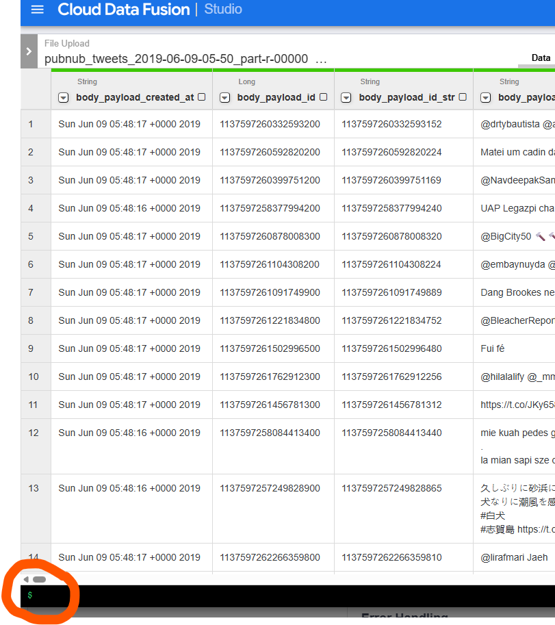


        Nota: Si el mensaje "No hay datos. Intente eliminar algunos pasos de transformación", elimine cualquiera de ellos haciendo clic en la X. Una vez que aparezcan los datos, podrá continuar.


8. Haz clic en el botón **"Aplicar"** en la esquina superior derecha. Luego, haz clic en la **X** de la esquina superior derecha para cerrar el cuadro de propiedades.


    Como puede ver, ha vuelto a Pipeline Studio , donde se ha colocado un solo nodo en el lienzo que representa las transformaciones que acaba de definir en Wrangler .


9. En la sección **Source**de la paleta de plugins, seleccione **PubSub** . El nodo fuente de PubSub aparecerá en el lienzo. Ábralo haciendo clic en el botón **Propiedades** .

    Especifique las distintas propiedades de la fuente PubSub como se muestra a continuación:

      - a. En **Nombre de referencia** , ingrese `Twitter_Input_Stream`

      - b. En **Suscripción**, ingrese `cdf_lab_subscription` (que es el nombre de su suscripción de PubSub que creó anteriormente)

    - c. Haga clic en **Validate**para asegurarse de que no se encontrarán errores.

    - d. Haga clic en la **X** en la parte superior derecha para cerrar el cuadro de propiedades.

    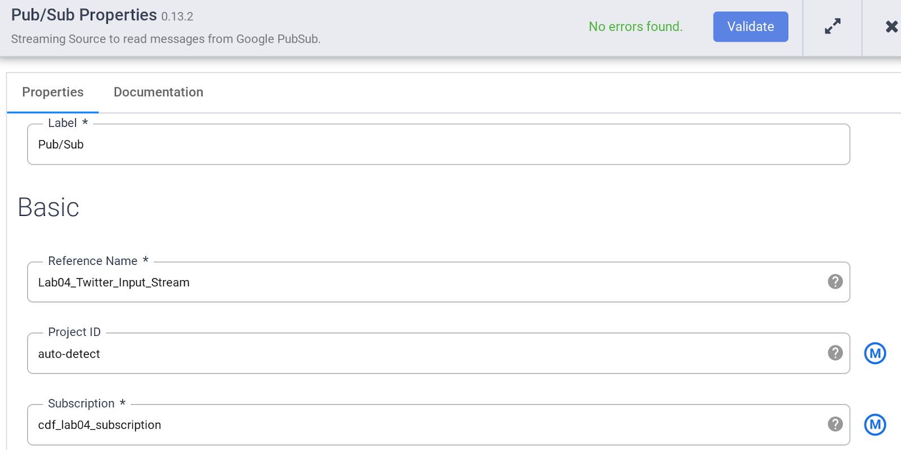

10. Ahora conecte el nodo de origen PubSub al nodo Wrangler que agregó anteriormente.


11. Abra las propiedades de su nodo Wrangler y agregue la siguiente directiva en la parte superior de los Pasos de transformación existentes:

    ```
    keep :message
    set-charset :message 'utf-8'
    rename :message :body
    ```


    Haga clic en la **X** en la parte superior derecha para cerrar el cuadro de propiedades.

    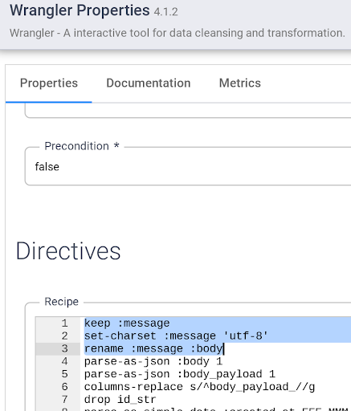

12. Ahora que ha conectado una fuente y una transformación a la canalización, complétela añadiendo un receptor. En la sección "**Sink (Receptor)**" del panel izquierdo, seleccione **BigQuery** . Aparecerá un nodo de receptor de BigQuery en el lienzo.

13. Conecte el nodo Wrangler al nodo BigQuery arrastrando la flecha desde el nodo Wrangler hasta el nodo BigQuery. A continuación, configurará las propiedades del nodo BigQuery.

14. Coloque el cursor sobre el nodo BigQuery y haga clic en **Propiedades** .

    - a. En **Reference Name** , ingrese `realtime_pipeline`

    - b. En **Dataset** , ingrese `realtime`.

    - c. En la **Table** , ingrese `tweets`

    - d. Haga clic en **Validate** para asegurarse de que no se encontrarán errores.

15. Haga clic en la **X** en la parte superior derecha para cerrar el cuadro de propiedades.

    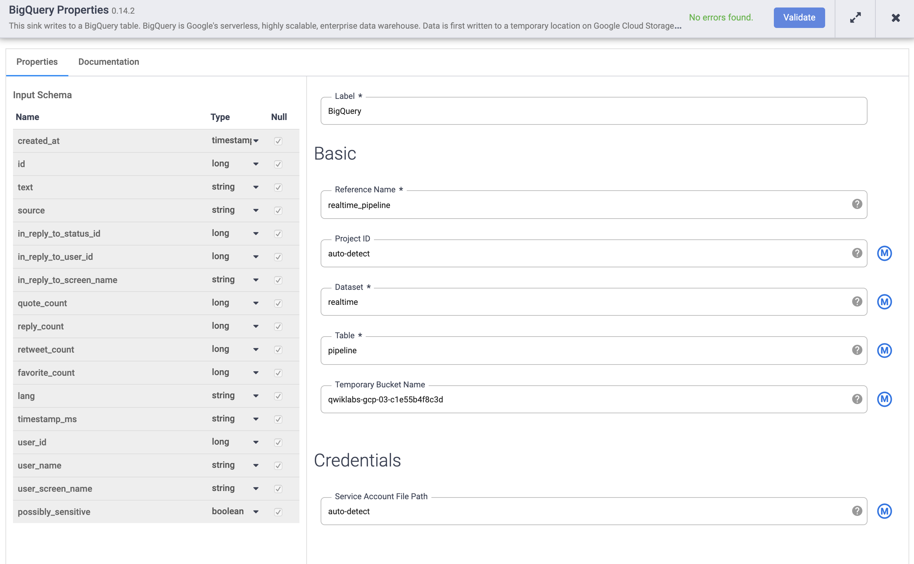

16. Haga clic en Nombrar su canalización , agréguelo `Realtime_Pipeline` como nombre y haga clic en **Guardar** .

17. Haga clic en el ícono **Deploy** y luego inicie la canalización.

18. Una vez implementado, haga clic en  **Run**. Espere a que el **Status** de la canalización cambie a "Running" . Tardará un par de minutos.

#
## Tarea 9. Enviar mensajes a Cloud Pub/Sub

En esta tarea se simula la ingesta masiva de mensajes en un tópico de Cloud Pub/Sub utilizando un trabajo de Dataflow basado en una plantilla predefinida.

### ¿Para qué sirve?

En lugar de enviar mensaje por mensaje manualmente, se utiliza un archivo con datos (por ejemplo, tweets) almacenado en Cloud Storage, para publicarlos todos automáticamente en un tópico de Pub/Sub. Esto permite probar pipelines de streaming con datos reales y en volumen, emulando un flujo de eventos en tiempo real.

### Pasos principales:

1. En la consola de Google Cloud, ir a **Dataflow > Crear trabajo desde plantilla**.

2. Completar los campos:
   - **Nombre del trabajo:** `streaming-pipeline` (u otro nombre descriptivo).  
   - **Plantilla:** seleccionar **Text Files on Cloud Storage to Pub/Sub**.  
   - **Input Cloud Storage File(s):** ingresar la ruta del archivo en Cloud Storage, por ejemplo:  
     `gs://tu-bucket/pubnub_tweets_2019-06-09-05-50_part-r-00000`  
   - **Output Pub/Sub Topic:** indicar el tópico de Pub/Sub previamente creado, con el formato:  
     `projects/tu-proyecto/topics/cdf_lab_topic`  
   - **Ubicación temporal:** una carpeta temporal en Cloud Storage para uso interno por Dataflow, por ejemplo:  
     `gs://tu-bucket/tmp/`


    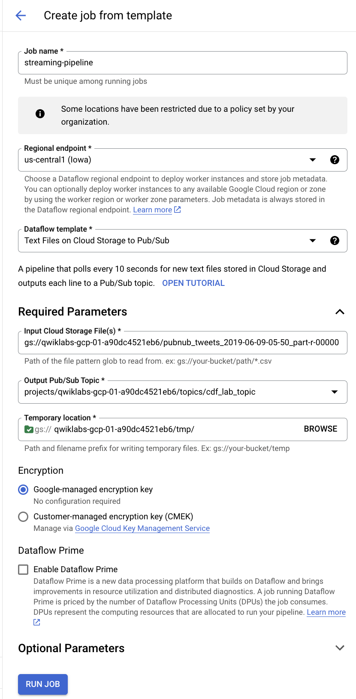


3. Hacer clic en **Run job** para lanzar el proceso.

4. Dataflow leerá línea a línea el archivo y publicará cada línea como un mensaje individual en Pub/Sub.

5. El pipeline de Cloud Data Fusion que esté suscripto a ese tópico empezará a recibir y procesar los mensajes en tiempo real.

### Beneficios:

- Simula un flujo continuo de datos para pruebas realistas.  
- Permite validar toda la arquitectura de ingestión y procesamiento streaming.  
- Facilita la automatización y escalabilidad en la generación de eventos de prueba.

---

Así podés replicar cargas de datos reales para probar y ajustar tus pipelines streaming en Google Cloud.


#
## Tarea 10. Visualización de las métricas de su pipeline
Tan pronto como los eventos se carguen en el tema Pub/Sub, deberías comenzar a ver que son consumidos por la canalización: observa cómo se actualizan las métricas en cada nodo.

- En la consola de Data Fusion, espere a que cambien las métricas de su canalización

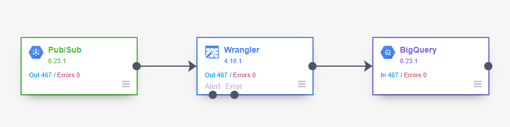

#
# ¡Felicidades!
En este laboratorio, aprendió a configurar una canalización en tiempo real en Data Fusion que lee mensajes entrantes de streaming desde Cloud Pub/Sub, procesa los datos y los escribe en BigQuery.

## 📎 Recursos  
- Documentación oficial: [https://cloud.google.com/data-fusion/docs](https://cloud.google.com/data-fusion/docs)  
- Enlace al lab oficial: [https://www.cloudskillsboost.google/focuses/12365](https://www.cloudskillsboost.google/focuses/12365?parent=catalog&utm_source=chatgpt.com)


#
