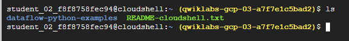
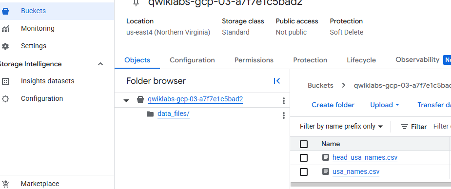
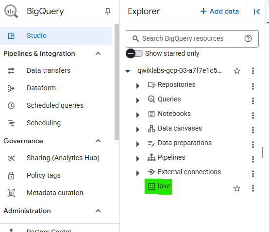
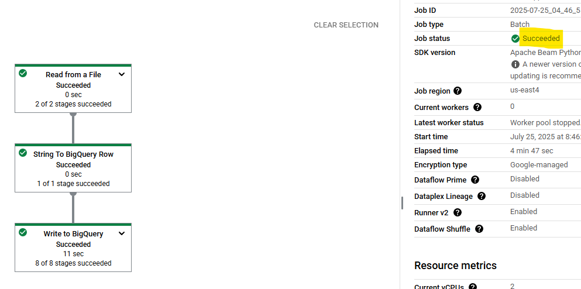
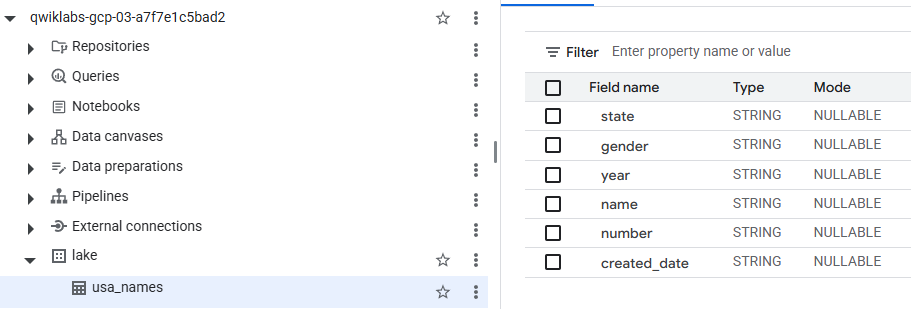
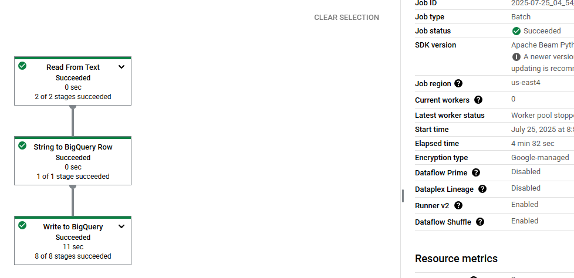
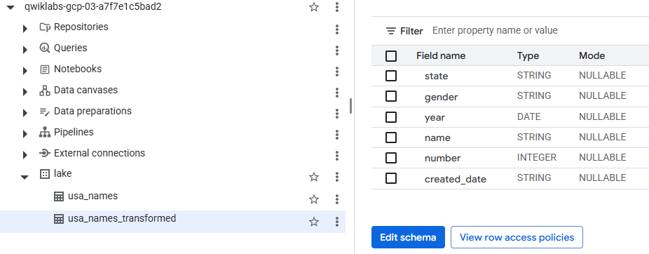
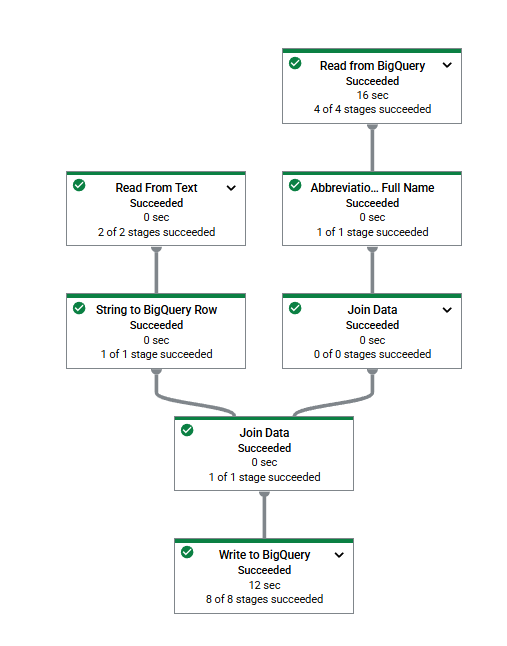
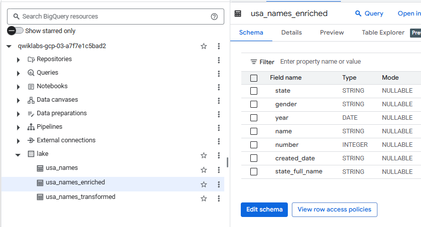
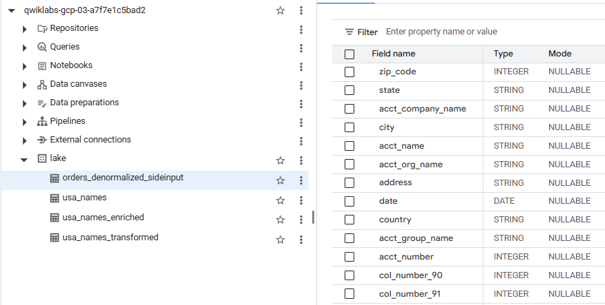

#  ETL Processing on Google Cloud Using Dataflow and BigQuery (Python)


En este laboratorio, utilizará el SDK de Apache Beam para Python para crear y ejecutar una canalización en Dataflow para ingerir datos de Cloud Storage a BigQuery, y luego transformar y enriquecer los datos en BigQuery.

## Lo que harás

En este laboratorio aprenderá a:

Cree y ejecute canalizaciones de Dataflow (Python) para ingerir datos desde Cloud Storage a BigQuery.
Cree y ejecute canalizaciones de Dataflow (Python) para transformar y enriquecer datos en BigQuery.
Cree y ejecute canalizaciones de Dataflow (Python) para unir datos en BigQuery y escribir los resultados en una nueva tabla.


---

# Laboratorio

##  Tarea 1. Asegúrese de que la API de flujo de datos esté habilitada correctamente.

1. En la barra de título de la consola de Google Cloud, escriba **Dataflow API** en el campo Buscar y luego haga clic en **API de Dataflow** en los resultados de la búsqueda.

2. Haga clic en **Manage**.

3. Haga clic en **Disable API.**

      Si se le solicita que confirme, haga clic en Desactivar .

4. Haga clic en **Enable**.

#

## Tarea 2. Descargar el código de inicio

Descargue los ejemplos de Python de Dataflow para utilizar en este laboratorio.

1. Ejecute el siguiente comando en Cloud Shell para obtener ejemplos de Python de Dataflow desde el GitHub de servicios profesionales de Google Cloud :

    ```sql
    gcloud storage cp -r gs://spls/gsp290/dataflow-python-examples .
    ```
    
    

2. Establezca una variable para el ID de su proyecto.

    ```sql
    export PROJECT= Project ID
    ```

    ```sql
    gcloud config set project $PROJECT
    ```
#
## Tarea 3. Crear un depósito de almacenamiento en la nube y copiar archivos en el depósito
En Cloud Shell, cree un depósito de Cloud Storage y copie los archivos en él. Estos archivos son los ejemplos de Python de Dataflow.

### Crear un depósito de almacenamiento en la nube


  Aún en Cloud Shell, use el comando make bucket para crear un nuevo bucket dentro de su proyecto:


  ```sql
  gcloud storage buckets create gs://$PROJECT --location=REGION
  ```
  

### Copiar archivos a tu bucket

En Cloud Shell, usa el `gsutil` comando para copiar archivos en el depósito de Cloud Storage que acabas de crear:

```sql
gcloud storage cp gs://spls/gsp290/data_files/usa_names.csv gs://$PROJECT/data_files/
gcloud storage cp gs://spls/gsp290/data_files/head_usa_names.csv gs://$PROJECT/data_files/
```
  
#

## Tarea 4. Crear un conjunto de datos de BigQuery
Crea un conjunto de datos en BigQuery. Aquí es donde se cargan tus tablas en BigQuery.

En Cloud Shell, cree el conjunto de datos denominado `lake`:

```sql
bq mk lake
```


#
## Tarea 5. Revisar y ejecutar la canalización de ingesta de datos
En esta tarea, revisará el código de la canalización para ver su funcionamiento.

 Luego, la configurará y la ejecutará.

La canalización de ingesta de datos introduce datos de Cloud Storage en la tabla de BigQuery mediante un origen TextIO y un destino BigQueryIO. En concreto, la canalización:

- Ingiere los archivos desde Cloud Storage.
- Filtra la fila de encabezado en los archivos.
- Convierte las líneas leídas en objetos de diccionario.
- Envía las filas a BigQuery.

### Revisar el código Python para la canalización de ingesta de datos

Utilice el editor de código de Cloud Shell para revisar el código de la canalización.

1. En la barra de menú de Cloud Shell, haga clic en **Abrir editor** .

2. Vaya a `dataflow_python_examples` > `dataflow_python_examples` y abra el `data_ingestion.py` archivo.

Lea los comentarios en el archivo, que explican qué hace el código.

Este código rellena una tabla de BigQuery con los archivos de datos de Cloud Storage.

Para regresar a Cloud Shell, haga clic en Abrir terminal .

### Configurar el contenedor Docker para los trabajos de Dataflow

Regrese a su sesión de Cloud Shell para configurar las bibliotecas de Python necesarias.
Los trabajos de Dataflow de este laboratorio requieren [nombre del `Python3.8` archivo]. Para garantizar que esté usando la versión correcta, ejecute los procesos de Dataflow en un contenedor Docker de Python 3.8.

Ejecute lo siguiente en Cloud Shell para iniciar un contenedor de Python:


```sql
cd ~
docker run -it -e PROJECT=$PROJECT -v $(pwd)/dataflow-python-examples:/dataflow python:3.8 /bin/bash
```
Este comando extrae un contenedor Docker con la última versión estable de Python 3.8 y ejecuta un shell de comandos para ejecutar los siguientes comandos dentro del contenedor. La `-v` bandera proporciona el código fuente como referencia `volume` para el contenedor, de modo que podamos editarlo en el editor de Cloud Shell y seguir accediendo a él dentro del contenedor en ejecución.

3. Una vez que el contenedor termine de extraerse y comience a ejecutarse en Cloud Shell, ejecute lo siguiente para instalarlo `apache-beam` en ese contenedor en ejecución:

```sql
pip install apache-beam[gcp]==2.59.0
```

4. A continuación, en el contenedor en ejecución en Cloud Shell, cambie los directorios a donde vinculó el código fuente:

```sql
cd dataflow/
```
5. Establezca el ID del proyecto en el contenedor:


```sql
export PROJECT=
```

### Ejecute el flujo de ingesta de datos en la nube
Ejecute el siguiente código para ejecutar la canalización de ingesta de datos:


```sql
python dataflow_python_examples/data_ingestion.py \
  --project=$PROJECT \
  --region=REGION \
  --runner=DataflowRunner \
  --machine_type=e2-standard-2 \
  --staging_location=gs://$PROJECT/test \
  --temp_location gs://$PROJECT/test \
  --input gs://$PROJECT/data_files/head_usa_names.csv \
  --save_main_session
```

Este código activa los trabajadores necesarios y luego los apaga cuando se completa la canalización.

2. En la barra de título de la consola, escriba **Dataflow** en el campo Buscar y luego haga clic en **Dataflow** en los resultados de la búsqueda.
Cuando se abra la página Flujo de datos, vea el estado de su trabajo.

3. Haga clic en el nombre del trabajo para ver su progreso.

  Una vez que el estado del trabajo sea "**Succeeded**" , puede pasar al siguiente paso. Este flujo de trabajo tarda aproximadamente cinco minutos en iniciarse, completarse y cerrarse.

  

4. Vaya a BigQuery ( **Menú de navegación > BigQuery** ) para ver que se hayan completado sus datos.

5. Haga clic en el nombre de su proyecto para ver la tabla `usa_names` debajo del conjunto de datos `lake`.

6. Haga clic en la tabla y luego navegue a la pestaña **Preview** para ver ejemplos de los `usa_names` datos.

    

#
##  Tarea 6. Revisar y ejecutar el pipeline de transformación de datos

En esta tarea, revisará la canalización de transformación de datos para comprender su funcionamiento. Luego, la ejecutará para procesar los archivos de Cloud Storage y enviar el resultado a BigQuery.

La canalización de transformación de datos también ingiere datos de Cloud Storage en la tabla de BigQuery mediante un origen TextIO y un destino BigQueryIO, pero con transformaciones de datos adicionales. En concreto, la canalización:

- Ingiere los archivos desde Cloud Storage.
- Convierte las líneas leídas en objetos de diccionario.
- Transforma los datos que contienen el año a un formato que BigQuery entiende como fecha.
- Envía las filas a BigQuery.

### Revisar el código Python para la canalización de transformación de datos

En el Editor de código, abra `data_transformation.py`.

Lea los comentarios en el archivo, que explican qué hace el código.

### Ejecute el flujo de transformación de datos en la nube

1. Ejecute el siguiente código para ejecutar la canalización de transformación de datos:

```sql
python dataflow_python_examples/data_transformation.py \
  --project=$PROJECT \
  --region=REGION \
  --runner=DataflowRunner \
  --machine_type=e2-standard-2 \
  --staging_location=gs://$PROJECT/test \
  --temp_location gs://$PROJECT/test \
  --input gs://$PROJECT/data_files/head_usa_names.csv \
  --save_main_session
```

2. En la barra de título de la consola de Google Cloud, escriba Dataflow en el campo Buscar y luego haga clic en Flujo de datos en los resultados de la búsqueda.

3. Haga clic en el nombre de este trabajo para ver el estado de su trabajo.

Esta secuencia de flujo de datos tarda aproximadamente cinco minutos en iniciarse, completar el trabajo y luego apagarse.



4. Cuando el estado de su trabajo (**Job Status**) sea **Succeeded** en la pantalla Estado del trabajo de Dataflow, navegue a **BigQuery** para verificar que sus datos se hayan completado.

Debería ver la tabla `usa_names_transformed`  debajo del conjunto de datos `lake`.

5. Haga clic en la tabla y navegue a la pestaña **Preview** para ver ejemplos de los usa_names_transformeddatos.



#

## Tarea 7. Revisar y ejecutar el proceso de enriquecimiento de datos
Ahora construye una canalización de enriquecimiento de datos que logra lo siguiente:

- Ingerir los archivos desde el almacenamiento en la nube.
- Filtrar la fila de encabezado en los archivos.
- Convierte las líneas leídas en objetos de diccionario.
- Enviar las filas a BigQuery.

### Revisar y editar el código Python para la canalización de enriquecimiento de datos

1. En el Editor de código, abra `data_enrichment.py`.

Consulta los comentarios, que explican la función del código. Este código rellena los datos en BigQuery.

La línea 83 actualmente se ve así:


```sql
values = [x.decode('utf8') for x in csv_row]
```
3. Edítelo para que se vea como lo siguiente:

```sql
values = [x for x in csv_row]
```
4. Cuando haya terminado de editar esta línea, recuerde **guardar** este archivo actualizado seleccionando la opción **File** en el Editor de código y haciendo clic en **Guardar** .

### Ejecutar la canalización de enriquecimiento de datos

Ejecute el siguiente código para ejecutar la canalización de enriquecimiento de datos:


```sql
python dataflow_python_examples/data_enrichment.py \
  --project=$PROJECT \
  --region=REGION \
  --runner=DataflowRunner \
  --machine_type=e2-standard-2 \
  --staging_location=gs://$PROJECT/test \
  --temp_location gs://$PROJECT/test \
  --input gs://$PROJECT/data_files/head_usa_names.csv \
  --save_main_session
```




2. En la página Dataflow, haga clic en su trabajo para ver **Job status**.
Esta secuencia de flujo de datos tarda aproximadamente cinco minutos en iniciarse, completar el trabajo y luego apagarse.

3. Una vez que el estado del trabajo sea **Succeed** en la pantalla **Dataflow Job Status** , en la consola haga clic en **Navigation menu > BigQuery** para verificar que se hayan completado sus datos.

    Debería ver la tabla `usa_names_enriched` debajo del lakeconjunto de datos.

4. Haga clic en la tabla y navegue a la pestaña **Preview** para ver ejemplos de los `usa_names_enriched` datos.
#



## Tarea 8. Revisar y ejecutar la canalización del lago de datos al almacén de datos.
Ahora crea una canalización de Dataflow que lee datos de dos fuentes de BigQuery y luego las une. En concreto, debes:

- Ingerir archivos de dos fuentes de BigQuery.
- Unir las dos fuentes de datos.
- Filtrar la fila de encabezado en los archivos.
- Convierte las líneas leídas en objetos de diccionario.
- Enviar las filas a BigQuery.

### Ejecute la canalización de ingesta de datos para realizar una unión de datos y escribir la tabla resultante en BigQuery

Primero revisas el `data_lake_to_mart.py` código para comprender su función. Luego, ejecutas la canalización en la nube.

1. En el Editor de código , abra `data_lake_to_mart.py` el archivo.

    Lea los comentarios del archivo, que explican la función del código. Este código une dos tablas y escribe los resultados en una nueva tabla de BigQuery.

2. Ejecute el siguiente bloque de código para ejecutar la canalización:

    ```sql
    python dataflow_python_examples/data_lake_to_mart.py \
    --worker_disk_type="compute.googleapis.com/projects//zones//diskTypes/pd-ssd" \
    --max_num_workers=4 \
    --project=$PROJECT \
    --runner=DataflowRunner \
    --machine_type=e2-standard-2 \
    --staging_location=gs://$PROJECT/test \
    --temp_location gs://$PROJECT/test \
    --save_main_session \
    --region=REGION

    ```
3. En la barra de título de la consola de Google Cloud, escriba **Dataflow** en el campo **Buscar** y, luego, haga clic en **Dataflow** en los resultados de la búsqueda.

4. Haga clic en este nuevo trabajo para ver el estado.

    Esta secuencia de flujo de datos tarda aproximadamente cinco minutos en iniciarse, completar el trabajo y luego apagarse.

  

5. Una vez que el estado de su trabajo sea **Succeeded** en la pantalla Estado del trabajo de Dataflow, haga clic en **Navigation menu > BigQuery** para verificar que se hayan completado sus datos.
Debería ver la tabla `orders_denormalized_sideinput ` debajo del conjunto de datos `lake`.

6. Haga clic en la tabla y navegue a la sección **Vista previa** para ver ejemplos de `orders_denormalized_sideinput` datos.




3

# ¡Felicidades!
Ejecutó código Python usando Dataflow para ingerir datos de Cloud Storage en BigQuery y luego transformar y enriquecer los datos en BigQuery.


#

