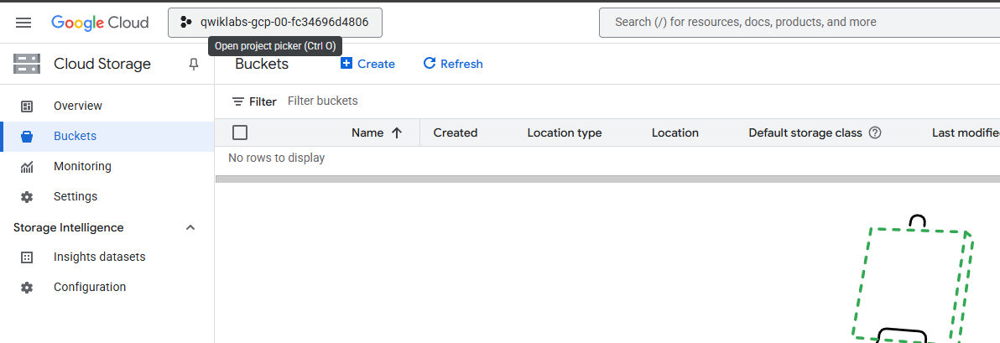
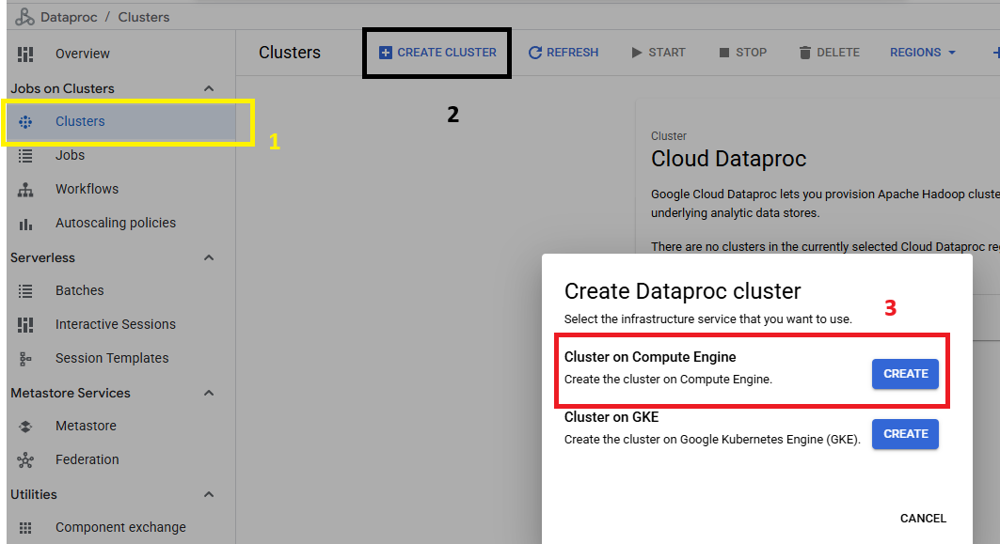
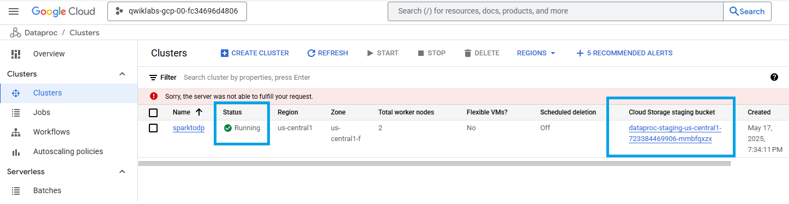
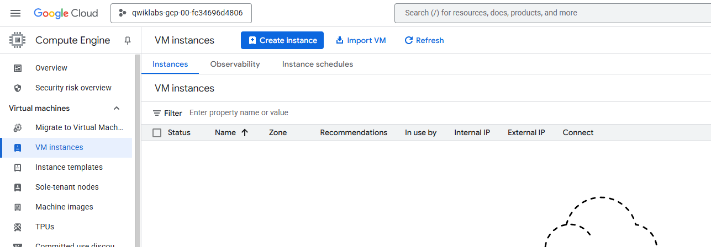
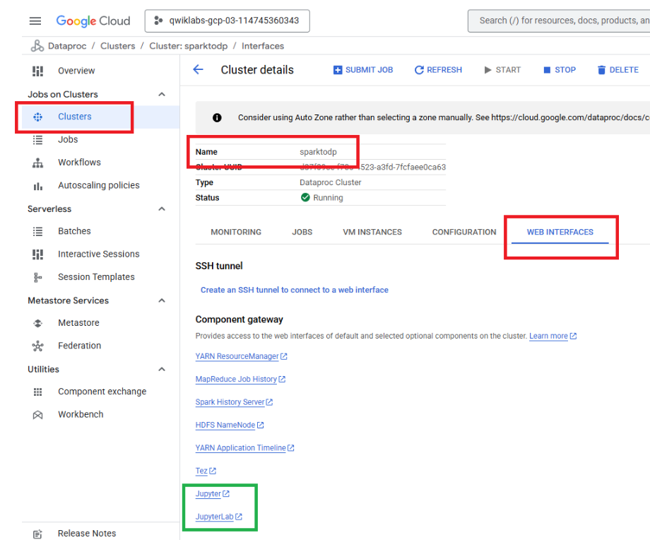
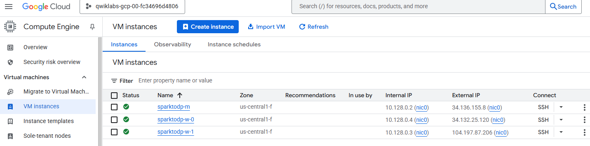
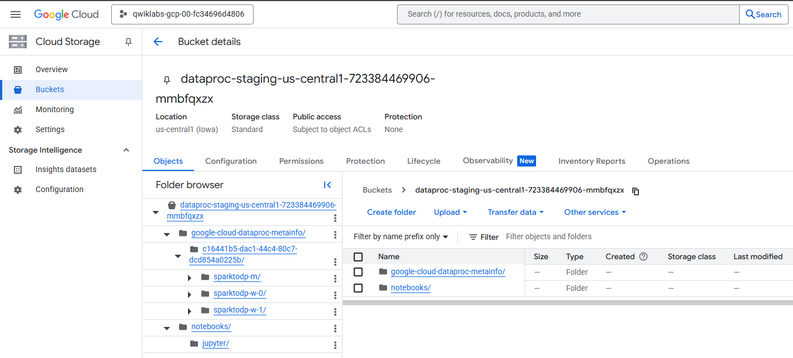
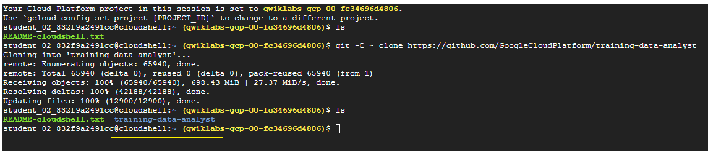
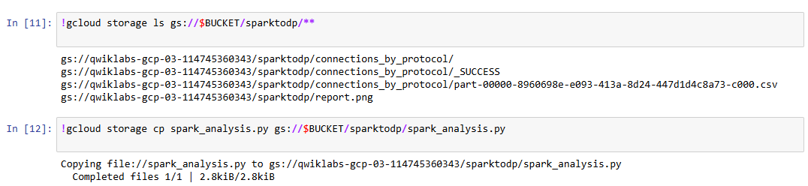

#  Running Apache Spark jobs on Cloud Dataproc (Ejecución de trabajos de Apache Spark en Cloud Dataproc)


Este laboratorio pertenece `Ruta de aprendizaje del Data Engineer`, del modulo `Creación de canalizaciones de datos por lotes en Google Cloud` (Google Skill Boost).


En este laboratorio se aprende a:

- Crear un clúster de Dataproc, que es el servicio administrado de GCP para correr Hadoop, Spark y otras herramientas de big data.

- Migrar trabajos existentes de  Apache Spark a Cloud Dataproc (Lift and Shift).

- Luego, modificar los trabajos de Spark para utilizar Cloud Storage en lugar de HDFS

- Optimizar trabajos de Spark para que se ejecuten en clústeres específicos de trabajos.


#
# Laboratorio

## Tarea 1. Levantar y desplazar (Lift and shift)

En esta etapa, vamoss a migrar un trabajo existente de Apache Spark a Google Cloud utilizando Cloud Dataproc, sin necesidad de modificar el código original.

Este enfoque se conoce como "Lift and Shift", y consiste en mover tus cargas de trabajo tal como están desde un entorno local o on-premise a la nube. La idea es aprovechar la infraestructura escalable de Google Cloud sin tener que reescribir o rediseñar tu código.

Con Cloud Dataproc, podés ejecutar notebooks, scripts o pipelines de Spark directamente en un clúster administrado en la nube, replicando el entorno Hadoop tradicional pero con todos los beneficios de la elasticidad, disponibilidad y eficiencia del cloud.


### Antes de crear el Cluster en Dataproc, miremos:

-  Google Storage --> buckets

  

- Compute Engine --> Instancias

   
#

### Configurar e iniciar un clúster de Cloud Dataproc

1) En la consola de Google Cloud, en el **Menú de navegación** , en la sección **Analytics , haga clic en Dataproc** .

2) Click en **Clusters** > **Crear clúster** > `Clúster on Compute Engine`.


3) Completar la configuración básica:

    - Ingrese `sparktodp` como el nombre del clúster 

    - Establezca la región en `REGIÓN` y zona a `ZONA`.

4)  En la sección **Versiones** , haga clic en **Cambiar** y seleccione **2.1 (Debian 11, Hadoop 3.3, Spark 3.3)** . Esta versión incluye Python3. 

5) Haga clic en **Seleccionar** .

6) En la sección **Componentes** > **Component gateway** , seleccione **Enable component gateway** .

7) En **Componentes opcionales** , seleccione **Jupyter Notebook**. 

8) Debajo de **Configurar clúster** de la lista del lado izquierdo, haga clic en **Configurar nodos (opcional)** .

9) En el nodo Administrador :

    - Primero, seleccione **el tipo de disco principal*** como **Disco persistente estándar** .

    - Cambiar **serie a E2** .

    - Establezca **el tipo de máquina en e2-standard-2 (2 vCPU, 8 GB de memoria)** .

    - Establezca **el tamaño del disco principal** en 30 GB .

10) En los nodos de trabajo :

    - Primero, seleccione el tipo de **disco principal** como **Disco persistente estándar** .

    - Cambiar **serie a E2** .

    - Establezca **el tipo de máquina en e2-standard-2 (2 vCPU, 8 GB de memoria)** .
    
    - Establezca **el tamaño del disco principal** en 30 GB .

11) Haga clic en **Crear**.


**El clúster debería iniciarse en unos minutos. Espere a que el clúster de Cloud Dataproc esté completamente implementado para continuar con el siguiente paso.**


**Cuando se creo el Cluster, miremos nuevamente Cloud Starage y Compute Engine, si se cre algo tambien**


#

### Clonar el repositorio del laboratorio

Como parte del laboratorio, se clona un repositorio público que contiene el código base, notebooks de Jupyter y scripts necesarios para completar las tareas prácticas.

El repositorio se clona directamente en el entorno de Cloud Shell, facilitando la edición y ejecución inmediata desde notebooks en Cloud Dataproc.

1) Para clonar el repositorio  para el laboratorio, ingrese el siguiente comando en Cloud Shell:

    ```sh
    ## clonamos  (copia) un repositorio de GitHub en tu nuestro  entorno  en la nube.

    ls
    git -C ~ clone https://github.com/GoogleCloudPlatform/training-data-analyst

    ls
    #   -C ~	Le indica a Git que ejecute el comando desde tu directorio home (~), sin importar en qué carpeta estés ahora.
    ```
    

2) Para localizar el depósito de Cloud Storage predeterminado utilizado por Cloud Dataproc, ingrese el siguiente comando en Cloud Shell:


    ```bash
    export DP_STORAGE="gs://$(gcloud dataproc clusters describe sparktodp --region=us-central1 --format=json | jq -r '.config.configBucket')"
    ```

Este comando extrae automáticamente el nombre del bucket de Cloud Storage que Dataproc crea por defecto para guardar archivos asociados al clúster (como notebooks, scripts, etc.).


Entonces, necesitamos saber cuál es el bucket, para poder subir ahí los archivos que queremos usar en el entorno Jupyter del clúster.


3) Para copiar los notebooks de muestra en la carpeta de trabajo de Jupyter, ingrese el siguiente comando en Cloud Shell:

    ```bash
    ## Copia todos los archivos .ipynb (notebooks) que están en la carpeta local  del repositorio clonado y Los sube a la carpeta `notebooks/jupyter` dentro del bucket de Cloud Storage asociado a tu clúster

    gcloud storage cp ~/training-data-analyst/quests/sparktobq/*.ipynb $DP_STORAGE/notebooks/jupyter
    ```
Dataproc con Jupyter lee los notebooks desde Cloud Storage.
Si no copiamos los archivos al bucket, no los vamos a ver cuando abramos Jupyter en el navegador.

#

### Accede al notebook de Jupyter


Una vez que el clúster se haya iniciado por completo, podrá conectarse a las interfaces web.


1) En Google Cloud Console, ir a **Dataproc > Clústeres**.

2) Abrir el clúster `sparktodp`.

3) Ir a **Interfaces web** > **Jupyter**.



Esto abre la página principal de Jupyter. Aquí puede ver el contenido del `/notebooks/jupyter`  en Cloud Storage, que ahora incluye los cuadernos de Jupyter de ejemplo utilizados en este laboratorio.




4) En la pestaña **Archivos** , haga clic en la carpeta **GCS** y luego haga clic en el cuaderno `01_spark.ipynb` para abrirlo.

5) Click en Cell > Run All para ejecutar todas las celdas.


#
## Tarea 2. Separar el procesamiento y el almacenamiento

###  Modificar los trabajos de Spark para utilizar Cloud Storage en lugar de HDFS

Partiendo del notebook original usado en la `Tarea anterior: "Lift & Shift"`, en esta tarea vas a crear una nueva versión que separa el almacenamiento del cómputo.
El objetivo es hacer que el trabajo de Spark ya no dependa del sistema de archivos interno del clúster (HDFS), sino que lea y escriba datos directamente desde Google Cloud Storage (GCS).

Para lograrlo, simplemente vas a reemplazar en el código todas las rutas que comienzan con `hdfs://` por rutas que empiecen con `gs://`, y ajustar los nombres de carpetas si es necesario. Esto transforma el trabajo para que sea compatible con arquitecturas cloud más flexibles y resilientes.

El primer paso consiste en usar Cloud Shell para copiar los datos de origen a un nuevo bucket de Cloud Storage, desde donde serán accesibles.

1) En Cloud Shell, cree un nuevo Bucket de almacenamiento para sus datos de origen:

    ```bash
    export PROJECT_ID=$(gcloud info --format='value(config.project)')
    gcloud storage buckets create gs://$PROJECT_ID
    ```
    
2) En Cloud Shell, copie los datos de origen en el Bucket:

    ```bash
    wget https://storage.googleapis.com/cloud-training/dataengineering/lab_assets/sparklab/kddcup.data_10_percent.gz
    gcloud storage cp kddcup.data_10_percent.gz gs://$PROJECT_ID/
    ```
    

3) Regrese al Notebook `01_spark` en su navegador.

4) Haga clic en **Archivo (File)** y luego seleccione **Hacer una copia (Make a Copy)** .

5)  Cuando se abra la copia, haga clic en el título **01_spark-Copy1** y cámbiele el nombre a `De-couple-storage`. (File > Rename... )

6) Abra la pestaña Jupyter para `01_spark`.

7) Haga clic en **File** y luego en **Save and checkpoint** , para guardar el cuaderno.

    Haga clic en **File** y luego en **Close and Halt** para apagar el notebook.

8) Regrese al Notebook  `De-couple-storage` en su navegador, si es necesario.


9) Ya no necesita las celdas que descargan y copian los datos en el sistema de archivos HDFS interno del clúster, por lo que deberá eliminarlas primero.

    - Elimine las celdas de comentarios iniciales y las primeras tres celdas de código **( In [1], In [2], y In [3])** para que el cuaderno ahora comience con la sección **Lectura de datos** .


10) Ahora modificará el código de la primera celda (que se mantiene activa In[4] a menos que haya vuelto a ejecutar el cuaderno) que define la ubicación de la fuente del archivo de datos y lee los datos de origen. La celda contiene el siguiente código:


        ```bash
        from pyspark.sql import SparkSession, SQLContext, Row

        spark = SparkSession.builder.appName("kdd").getOrCreate()
        sc = spark.sparkContext
        data_file = "hdfs:///kddcup.data_10_percent.gz"
        raw_rdd = sc.textFile(data_file).cache()
        raw_rdd.take(5)
        ```

11) Reemplace el contenido de la celda **In [4]** con el siguiente código. El único cambio es crear una variable para almacenar el nombre del depósito de Cloud Storage y luego apuntar al data_filedepósito que usamos para almacenar los datos de origen en Cloud Storage:

    ```bash
    from pyspark.sql import SparkSession, SQLContext, Row

    gcs_bucket='[Your-Bucket-Name]'
    spark = SparkSession.builder.appName("kdd").getOrCreate()
    sc = spark.sparkContext
    data_file = "gs://"+gcs_bucket+"//kddcup.data_10_percent.gz"
    raw_rdd = sc.textFile(data_file).cache()
    raw_rdd.take(5)
    ```
Cuando haya reemplazado el código, la primera celda se verá similar a la siguiente, con el ID de su proyecto de laboratorio como nombre del depósito:


12) En la celda que acaba de actualizar, reemplace `[Your-Bucket-Name]` con el nombre del contenedor de almacenamiento que creó en el primer paso de esta sección. Creó ese contenedor usando el ID del proyecto como nombre, que puede copiar aquí desde el panel de información de inicio de sesión del laboratorio de Qwiklabs, a la izquierda de esta pantalla. Reemplace todo el texto del marcador de posición, incluidos los corchetes [].

14) Click en **Cell** > **Run All** para ejecutar todas las celdas.

#
### Tarea 3. Implementar trabajos de Spark.


Ahora crea un archivo Python independiente, que puede implementarse como un trabajo de Cloud Dataproc y que realizará las mismas funciones que este notebook.


1) En el `De-couple-storage` menú de Jupyter Notebook, haga clic en **Archivo** y seleccione **Hacer una copia** .

2) Cuando se abra la copia, haga clic en **De-couple-storage-Copy1** y cámbiele el nombre a `PySpark-analysis-file`.

3) Abra la pestaña Jupyter para `De-couple-storage`.

4) Haga clic en **Archivo** y luego en **Guardar y punto de control** para guardar el cuaderno.

5) Haga clic en **Archivo** y luego **en Cerrar y Detener** para apagar el notebook.


    - Si se le solicita que confirme que desea cerrar el cuaderno, haga clic **en Salir** o **Cancelar** .


6) Regrese a la pestaña `PySpark-analysis-file`  de Jupyter Notebook en su navegador.

7)  Haga clic en la primera celda en la parte superior del cuaderno.

    - Haga clic en **Insertar** y seleccione **Insertar celda arriba** .

8) Pegue el siguiente código de importación de biblioteca y manejo de parámetros en esta nueva primera celda de código:

    ```bash
    %%writefile spark_analysis.py

    import matplotlib
    matplotlib.use('agg')

    import argparse
    parser = argparse.ArgumentParser()
    parser.add_argument("--bucket", help="bucket for input and output")
    args = parser.parse_args()

    BUCKET = args.bucket
    ```

- `%%writefile` para convertir celdas a script.
    
    El comando `%%writefile` es una **cell magic** en Jupyter Notebook, y se utiliza para escribir el contenido de una celda directamente en un archivo.

Cada celda se convierte en parte del archivo .py así:

- `%%writefile spark_analysis.py` → crea el archivo: 

    Guarda todo lo que sigue en la celda dentro de un archivo llamado `spark_analysis.py`.

- Esto es útil cuando el script corre en un entorno sin GUI (como Dataproc), ya que evita errores por falta de entorno gráfico.

- Usa argparse para **leer argumentos desde la línea de comandos**.
En este caso, espera un argumento `--bucket`, que representa el nombre del bucket de Cloud Storage que se usará como entrada y salida de datos.

9)  Para las celdas restantes, inserte `%%writefile -a spark_analysis.py` al principio de cada celda de código Python. Estas son las cinco celdas etiquetadas como **In [x]** .


    ```sh
    %%writefile -a spark_analysis.py
    ```
Por ejemplo, la siguiente celda ahora debería verse así:

        ```bash
        %%writefile -a spark_analysis.py
        from pyspark.sql import SparkSession, SQLContext, Row

        spark = SparkSession.builder.appName("kdd").getOrCreate()
        sc = spark.sparkContext
        data_file = "gs://{}/kddcup.data_10_percent.gz".format(BUCKET)
        raw_rdd = sc.textFile(data_file).cache()
        #raw_rdd.take(5)
        ```

10) Repita este paso, insertando `%%writefile -a spark_analysis.py` al comienzo de cada celda de código hasta llegar al final.

11) En la última celda, donde está trazado el gráfico de barras de Pandas, elimine el `%matplotlib inline`.


12) Asegúrese de haber seleccionado la última celda de código en el cuaderno. Luego, en la barra de menú, haga clic en **Insertar** y seleccione **Insertar celda debajo** .
Pegue el siguiente código en la nueva celda:

    ```bash
    %%writefile -a spark_analysis.py

    ax[0].get_figure().savefig('report.png');

    ```


13) Agregue otra celda nueva al final del cuaderno y pegue lo siguiente:

    ```bash
    %%writefile -a spark_analysis.py

    import google.cloud.storage as gcs
    bucket = gcs.Client().get_bucket(BUCKET)
    for blob in bucket.list_blobs(prefix='sparktodp/'):
        blob.delete()
    bucket.blob('sparktodp/report.png').upload_from_filename('report.png')
    ```


14) Agrega una nueva celda al final del cuaderno y pega lo siguiente:

    ```bash
    %%writefile -a spark_analysis.py

    connections_by_protocol.write.format("csv").mode("overwrite").save(
        "gs://{}/sparktodp/connections_by_protocol".format(BUCKET))
    ```

### Automatización de pruebas


1) En el `PySpark-analysis-file`, agregue una nueva celda al final del cuaderno y pegue lo siguiente:

    ```sh
    BUCKET_list = !gcloud info --format='value(config.project)'
    BUCKET=BUCKET_list[0]
    print('Writing to {}'.format(BUCKET))
    !/opt/conda/miniconda3/bin/python spark_analysis.py --bucket=$BUCKET
    ```


2) Agrega una nueva celda al final del cuaderno y pega lo siguiente:

    ```sh
    !gcloud storage ls gs://$BUCKET/sparktodp/**
    ```

3) Para guardar una copia del archivo Python en el almacenamiento persistente, agregue una nueva celda y pegue lo siguiente:

    ```sh
    !gcloud storage cp spark_analysis.py gs://$BUCKET/sparktodp/spark_analysis.py
    ```


4) Haga clic en **Cell** y luego en **Run All**.

Si el notebook crea y ejecuta correctamente el archivo Python, debería ver un resultado similar al siguiente en las dos últimas celdas. Esto indica que el script se ha ejecutado completamente y ha guardado el resultado en el depósito de Cloud Storage que creó anteriormente en el laboratorio.



### Ejecute el trabajo de análisis desde Cloud Shell.


1) Regrese a su Cloud Shell y copie el script de Python desde Cloud Storage para poder ejecutarlo como un trabajo de Cloud Dataproc:

    ```
    gcloud storage cp gs://$PROJECT_ID/sparktodp/spark_analysis.py spark_analysis.py
    ```

2) Crear un script de lanzamiento:

    ```
    nano submit_onejob.sh
    ```


3) Pegue lo siguiente en el script:

    ```bash
    #!/bin/bash
    gcloud dataproc jobs submit pyspark \
        --cluster sparktodp \
        --region REGION \
        spark_analysis.py \
        -- --bucket=$1
    ```

4) Presione `CTRL+X` luego la tecla `Y` y `Enter` para salir y guardar.

5) Hacer que el script sea ejecutable:

    ```
    chmod +x submit_onejob.sh
    ```

6) Inicie el trabajo de análisis de PySpark:

    ```bash
    ./submit_onejob.sh $PROJECT_ID
    ```

7) En la pestaña Consola en la nube, navegue a la página **Dataproc > Clústeres** si aún no está abierta.

8) Haga clic en **Jobs.**

9) Haga clic en el nombre del trabajo que aparece. Puede supervisar el progreso desde aquí y desde Cloud Shell. Espere a que el trabajo se complete correctamente.

10) Navegue hasta su depósito de almacenamiento y observe que el informe de salida `/sparktodp/report.png` tiene una marca de tiempo actualizada que indica que el trabajo independiente se completó correctamente.

El contenedor de almacenamiento utilizado por este trabajo para el almacenamiento de datos de entrada y salida es el contenedor que utiliza solo el ID del proyecto como nombre.

11) Regrese a la página **Dataproc > Clústeres** .

12) Seleccione el clúster `sparktodp` y haga clic en **Eliminar (Delete)** . Ya no lo necesita.

13) Haga clic en **CONFIRMAR** .

14) Cierre las pestañas de **Jupyter** en su navegador.

#

## Resumen general de las tareas del Lab.


| Tarea       | ¿Qué hiciste?                                                                                      | ¿Para qué sirve?                                                                                                                  |
| ----------- | -------------------------------------------------------------------------------------------------- | --------------------------------------------------------------------------------------------------------------------------------- |
| **Tarea 1** | Ejecutaste un trabajo Spark desde un **notebook** usando **HDFS** como almacenamiento.             | Simula un entorno clásico tipo Hadoop (cómputo y almacenamiento juntos).                                                          |
| **Tarea 2** | Modificaste el notebook para usar **Cloud Storage (gs\://)** en lugar de HDFS (hdfs\://).          | Separás el almacenamiento del cómputo (arquitectura moderna). Preparás el entorno para migrar a la nube real.                     |
| **Tarea 3** | Convertiste el notebook en un **script Python ejecutable**, lo subiste y lo corriste como **job**. | Automatizás el procesamiento. Ya no necesitás notebooks. Todo puede ejecutarse por comandos o integrarse a pipelines automáticos. |


#
#
#
Lab: Running Apache Spark Jobs on Cloud Dataproc

✨ Objetivo

Migrar y modernizar trabajos de Apache Spark para que se ejecuten en la nube, aprovechando Cloud Dataproc y prácticas cloud-native.

✅ Tarea 1: Migrar un trabajo Spark existente ("Lift and Shift")

🔧 Qué se hace:

Crear un clúcster de Cloud Dataproc.

Activar Jupyter Notebook y la puerta de enlace de componentes.

Clonar el repositorio de ejemplos desde GitHub.

Copiar los notebooks al bucket de Cloud Storage asociado al clúcster.

Ejecutar un notebook Spark que usa HDFS como almacenamiento.

🧐 Por qué:

Permite migrar cargas de trabajo existentes sin necesidad de modificar el código original. Este enfoque se llama "Lift and Shift" y es el primer paso hacia la modernización.

✅ Tarea 2: Desacoplar almacenamiento y cómputo

🔧 Qué se hace:

Crear una copia del notebook original.

Cambiar las rutas HDFS (hdfs://) a rutas GCS (gs://).

Subir los datos al bucket de Cloud Storage.

Ejecutar el notebook modificado.

🧐 Por qué:

Usar Cloud Storage en lugar de HDFS permite desacoplar almacenamiento y procesamiento. Esto mejora la escalabilidad, reduce costos y sigue buenas prácticas cloud-native.

✅ Tarea 3: Ejecutar Spark en clúcster efímero

🔧 Qué se hace:

Crear un script en Python (spark_analysis.py).

Ejecutar el script como un trabajo Spark con el comando gcloud dataproc jobs submit spark.

Utilizar clúcsteres temporales que se apagan luego del trabajo.

🧐 Por qué:

Permite optimizar los recursos cloud, ejecutando Spark solo cuando es necesario. Reduce costos y automatiza procesos.

🗾 Resultado Final:

Migraste un trabajo Spark sin cambios (Lift & Shift).

Modernizaste el almacenamiento usando GCS.

Automatizaste la ejecución con clúcsteres efímeros.

Este flujo refleja una evolución natural hacia arquitecturas de datos escalables, mantenibles y económicas en la nube.
#